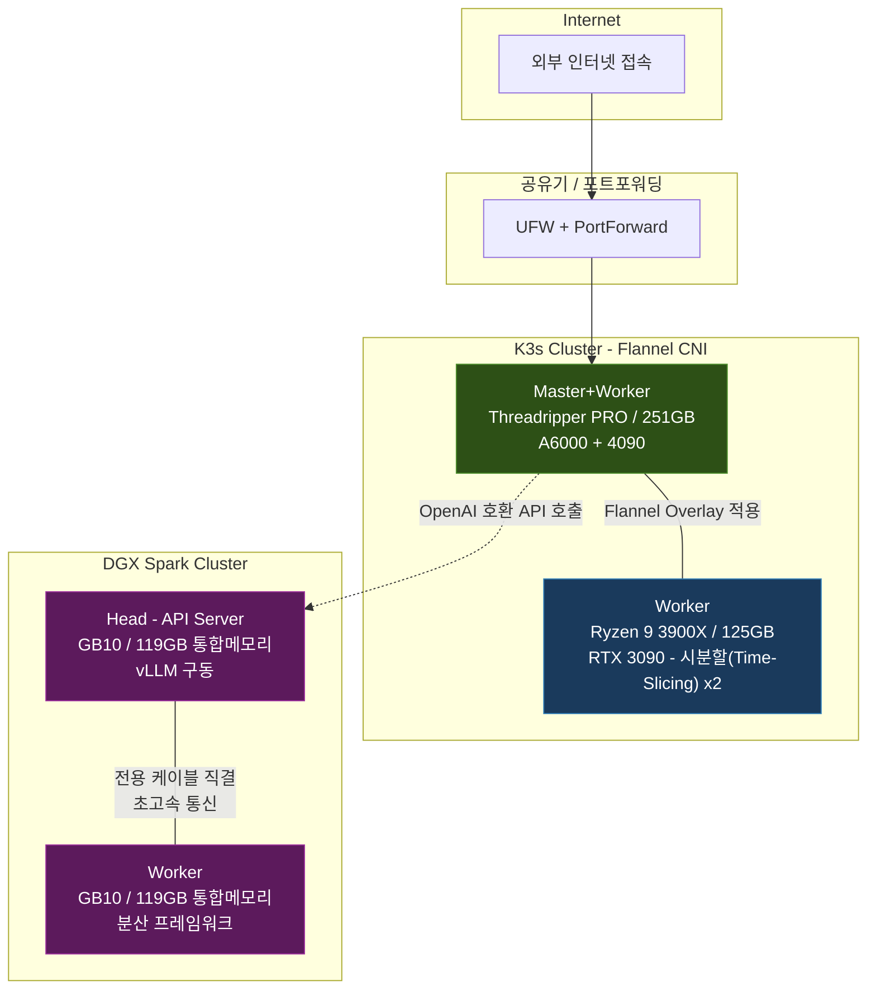

## 들어가며

실제 회사 업무에서 활용하는 기술들을 개인적으로 직접 구축하고 운영해 보기 위해 '홈랩' 환경을 구축했다. 안정적인 서버 운영을 돕는 쿠버네티스(Kubernetes)[^k8s] 클러스터 운영, 인공지능 학습을 자동화하는 ML 파이프라인, 대규모 언어 모델(LLM) 서빙 등 실무에서 접하는 인프라를 가능한 한 동일한 구조로 재현하는 것이 목적이다.

기존에 활용하던 서버에 신규 서버를 더하고, 운영체제(OS) 설치부터 네트워크망 구성, 클러스터 셋업, 서비스 배포까지 모든 과정을 직접 진행했다. 재직 중인 회사의 분석 시스템과 유사한 환경을 꾸미면서 기능 개발과 운영 경험을 간접적으로 학습하고 있다. 현재 총 4대의 서버가 두 개의 클러스터로 나뉘어 운영 중이며, 그 위에서 약 40여 개의 서비스가 돌아가고 있다.

이 글에서는 서버 하드웨어의 구성, 소프트웨어 기술을 선택한 이유, 그리고 전체 네트워크 형태(토폴로지)를 다루고, 이어지는 2편에서 각 서비스의 역할과 개발 배경을 소개한다.

---

## 하드웨어 구성

### 서버 목록

| 구분 | 역할 | CPU | RAM | GPU | 스토리지 |
|------|------|-----|-----|-----|----------|
| K3s Master + Worker | 시스템 제어(Control Plane)[^control_plane], 서비스 호스팅 | AMD Threadripper PRO 7965WX (24C/48T) | 251 GB | RTX A6000 48GB + RTX 4090 24GB | NVMe 5.2TB |
| K3s Worker | 인공지능 그래픽 카드(GPU) 작업 전담 | AMD Ryzen 9 3900X (12C/24T) | 125 GB | RTX 3090 24GB | NVMe 1.7TB + HDD 3.6TB |
| DGX Spark #1 (Head) | AI 언어모델 서버 (vLLM API) | ARM Cortex-X925/A725 (20C) | 119 GB | NVIDIA GB10 (Blackwell)[^blackwell] | NVMe 931GB |
| DGX Spark #2 (Worker) | AI 언어모델 분산 처리 노드 | ARM Cortex-X925/A725 (20C) | 119 GB | NVIDIA GB10 (Blackwell) | NVMe 916GB |

### K3s 클러스터

Master 노드가 전체를 지휘하는 Control Plane 역할과 Worker Node 역할을 겸임한다. 이 노드에 대부분의 서비스 파드들이 배치되어 있다. 반면, 이미지 생성 및 모델 학습 등 VRAM 요구량이 높은 작업은 별도의 Worker 노드에 분산 처리한다.

Worker 노드에는 'GPU Time-Slicing'[^time_slicing] 기술을 적용했다. 이는 물리적인 RTX 3090 그래픽 카드 할당량을 논리적으로 2장으로 분할하여 사용하는 방법이다. 이를 통해 일상적인 텍스트 임베딩 서비스와 특정 시간에 실행되는 배치 학습 작업을 단일 그래픽 카드 환경에서 효율적으로 병행 처리한다. 제한된 자원 환경에서 VRAM 활용 효율을 극대화하기 위해 도입한 아키텍처이다.

### DGX Spark 클러스터

NVIDIA DGX Spark는 AI 워크로드 연구를 위해 구축한 워크스테이션 환경이다. 최신 Blackwell 아키텍처 기반의 GB10 칩과 ARM 프로세서가 통합 메모리(UMA)[^uma] 구조로 결합되어 있다. 별도의 전용 VRAM이 독립적으로 존재하지 않고 CPU와 GPU가 119GB의 메모리를 공유한다. 두 대의 워크스테이션을 클러스터링하여 약 240GB의 통합 메모리를 모델 적재에 활용한다.

이러한 환경에서는 양자화 기법(AWQ 4-bit)을 적용할 경우 200B 이상 파라미터의 대형 LLM 구동이 가능하다. 현재 모델 웨이트를 분할하여 두 노드에 분산 배치하는 텐서 병렬(Tensor Parallel) 방식으로 서빙 인프라를 운영 중이다.

DGX Spark를 앞서 서술한 K3s 클러스터에 편입시키지 않은 주요 원인은 아키텍처(ARM vs x86) 차이에 기인한다. 이기종 하드웨어를 단일 클러스터로 통합할 시 파생되는 네트워크 이슈 및 관리 오버헤드를 최소화하기 위해, DGX Spark 노드는 언어 모델 전용 서빙 클러스터로 논리적으로 격리하고 외부에서 API 연결만 수용하도록 아키텍처를 분리했다.

---

## 핵심 보안 및 네트워크 구성

### 제로 트러스트(Zero Trust) 기반 접근 제어

초기 구성에서는 서비스 외부 노출 시 주로 사설 공유기의 포트포워딩에 의존했다. 이는 Kubernetes NodePort 서비스 특성상 특정 트래픽이 리눅스 기본 방화벽인 UFW의 INPUT 체인을 우회하는 이슈가 존재했기 때문이다.

그러나 횡적 이동(Lateral Movement) 등 내부망 보안 위협을 방지하기 위해 방화벽 정책을 세분화하여, **Zero Trust 원칙이 반영된 보안 아키텍처**로 고도화했다. 

1. **Password 기반 인증 차단**: 전체 노드(Master, Worker, DGX 등)에서 패스워드 기반 SSH 접근(`PasswordAuthentication`)과 Root 직접 접속(`PermitRootLogin`)을 비활성화했다. 사전 등록된 인증 키(SSH Key) 기반의 접근만 허용된다.
2. **Core API 접근 통제**: K3s API(6443) 및 Kubelet(10250)과 같은 시스템 제어 데몬의 경우, 내부망이라 할지라도 인가되지 않은 IP 대역에서의 접근을 명시적으로 Drop 처리하는 엄격한 UFW 화이트리스트 룰셋을 일괄 적용했다.
3. **NetworkPolicy deny-all 전면 도입**: 전체 47개 네임스페이스에 대해 171개의 Kubernetes NetworkPolicy를 단계적으로 적용하여, 파드(Pod)[^pod] 간 네트워크 통신을 명시적으로 허용된 경로만 개방하는 마이크로 세그멘테이션(Microsegmentation)[^microseg] 아키텍처를 구현했다. 위험도 등급별로 LOW → MEDIUM → HIGH → CRITICAL 순으로 4단계에 걸쳐 deny-all 기본 정책을 배포하고, 각 단계마다 전체 서비스의 정상 가용성을 검증한 뒤 다음 단계로 진입하는 방식으로 전개했다.

### 서비스 외부 노출 방식

Ingress Controller[^ingress] 대신 직관적인 포트 매핑 관리를 위해 **NodePort**[^nodeport] 서비스 타입을 주로 채택했다. 30000~32767 포트 대역을 고정 할당함으로써, 소규모 인프라 특성상 개별 애플리케이션의 접근 엔드포인트를 직관적으로 지정하고 추적할 수 있도록 설계했다. 

### DGX Spark 내부 통신

DGX Spark 노드 간 대역폭 병목 방지를 위해 QSFP 전용망으로 물리적 직결 통신을 구성했다. 텐서 병렬 연산 시 발생하는 노드 간 대용량 분산 통신 오버헤드를 해당 전용 백본으로 분리하여 처리하고, 외부 추론 API 요청은 Head 노드가 단일 엔드포인트로서 전담하여 처리하는 구조이다.

---

## 주요 소프트웨어 스택

### 플랫폼: K3s 도입 배경

초기에는 표준적인 쿠버네티스(kubeadm) 구축을 고려했으나, 제한적인 노드 자원 하에서 모든 코어 컴포넌트를 구동할 경우 리소스 오버헤드가 크다고 판단했다. K3s[^k3s]는 불필요한 의존성을 배제한 경량화 아키텍처 구조로 시스템 리소스 점유율을 줄임과 동시에, Flannel 및 기본적인 Ingress Controller를 내장하고 있어 클러스터 제반 관리가 용이한 강점이 있다.

### 이미지 레지스트리: Harbor

Public Registry 의존에 따른 이미지 Pull 속도 저하 및 Rate Limit 제약을 회피하기 위해, 자체 프라이빗 레지스트리인 Harbor를 로컬 클러스터망에 프로비저닝했다. 취약점 스캔 기능을 내장하여 베이스 이미지의 보안 검증 단계도 부분적으로 자동화했다.

### CI/CD 프로비저닝: GitLab + Kaniko

소스 코드 형상 관리 및 컨테이너 빌드, 클러스터 배포를 위해 GitLab과 Kaniko 기반 파이프라인을 구축했다. 
Kaniko는 Docker Daemon 소켓 통신을 요구하지 않으며 Root 커널 권한 없이 이미지를 빌드할 수 있어, 클러스터 내부 CI 파이프라인 구성 시 컨테이너 무결성을 보장하고 권한 탈취 리스크를 완화할 수 있다. 코드 Push 시 파이프라인이 즉각 트리거되며 빌드와 롤아웃이 자동 수행된다.

### ML 워크플로우 통제: Kubeflow Pipelines v2

데이터 수집부터 피처(Feature) 전처리, 모델 학습, 예측 추론에 이르는 일련의 배치 워크플로우 스케줄링을 담당한다. Apache Airflow 등 유사 오케스트레이션 툴과 비교 후, 컴퓨팅 리소스(GPU 등) 및 K8s 파드 통합 관리 등 AI/ML 워크로드에 특화된 장점을 살려 Kubeflow를 메인 파이프라인 솔루션으로 채택했다. 최근 레거시 SDK에서 v2 기반 엔진 마이그레이션도 안정적으로 완료했다.

### 데이터 스토리지 아키텍처

- **PostgreSQL**: 주식, 환율 시계열성 정형 데이터 집합 1차 보관 및 마이크로서비스 기반 유저 메타데이터 저장용 백엔드이다.
- **Teradata Vantage Express**: 실무 분산 DW 환경과 유사한 시스템 토폴로지를 구성하여, 애플리케이션 계층 In-DB 쿼리와 RDB 모형 연산 파이프라인을 비교 대조하는 샌드박스 용도로 구동한다.
- **Elasticsearch 및 CouchDB**: 대규모 비정형 지식 문서의 역인덱스(Inverted Index) 생성 및 RAG 파이프라인 내 텍스트 고속 검색을 지원하는 NoSQL 저장소로 활용한다.

### 대규모 언어 모델 서빙: vLLM

vLLM[^vllm] 인스턴스는 PagedAttention 적용 및 멀티 GPU 병렬 처리 아키텍처 구성을 통해 다수 다중 요청을 병목 없이 고속 처리한다. OpenAI Spec 호환 API를 지원하며 최근 FP8 KV Cache 기능의 안정화로 인하여, 다수 배포된 AI 에이전트들이 복잡한 추론 임무를 원활히 수행하는 데 핵심적인 LLM 백엔드 역할을 담당한다.

### 리소스 매트릭 관제: Prometheus + Grafana

Prometheus가 CPU 워크로드, 메인 메모리, 컨테이너 리소스 등 각종 노드 레벨 매트릭을 주기적으로 폴링 수집하고, Grafana 대시보드가 이를 시계열로 시각화한다. 특히 개별 ML 파이프라인 점유 VRAM 수준과 GPU 유틸리티를 측정하는 모니터링 아그리게이터를 구성했다.

### 통합 인증 레이어: OpenLDAP + Keycloak

파편화되어 배포된 개별 마이크로서비스마다 독립 인증 프로세스를 거쳐야 하는 관리 복잡도를 완화하기 위해 도입되었다. OpenLDAP의 시스템 계정 체계에 기반하여 Keycloak이 OAuth 2.0 / OIDC 기반 인증 트랜잭션을 중재하는 단일 통합 인증(SSO)[^sso] 접근 인프라다.

---

## 마무리

이 글에서는 홈랩의 하드웨어 구성과 이를 운영하기 위한 시스템 소프트웨어 스택, 그리고 Zero Trust 기반의 네트워크 보안망 아키텍처를 설명했다.

이어지는 2편에서는 이 기반 위에서 운영 중인 실제 서비스들을 소개한다. 대시보드 구조부터 AI 에이전트 플랫폼에 이르는 다양한 구성 요소들의 역할과 구조를 살펴본다.

---

## 업데이트 내역

| 날짜 | 내용 |
|------|------|
| 2026-03-25 | 초판 작성 |
| 2026-04-08 | Zero Trust 보안 아키텍처(SSH 키 전용 인증, UFW 화이트리스트 룰셋) 내용 반영, 전문적 어투로 리팩토링 |
| 2026-04-13 | NetworkPolicy deny-all 전면 도입(47개 NS, 171개 정책) 내용 추가, K3s v1.33.6 기준 서비스 수 40여 개로 최신화 |

---

[^k8s]: **쿠버네티스(Kubernetes)**: 수많은 프로그램(컨테이너)을 죽지 않고 24시간 안전하게 돌아가도록 분산 관리해 주는 클라우드 오케스트레이터입니다.
[^control_plane]: **제어판(Control Plane)**: 클러스터의 두뇌 역할을 하며 모든 자원의 상태 파악과 지시를 내리는 코어 서버 부분입니다.
[^blackwell]: **Blackwell 아키텍처**: NVIDIA가 발표한 차세대 인공지능(AI) 반도체 구조로, 엄청난 연산 속도를 자랑합니다.
[^time_slicing]: **Time-Slicing**: 고가의 물리 그래픽 카드를 시간을 매우 잘게 쪼개어 가상으로 분할, 여러 프로그램이 동시에 쓸 수 있게 하는 기술입니다.
[^uma]: **통합 메모리(UMA)**: CPU와 GPU가 서로 메모리를 나눠 쓰지 않고 하나의 거대한 작업 공간을 공유하여 데이터 교환 속도를 극대화하는 방식입니다.
[^ingress]: **Ingress Controller**: 외부 사용자가 어떤 주소(URL)로 접속하든 맞는 프로그램으로 안전하게 길을 안내해 주는 고급 정문 관리자입니다.
[^nodeport]: **NodePort**: 정해진 특정 포트(예를 들어 30005)로 들어오는 요청을 특정 내부 서비스로 곧바로 이어 주는 전통적이고 직관적인 연결 방식입니다.
[^k3s]: **K3s**: 리소스를 적게 먹으면서도 필수 쿠버네티스 기능을 전부 수행하도록 경량화(다이어트)된 버전입니다.
[^vllm]: **vLLM**: 거대한 인공지능 두뇌 모델(LLM)을 빠르고 효율적으로 구동하여, 메모리를 절약하면서 동시에 대량 서비스해 주는 엔진입니다.
[^sso]: **단일 인증(SSO, Single Sign-On)**: 한 번 로그인하면 다른 플랫폼에 들어갈 때도 비밀번호를 칠 필요 없이 자동 탑승하게 해 주는 시스템입니다.
[^pod]: **파드(Pod)**: 쿠버네티스에서 하나 이상의 컨테이너를 감싸는 최소 배포 및 관리 단위입니다.
[^microseg]: **마이크로 세그멘테이션(Microsegmentation)**: 네트워크를 아주 작은 구역으로 쪼개어, 허가된 통신만 통과시키는 보안 기법입니다.
