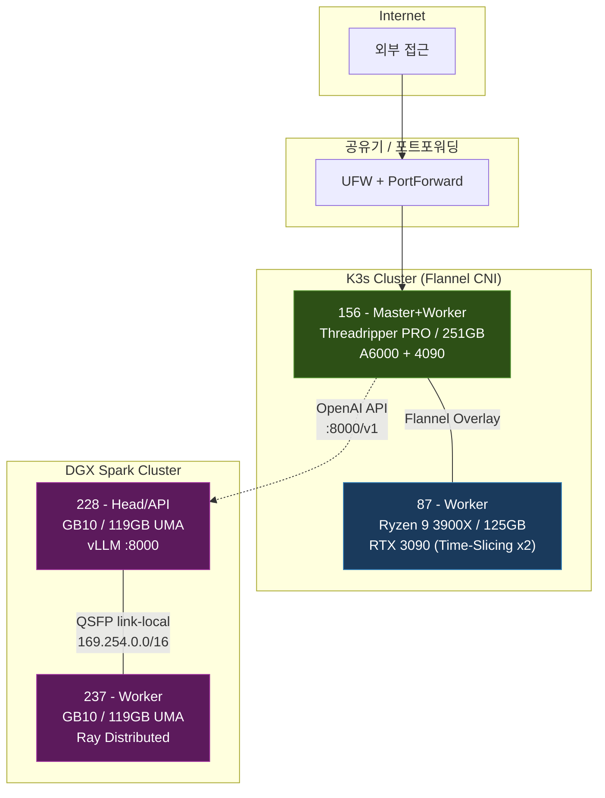

## 들어가며

업무에서 사용하는 기술들을 직접 구축하고 운영해보기 위해 홈랩을 만들었다. Kubernetes 클러스터 운영, ML 파이프라인 자동화, 대규모 언어 모델(LLM) 서빙 등 실무에서 접하는 인프라를 가능한 한 동일한 구조로 재현하는 것이 목적이다.

기존에 활용하던 서버에 신규 서버 증설 OS 설치, 네트워크 구성, 클러스터 셋업, 서비스 배포까지 전 과정을 직접 진행하면서 재직중인 회사의 분석 시스템과 유사한 환경을 구성, 기능 개발 경험을 쌓고 있으며, 운영 경험을 간접적으로 해보는 중이다. 현재 4대의 서버가 두 개의 클러스터로 나뉘어 운영 중이며, 그 위에 약 30여 개의 서비스가 돌아간다.

이 글에서는 하드웨어 구성, 소프트웨어 스택 선택 이유, 네트워크 토폴로지를 다루고, 이어지는 2편에서 각 서비스의 역할과 개발 배경을 소개한다.

---

## 하드웨어 구성

### 서버 목록

| 구분 | 역할 | CPU | RAM | GPU | 스토리지 |
|------|------|-----|-----|-----|----------|
| K3s Master + Worker | Control Plane, 서비스 호스팅 | AMD Threadripper PRO 7965WX (24C/48T) | 251 GB | RTX A6000 48GB + RTX 4090 24GB | NVMe 5.2TB |
| K3s Worker | GPU 워크로드 전담 | AMD Ryzen 9 3900X (12C/24T) | 125 GB | RTX 3090 24GB | NVMe 1.7TB + HDD 3.6TB |
| DGX Spark #1 (Head) | vLLM API 서버 | ARM Cortex-X925/A725 (20C) | 119 GB | NVIDIA GB10 (Blackwell) | NVMe 931GB |
| DGX Spark #2 (Worker) | vLLM 분산 추론 노드 | ARM Cortex-X925/A725 (20C) | 119 GB | NVIDIA GB10 (Blackwell) | NVMe 916GB |

### K3s 클러스터

156 서버가 Control Plane과 Worker를 겸한다. 이 서버에 대부분의 서비스가 배포되어 있으며, GPU 워크로드(ML 파이프라인, 이미지 생성 등)는 87 서버로 분산한다.

87 서버에는 GPU Time-Slicing을 적용하여 RTX 3090 하나를 가상 2개 GPU로 분할했다. 이를 통해 Ollama 임베딩 서비스(상시)와 ML 파이프라인 GPU 학습(스케줄 실행)이 하나의 물리 GPU에서 시분할로 공존할 수 있다. 이 방식은 별도의 GPU를 추가 구매하지 않고도 임베딩 서비스의 가용성과 ML 학습의 GPU 가속을 동시에 확보할 수 있어 채택했다.

### DGX Spark 클러스터

NVIDIA DGX Spark는 개인용 AI 워크스테이션이다. Blackwell 아키텍처 기반 GB10 GPU와 ARM CPU가 통합 메모리 아키텍처(UMA)를 사용한다. 일반 GPU처럼 별도의 VRAM이 있는 것이 아니라 CPU와 GPU가 119GB 메모리를 공유하기 때문에, 두 대를 클러스터로 묶으면 약 240GB의 메모리를 LLM 모델 로딩에 활용할 수 있다.

이 용량이면 AWQ 4-bit 양자화된 200B 이상 규모의 MoE 모델을 올릴 수 있다. 실제로 현재 MiniMax-M2.5-AWQ(229B MoE)를 tensor parallel 2로 양쪽 노드에 분할 배치하여 192K 컨텍스트로 서빙하고 있다.

DGX Spark를 K3s 클러스터에 편입시키지 않은 이유는 아키텍처 차이(ARM vs x86) 때문이다. K3s 자체는 ARM을 지원하지만, 클러스터 내 이미지 호환성, GPU 런타임, QSFP 네트워크 구성 등을 고려하면 분리 운영이 관리상 단순하다. DGX Spark 클러스터는 vLLM 서빙이라는 단일 목적에 집중하고, K3s 클러스터에서 API 호출로 접근하는 구조를 택했다.

---

## 네트워크 구성

### 서비스 노출 방식

Ingress Controller(Traefik) 대신 **NodePort** 방식을 기본으로 사용한다. 30000~32767 범위에서 포트를 할당하는 단순한 방식이지만, 홈랩 규모에서는 관리가 직관적이라는 장점이 있다. 현재 약 28개의 NodePort 서비스가 운영 중이다. Harbor 등 일부 서비스만 Ingress로 노출하고 있다.

외부 접근이 필요한 서비스는 공유기의 포트포워딩을 통해 노출한다. 방화벽 구조는 이중으로 되어 있는데, 공유기 포트포워딩이 1차 방어선이고 UFW가 2차 방어선이다. Kubernetes NodePort 트래픽은 iptables의 PREROUTING 체인에서 처리되어 UFW의 INPUT 규칙을 우회하는 특성이 있기 때문에, 외부 노출 제어는 사실상 공유기 포트포워딩에 의존한다. 이 점은 보안 정책 문서에 별도로 정리하여 관리하고 있다.

### DGX Spark 내부 통신

DGX Spark 두 대는 QSFP 케이블로 직접 연결되어 있다. link-local 주소(169.254.0.0/16)를 사용하여 클러스터 내부 통신을 한다. 이 전용 링크를 통해 tensor parallel 분산 추론 시 GPU간 데이터 전송이 이루어지며, vLLM은 Ray를 분산 실행 백엔드로 사용한다. 외부 API 요청은 모두 228 서버(Head)의 8000번 포트로 들어오는 구조다.

---

## 소프트웨어 스택

### 왜 K3s인가

처음에는 표준 Kubernetes(kubeadm)를 고려했지만, 홈랩 환경에서 etcd 클러스터 관리, 별도의 CNI 플러그인 설치, 인증서 갱신 등의 운영 부담이 크다고 판단했다. K3s는 이런 요소들이 내장되어 있어 설치가 단순하고 리소스 사용량도 적다. 워커 노드 추가도 한 줄 명령으로 가능하다.

Flannel을 기본 CNI로 사용하며, Traefik이 기본 Ingress Controller로 포함되어 있다. K3s를 택한 또 다른 이유는 Rancher와의 통합인데, Rancher로 클러스터 전체를 웹 UI에서 관리할 수 있어 터미널에 접속하지 않고도 워크로드 상태를 파악할 수 있다.

### 컨테이너 이미지 관리: Harbor

Docker Hub의 rate limit 문제와 내부 네트워크 이미지 풀 속도를 고려하여 자체 레지스트리를 운영한다. Harbor를 선택한 이유는 Trivy 기반 취약점 스캔이 내장되어 있고, RBAC 기반 프로젝트 관리가 가능하며, Garbage Collection을 통한 스토리지 관리가 자동화되어 있기 때문이다.

모든 서비스 이미지는 `harbor.local.cluster/library/` 경로로 통일하여 관리한다.

### CI/CD: GitLab + Kaniko

Self-hosted GitLab을 운영하고, 모노레포(ai-agent-scm) 구조로 여러 서비스의 소스코드를 관리한다. CI/CD 파이프라인은 GitLab Runner + Kaniko 빌드 조합을 사용한다.

Kaniko를 선택한 이유는 Docker 데몬(Docker-in-Docker)을 쓰지 않고 컨테이너 이미지를 빌드할 수 있어서다. K3s 환경에서 DinD는 보안적으로 부담이 크고, 호스트 Docker 소켓을 마운트하는 방식도 권장되지 않기 때문이다. `feature/*` 브랜치에서 Merge Request를 생성하고 main에 merge하면 Kaniko가 이미지를 빌드하여 Harbor에 push하고, kubectl로 Kubernetes 배포까지 자동으로 진행한다.

### ML 파이프라인: Kubeflow Pipelines v2

ML 워크플로우를 Kubernetes 위에서 DAG로 정의하고 스케줄 실행한다. 데이터 수집, 전처리, 모델 학습, 추론, 결과 평가까지의 파이프라인을 코드로 관리할 수 있다.

Kubeflow를 선택한 이유는 Kubernetes 네이티브 파이프라인 오케스트레이터라는 점이다. Airflow 같은 범용 워크플로우 도구와 달리 Kubeflow는 ML 워크로드에 특화되어 있으며, GPU/CPU 자원 할당, 이미지 기반 스텝 실행, Recurring Run(크론 스케줄) 등이 자연스럽게 지원된다. 또한 Notebook 환경(JupyterLab), 하이퍼파라미터 튜닝(Katib), TensorBoard 등 ML 개발에 필요한 도구들이 통합된 플랫폼이라는 것도 장점이다.

초기에는 KFP v1 SDK(`dsl.ContainerOp`)를 사용했으나, v2로 마이그레이션하면서 `@dsl.component` 데코레이터와 `kfp.kubernetes` 모듈 기반으로 전환했다.

### 데이터베이스

**PostgreSQL**은 주식 시세, 환율, 거시경제 지표 등 수집 데이터의 중앙 저장소이자, Service Portal과 Analysis Portal 등 웹 서비스의 애플리케이션 DB로 사용된다.

**Teradata Vantage Express**는 업무에서 사용하는 Teradata 환경을 로컬에 재현하기 위해 QEMU 가상머신으로 운영한다. `teradatasql`(순수 SQL 드라이버)과 `teradataml`(DataFrame 기반 in-database analytics)의 두 가지 접근 방식을 실제 데이터로 비교 테스트하는 것이 주요 목적이다. 이에 대해서는 별도의 글에서 상세히 다룰 예정이다.

**Elasticsearch**는 로그 수집 및 검색용으로, **CouchDB**는 문서 동기화와 Langflow의 RAG Vector Store 중 하나로 활용된다.

### LLM 서빙: vLLM

vLLM을 선택한 이유는 OpenAI 호환 API를 제공하여 기존 에코시스템(OpenWebUI, OpenCode 등)과 바로 연동할 수 있고, tensor parallel 분산 추론을 지원하여 DGX Spark 2노드 클러스터에서 200B+ 모델을 서빙할 수 있기 때문이다.

모델 전환 이력은 다음과 같다:

| 시기 | 모델 | 사유 |
|------|------|------|
| 초기 | Qwen3-235B-A22B-AWQ | 첫 대규모 모델 배치 |
| 이세 | Qwen3.5-122B-A10B-FP8 | 경량화, 응답 속도 개선 |
| 현재 | MiniMax-M2.5-AWQ (229B MoE) | 코딩 성능 향상, 192K 컨텍스트 |

한때 llama.cpp로 GGUF 포맷 모델(Qwen3.5-397B MXFP4, 201GB)을 시도했으나, 생성 속도가 11.5 tokens/sec에 그쳐 vLLM으로 롤백했다. SGLang도 검토했으나 DGX Spark의 CUDA 13 호환성과 안정성 측면에서 vLLM을 유지하기로 결정했다.

현재 설정에서는 tool calling(minimax_m2 parser)과 reasoning(minimax_m2_append_think parser)이 활성화되어 있어, AI 코딩 에이전트에서 함수 호출과 사고 과정 추적이 가능하다.

### 모니터링: Prometheus + Grafana + DCGM Exporter

Prometheus가 Node Exporter(CPU/RAM/디스크), DCGM Exporter(GPU 사용률/온도/전력/메모리) 등으로부터 메트릭을 15초 간격으로 수집하고, Grafana에서 시각화한다.

GPU 모니터링을 위해 DCGM Exporter를 DaemonSet으로 배포했다. 처음에는 NVIDIA Container Registry(nvcr.io)의 이미지를 사용하려 했으나 인증 문제가 있어 Docker Hub 공개 이미지로 전환했고, `runtimeClassName: nvidia` 설정이 필수인 것을 트러블슈팅 과정에서 발견했다.

Kubeflow Pipeline 실행 시 Pod 단위의 CPU/RAM/GPU 사용량을 실시간으로 확인할 수 있는 커스텀 대시보드(17개 패널)도 구성했다.

### 분산 스토리지: Longhorn

PersistentVolume을 자동으로 복제하는 Kubernetes 네이티브 분산 스토리지다. Ceph이나 Rook에 비해 설치와 운영이 단순하여 홈랩 규모에 적합하다고 판단했다. 다만 단일 노드에서 디스크 공간이 부족해지면 `faulted` 상태가 되는 문제가 있어, replica 수를 1로 설정한 `longhorn-single` StorageClass를 별도로 만들어 가벼운 워크로드에 사용하고 있다.

### 인증: OpenLDAP + Keycloak

여러 서비스에 동일한 계정으로 로그인할 수 있도록 OpenLDAP을 중앙 사용자 저장소로 운영한다. Keycloak은 OIDC 기반 SSO 서버로, Service Portal과 Analysis Portal에서 SSO 로그인을 지원한다. LDAP 그룹(admins, ml-users, developers, devops, viewers)으로 서비스별 접근 권한을 제어한다.

---

## 마무리

이 글에서는 홈랩의 하드웨어 구성과 핵심 소프트웨어 스택, 그리고 각각을 선택한 이유를 다뤘다.

이어지는 2편에서는 이 인프라 위에서 운영 중인 서비스들을 소개한다. 사용자용 서비스(분석 포털, JupyterLab, Langflow, OpenWebUI 등)부터 관리용 서비스(서비스 포털, Agent Task Hub), 그리고 데이터 수집/ML 파이프라인까지 각 서비스의 역할과 개발 배경을 정리할 예정이다.
