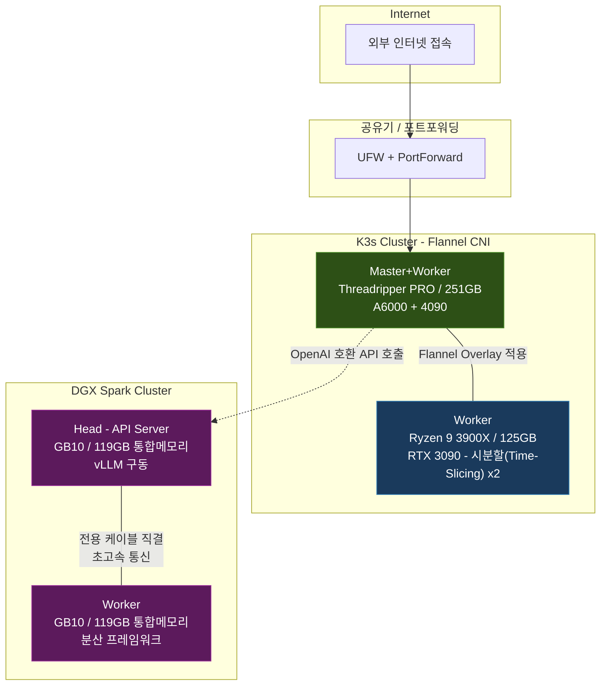

## 들어가며

실제 회사 업무에서 활용하는 기술들을 개인적으로 직접 구축하고 운영해 보기 위해 '홈랩' 환경을 구축했다. 안정적인 서버 운영을 도와주는 쿠버네티스(Kubernetes)[^k8s] 클러스터 운영, 인공지능 학습을 자동화하는 ML 파이프라인, 거대한 언어 모델(LLM)을 구동하는 서빙 등 실무에서 접하는 인프라를 가능한 한 똑같은 구조로 재현하는 것이 목적이다.

기존에 활용하던 서버에 신규 서버를 더하고, 운영체제(OS) 설치부터 네트워크망 구성, 클러스터 셋업, 서비스 배포까지 모든 과정을 직접 진행했다. 재직 중인 회사의 분석 시스템과 유사한 환경을 꾸미면서 기능 개발과 운영 경험을 간접적으로 학습하고 있다. 현재 총 4대의 서버가 두 개의 클러스터로 나뉘어 운영 중이며, 그 위에서 약 30여 개의 서비스가 돌아가고 있다.

이 글에서는 서버 하드웨어의 구성, 소프트웨어 기술을 선택한 이유, 그리고 전체 네트워크 형태(토폴로지)를 다루고, 이어지는 2편에서 각 서비스의 역할과 개발 배경을 소개한다.

---

## 하드웨어 구성

### 서버 목록

| 구분 | 역할 | CPU | RAM | GPU | 스토리지 |
|------|------|-----|-----|-----|----------|
| K3s Master + Worker | 시스템 제어(Control Plane)[^control_plane], 서비스 호스팅 | AMD Threadripper PRO 7965WX (24C/48T) | 251 GB | RTX A6000 48GB + RTX 4090 24GB | NVMe 5.2TB |
| K3s Worker | 인공지능 그래픽 카드(GPU) 작업 전담 | AMD Ryzen 9 3900X (12C/24T) | 125 GB | RTX 3090 24GB | NVMe 1.7TB + HDD 3.6TB |
| DGX Spark #1 (Head) | AI 언어모델 서버 (vLLM API) | ARM Cortex-X925/A725 (20C) | 119 GB | NVIDIA GB10 (Blackwell)[^blackwell] | NVMe 931GB |
| DGX Spark #2 (Worker) | AI 언어모델 분산 처리 노드 | ARM Cortex-X925/A725 (20C) | 119 GB | NVIDIA GB10 (Blackwell) | NVMe 916GB |

### K3s 클러스터

가장 핵심이 되는 Master 서버가 전체를 지휘하는 제어판 역할과 일반 일꾼(Worker) 역할을 겸한다. 이 서버에 대부분의 서비스 프로그램들이 배치되어 있다. 반면, 그래픽 카드 자원을 많이 사용하는 작업(마우스 클릭만으로 이미지를 생성하거나, 복잡한 데이터를 학습하는 작업)은 별도의 Worker 서버로 통계를 나눠서 처리한다.

Worker 서버에는 'GPU Time-Slicing'[^time_slicing] 이라는 기술을 적용했다. 이는 물리적인 RTX 3090 그래픽 카드 한 장을 가상의 그래픽 카드 2장으로 쪼개서 사용하는 방법이다. 이를 통해 일상적인 문장 분석(임베딩) 서비스와, 특정 시간에만 돌아가는 학습 작업을 한 대의 그래픽 카드에서 효율적으로 동시에 처리할 수 있다. 값비싼 부품을 새로 사지 않고도 두 가지 역할을 훌륭히 수행하도록 고안한 방식이다.

### DGX Spark 클러스터

NVIDIA DGX Spark는 인공지능 연구를 위한 개인용 워크스테이션이다. 최신 Blackwell 아키텍처 기반의 GB10 칩과 ARM 프로세서가 통합 메모리(UMA)[^uma] 구조로 묶여 있다. 일반적인 컴퓨터의 그래픽 카드처럼 별도의 전용 메모리(VRAM)가 존재하는 것이 아니라 메인 CPU와 그래픽 칩셋이 119GB에 달하는 거대한 메모리를 함께 공유한다. 따라서 이 워크스테이션 두 대를 연결하면 약 240GB의 메모리를 인공지능 모델을 띄우는 데 전부 활용할 수 있다.

이 정도 용량이면 압축 기술(AWQ 4-bit)을 곁들여 수천억 개의 파라미터를 가진 초거대 모델을 구동할 수 있다. 실제로 현재 거대한 모델들의 일부를 쪼개서 두 기계 양쪽에 절반씩 배치하는 방식(Tensor Parallel)으로 구동 중이다.

DGX Spark를 앞서 말한 K3s 공간에 편입시키지 않은 이유는 내부 두뇌 구조(ARM 대 x86)가 다르기 때문이다. 물리적으로 서로 다른 종류의 컴퓨터를 하나의 클러스터로 억지로 묶으면 오류 수정이나 네트워크 관리가 매우 복잡해지므로, DGX Spark는 순수하게 언어 모델 전용 서빙 공간으로 격리하고 외부에서 연결만 하도록 분리했다.

---

## 핵심 보안 및 네트워크 구성

### 제로 트러스트(Zero Trust) 기반 철통 보안망

예전 설정에서는 외부에서 내부 서비스로 접근할 때 공유기의 설정(포트포워딩)에 주로 의존했다. 쿠버네티스의 통신 구조적인 특성상 특정 트래픽이 리눅스의 기본 방화벽인 UFW의 대문을 우회하는 단점이 있었기 때문이다.

하지만 내부망이라도 해킹 시 큰 피해를 줄 수 있으므로, 최근에는 시스템 접근 권한과 방화벽 정책을 근본부터 뜯어고쳐 **사내망 수준의 극한의 철통 보안(Zero Trust)**을 구축했다. 

1. **비밀번호 로그인 완전 차단**: 모든 서버군(Master, Worker, 추가 운영 체제 포함)에서 전통적인 비밀번호 입력을 통한 관리자 접근(`PasswordAuthentication` 및 `PermitRootLogin`)을 원천적으로 막았다. 오직 미리 교환된 비밀 암호키 파일(SSH Key)을 소지한 기기에서만 접속이 허용된다.
2. **핵심 포트 전차단**: 시스템을 제어하는 핵심 통로(K3s 6443, Kubelet 10250)에 대해, 아무리 내부 망이라도 인가되지 않은 IP의 접근을 거부하도록(Drop) IP 단위 UFW 화이트리스트 규칙을 엄격하게 세웠다.

### 서비스 외부 노출 방식

웹에서 곧바로 서비스를 띄워주는 복잡한 매니저 도구(Ingress Controller)[^ingress] 대신, 쿠버네티스 기기의 특정 포트 번호를 지정하여 외부 통로를 만들어주는 직관적인 **NodePort**[^nodeport] 방식을 애용한다. 30000~32767 사이의 번호를 지정하는 고전적인 방식이지만 집 규모(홈랩)의 구성에서는 어디에 어떤 프로그램이 도는지 파악하기 편하다. 

### DGX Spark 내부 통신

DGX Spark 두 대는 빠른 대규모 데이터 전송을 위해 전용 케이블(QSFP)로 직결했다. 클러스터는 전용 내부망 주소를 통해 데이터를 주고받는데, 인공지능이 계산을 할 때 막대한 양의 정보가 이 망을 타고 두 그래픽 칩셋을 분주하게 오간다. 외부 API 요청은 온전히 Head 컴퓨터가 받아서 처리한다.

---

## 주요 소프트웨어 스택

### 왜 K3s인가

애초에는 가장 보편적이고 표준적인 쿠버네티스(kubeadm)를 고려했다. 하지만 개인 가정 환경에서 거대한 관리 프로그램을 모두 띄우면 관리가 무겁고 각종 추가 설치 부담이 상당하다. K3s[^k3s]는 이런 불필요한 무게를 덜어내어 설치가 아주 간단하고 시스템 자원도 상대적으로 적게 차지한다. 덩치는 작아졌지만 강력한 관리 기능(Flannel, Traefik 등)이 조립식으로 내장되어 있어 애용하게 되었다.

### 컨테이너 백화점 관리: Harbor

인터넷에서 프로그램을 내려받을 때 발생할 수 있는 속도 저하나 용량 제한 문제를 피하기 위해 자체적인 안전한 다운로드/보관소(레지스트리)를 운영한다. 이 역할을 Harbor가 수행하는데, 악성코드나 보안 취약점을 미리 스캔해주는 똑똑한 기능이 내장되어 있어 관리가 매우 수월하다.

### 자동화 배포: GitLab + Kaniko

소스 코드를 저장하고 자동으로 서버에 프로그램을 깔아주는 역할을 GitLab과 Kaniko가 담당한다.
Kaniko를 선택한 이유는 보안을 지키면서도 컨테이너 이미지를 편리하게 포장(빌드)할 수 있어서다. 쿠버네티스 생태계 안에서 위험할 수 있는 권한을 회피하면서도 개발과 배포를 완벽히 자동화했다. 코드 수정 사항을 승인만 하면 수 분 안에 빌드와 배포가 스스로 이루어진다.

### 예측 파이프라인: Kubeflow Pipelines v2

데이터를 모으고 가공해서 모델을 학습시키고 예측하는, 일련의 컨베이어 벨트 작업(워크플로우)을 스케줄대로 자동 실행한다. 범용 도구가 많지만 Kubeflow를 선택한 이유는 그래픽 카드 배정, 예약 등이 인공지능 모델 학습에 가장 특화되어 있었기 때문이다. 최근 최신 시스템인 v2로 안정적인 전환도 마친 상태다.

### 데이터베이스 저장소

- **PostgreSQL**: 주식, 환율 등 수집된 정보가 저장되는 창고이자 주요 웹 시스템의 데이터를 보관한다.
- **Teradata Vantage Express**: 업무에서 활용되는 상용 데이터베이스 환경을 로컬에 비슷하게 차려두고 쿼리와 모델 학습 기능을 비교 테스트하기 위해 운영한다. 
- **Elasticsearch 및 CouchDB**: 방대한 문서를 빠르게 검색하거나 지식을 바탕으로 AI가 질의응답을 돕는 데이터 창고로 활용한다.

### 초거대 AI 서빙: vLLM

vLLM[^vllm]을 도입한 이유는 여러 인공지능 소프트웨어들과 즉시 연동되는 마법의 열쇠(OpenAI 호환 API)를 제공하며, 거대한 칩셋 두 대를 병렬로 연결하여 초대형 모델들을 띄우기에 최적이기 때문이다. 한 번에 들어오는 여러 사용자의 요청을 엄청난 속도로 동시에 대응할 수 있다.

AI 에이전트들이 스스로 명령어를 내리고 논리적으로 사고할 수 있는 깊은 심도를 제공하도록 운영 중이다. 

### 모니터링: Prometheus + Grafana

Prometheus(프로메테우스)가 CPU, 메모리의 각종 수치들을 주기적으로 꼼꼼하게 측정하고, Grafana(그라파나)가 이를 웹 브라우저에서 보기 좋은 그래프로 그려낸다. 어떤 파이프라인이 그래픽 카드를 얼마나 가혹하게 쓰는지 대시보드에서 파악할 수 있다.

### 계정 통합: OpenLDAP + Keycloak

여러 서비스에 들어갈 때마다 회원가입을 하거나 비밀번호를 치기 불편하므로, 하나의 계정으로 모든 서비스에 로그인할 수 있도록 묶어주는 길목(SSO)[^sso] 시스템이다. 아이디 하나로 인프라 서비스 전체 여권을 발급해 주는 셈이다.

---

## 마무리

이 글에서는 홈랩의 하드웨어 구성과 그 하드웨어를 빈틈없이 움직이게 하는 대표적인 시스템 소프트웨어들과, 강력하게 고도화된 철통 네트워크 보안망 모델을 설명했다.

이어지는 2편에서는 이 기반 위에서 돌아가고 있는 아기자기한 실제 서비스들을 소개한다. 개발자를 돕는 대시보드 구조부터 인공지능 에이전트들의 허브까지 다채로운 도구들의 개발 배경을 이어나간다.

---

[^k8s]: **쿠버네티스(Kubernetes)**: 수많은 프로그램(컨테이너)을 죽지 않고 24시간 안전하게 돌아가도록 분산 관리해 주는 클라우드 오케스트레이터입니다.
[^control_plane]: **제어판(Control Plane)**: 클러스터의 두뇌 역할을 하며 모든 자원의 상태 파악과 지시를 내리는 코어 서버 부분입니다.
[^blackwell]: **Blackwell 아키텍처**: NVIDIA가 발표한 차세대 인공지능(AI) 반도체 구조로, 엄청난 연산 속도를 자랑합니다.
[^time_slicing]: **Time-Slicing**: 고가의 물리 그래픽 카드를 시간을 매우 잘게 쪼개어 가상으로 분할, 여러 프로그램이 동시에 쓸 수 있게 하는 기술입니다.
[^uma]: **통합 메모리(UMA)**: CPU와 GPU가 서로 메모리를 나눠 쓰지 않고 하나의 거대한 작업 공간을 공유하여 데이터 교환 속도를 극대화하는 방식입니다.
[^ingress]: **Ingress Controller**: 외부 사용자가 어떤 주소(URL)로 접속하든 맞는 프로그램으로 안전하게 길을 안내해 주는 고급 정문 관리자입니다.
[^nodeport]: **NodePort**: 정해진 특정 포트(예를 들어 30005)로 들어오는 요청을 특정 내부 서비스로 곧바로 이어 주는 전통적이고 직관적인 연결 방식입니다.
[^k3s]: **K3s**: 리소스를 적게 먹으면서도 필수 쿠버네티스 기능을 전부 수행하도록 경량화(다이어트)된 버전입니다.
[^vllm]: **vLLM**: 거대한 인공지능 두뇌 모델(LLM)을 빠르고 효율적으로 구동하여, 메모리를 절약하면서 동시에 대량 서비스해 주는 엔진입니다.
[^sso]: **단일 인증(SSO, Single Sign-On)**: 한 번 로그인하면 다른 플랫폼에 들어갈 때도 비밀번호를 칠 필요 없이 자동 탑승하게 해 주는 시스템입니다.
