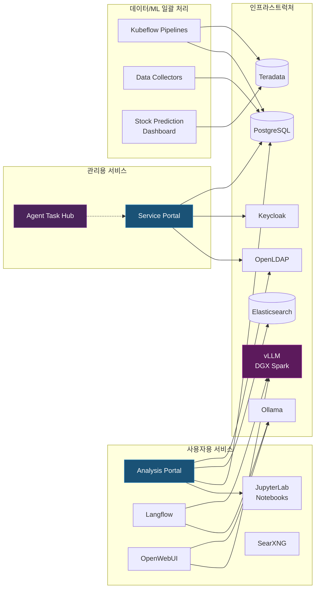

## 개요

[이전 글](/infrastructure/home-lab-architecture/)에서는 온프레미스 기반 홈랩 인프라의 하드웨어 토폴로지와 핵심 소프트웨어 계층(Control Plane 구성)을 살펴보았다. 본 글에서는 해당 오케스트레이션 구조 위에서 마이크로서비스 형태로 구동 중인 주요 애플리케이션 워크로드를 세부적으로 기술한다.

현재 운영 중인 서비스 워크로드는 다음과 같이 크게 3개의 계층으로 분류할 수 있다.

1. **사용자용 서비스**: 분석 포털, Jupyter 샌드박스, LLM 프론트엔드(UI) 등 클라이언트 접점(End-User) 애플리케이션이다.
2. **제어 영역(Control Plane) 서비스**: 컨테이너 헬스체크 모니터링 및 로컬 파이프라인 내 다중 AI 에이전트 워크플로우를 통제하는 관제 인프라다.
3. **데이터 수집 및 ML 파이프라인**: 스케줄러 기반 백그라운드 일괄(Batch) 데이터 배치 프로세스 및 모델 훈련/추론 자동화 오케스트레이션 파이프라인이다.

---

## 사용자용 서비스

### Analysis Portal (분석 포털)

Kubeflow[^kubeflow] 워크스페이스에 대한 엔드유저 접근성을 개선하기 위해 자체 개발한 프론트엔드 포털이다. 리소스 할당(CPU/RAM/GPU) 및 분석 컨테이너 이미지(기본, 데이터 사이언스, 고급 등) 프로비저닝 워크플로우를 통제한다. 

기본 Kubeflow 대시보드의 RBAC(Role-Based Access Control) 기능 제약으로 인해 독립적인 포털을 구축했다.

- **작업 환경 관리**: 인스턴스 라이프사이클(생성, 구동, 중지, 삭제) 관리 기능.
- **데이터베이스 연동**: 포털 유저 계정 발급 시 PostgreSQL의 Role을 동기화하여 UI 기반의 DB 접근 권한 제어 지원.
- **벡터 데이터베이스(Vector DB) 관리**: Elasticsearch, CouchDB 등 임베딩 데이터베이스 인스턴스 엑세스 권한 연동.
- **스토리지 마운트**: 사용자별 NFS 볼륨 Read-only 동적 마운트 할당 파이프라인 적용.
- **사용자 안내서 내장**: 시스템 FAQ 및 모듈 연동 가이드 탑재.

프론트엔드 계층은 HTMX[^htmx]를 도입하여 구축했다. 관리 시스템의 워크로드 특성상 복잡한 클라이언트 측 렌더링보다는 명시적인 상태 관리 및 경량 API 통신성에 중점을 두었다.

### JupyterLab 분석 샌드박스 

프로비저닝된 사용자 개별 샌드박스 컨테이너(JupyterLab[^jupyterlab]) 내부에는 다음 도구와 구성이 사전 세팅되어 있다.

- **Jupyternaut 연동**: 코드 생성 어시스턴트로 로컬 클러스터망의 Ollama Endpoint와 직접 연동되어 PII 등 데이터 외부 유출 리스크를 원천 차단한다.
- **임베딩(Embedding) 서버 연동**: 프로토타입 단계의 RAG 체인 파이프라인 구성을 위해 로컬 임베딩 모델 서버 Endpoint가 기본 등록되어 있다.
- **데이터베이스 프로비저닝**: 컨테이너 런타임에 주입된 환경변수를 통해 인가된 데이터 소스에만 제한적인 접근이 허용된다.
- **형상 관리 시스템(Git) 연동**: GitLab 리포지토리와 SSH Key 프로비저닝 없이 API 토큰 기반으로 인증되도록 구성되었다.

### Langflow

코드 레벨의 조작 없이 노드 기반 비주얼 에디터를 통해 LLM 파이프라인을 설계하는 Low-code 프레임워크다. PoC(Proof of Concept) 단계의 RAG[^rag] 체인 및 에이전트 구성을 신속하게 프로토타이핑한다. 인프라 클러스터 내부에 배포된 다수의 오픈소스 LLM 및 Vector DB Endpoint 설정이 사전 주입되어 있다.

### OpenWebUI

표준적인 멀티 모델 챗봇 프론트엔드다. DGX Spark 클러스터에서 할당되는 대규모 파라미터(Heavy-weight) 모델부터 Worker 노드의 소형 모델까지 vLLM API를 취합하여 단일 창구에서 성능을 테스트한다.

### SearXNG

셀프 호스팅 방식의 오픈소스 메타 검색 엔진이다. 내부망의 멀티 AI 에이전트들이 웹 검색 API를 호출할 시 외부 써드파티 검색 엔진의 쿼리 로깅을 우회하고 자체 크롤링 트래픽을 처리하는 프록시 역할을 담당한다.

### ComfyUI

Stable Diffusion 모델 기반의 이미지 생성 파이프라인을 노드 시퀀스로 제어하는 도구다. VRAM 점유 최적화를 위해 GPU Time-slicing이 적용된 Worker 노드에서 전용 컨테이너 격리 상태로 구동된다.

---

## 제어 영역(Control Plane) 서비스

### Service Portal (서비스 통합 포털)

현재 K3s 인프라 내부에는 30여 개 이상의 마이크로서비스가 프로비저닝되어 있다. 파편화된 컨테이너의 포트 할당 관리 및 헬스체크 프로세스를 통합 모니터링하기 위해 개발한 커스텀 컨트롤러 뷰어다.

- **실시간 상태 폴링**: 30초 주기로 워크로드 엔드포인트에 커스텀 Probe를 요청하여 응답 레이턴시 매트릭을 갱신한다.
- **프로세스 런타임 제어**: 권한이 인가된 세션에 한하여 타겟 컨테이너의 강제 재시작(Restart) 및 종료 작업을 UI상에서 트리거한다.
- **Endpoint 디스커버리**: K3s 클러스터에 배포되는 신규 워크로드의 메타데이터를 스캔하여 대시보드 리스트에 동적으로 로드한다.
- **시스템 토폴로지 매핑**: 아키텍처 상의 논리적 계층 구조를 시각화하여 관제 패널로 제공한다.
- **노드 리소스 매트릭 집계**: 개별 인스턴스의 프로세서 및 메모리 사용량 수치를 수집 및 집계한다.
- **Auto-healing 로직 적용**: 헬스체크 타임아웃 이벤트 발생 시 타겟 파드의 재시작을 트리거하며 연속 복구 실패 시에만 관리자 알림을 발송한다. 코어 인프라 제어 영역 파드는 트리거 대상에서 하드코딩으로 예외 처리되어 시스템 락아웃을 방지한다.

고빈도의 상태 데이터 갱신 처리를 위해 프론트엔드 계층은 React[^react]를 기반으로 구축했다. 분산된 AI 에이전트들이 인프라 상태를 참조할 경우 표준 MCP(Model Context Protocol) 통신 규약을 통해 해당 포털의 매트릭 메타데이터를 연동받도록 설계했다.

### Agent Task Hub (ATH)

멀티 AI 에이전트 간 컴퓨팅 자원 확보 경합, 역할 충돌, 코드 오염 등의 Race Condition을 제어하기 위해 자체 설계한 작업 관제(Orchestration) 시스템이다. (OpenClaw 등의 에이전트 모델의 Sandbox 제어 환경 내에서 워크플로우를 통제한다)

- **작업 Task 메타데이터 레지스트리**: 에이전트는 코드 런타임 진입 전, 반드시 ATH API를 통해 작업 목적 및 계획을 Task 메타데이터로 등록해야 한다. (Phase 6a 교차 검증)
- **지식 베이스(Knowledge Base) 풀**: 작업 런타임 중 발견된 시스템 설정, 에러 레퍼런스 및 해결 패턴을 SQLite 스토리지에 적재하여, 커뮤니케이션 오버헤드 없이 다른 에이전트 간의 컨텍스트 추론 성능을 향상시킨다.
- **동시성 파일 Lock 제어**: 소스 코드 등 동일 파일에 대한 병렬 I/O 경합을 방지하기 위해 분산 락 개념을 적용했다. (기본 TTL 5분)
- **포커스 메세징 브로드캐스트**: 현재 구동 중인 개별 에이전트의 포커스 지점 및 작업 경계를 인프라 전역 채널에 브로드캐스트하여 중복 연산을 차단한다.
- **통합 Audit 로깅**: 전체 에이전트 활동 이력 통제를 위한 단일 채널 로깅 인터페이스다.

데이터베이스는 SQLite(WAL Mode 적용)를 채택해 최소한의 I/O 지연으로 응답성을 보장했다. 클러스터 내 시스템 프롬프트(지침서) 단계에서 ATH 규약을 인젝션하여 에이전트의 런타임 제어권 이탈을 통제하고 있다.

### Log Analyzer (통합 로그 분석 컨트롤러)

분산된 마이크로서비스 파드에서 생성되는 로그 스트림을 수집하고 파싱하는 Streamlit 기반의 지능형 관제 환경이다. 단순 정적 로그 수집(Aggregation)을 넘어 아래의 지능적 RAG 기반 분석 시스템이 모듈화되어 있다.

- **원격 매트릭 및 병목 폴링**: Cron 데몬을 통해 5분 간격으로 대상 노드의 CPU Overload, Zombie 프로세스, 메모리 병목 현상을 폴링 수집한다.
- **PII(개인식별정보) 동적 마스킹**: 로그 데이터에 평문으로 존재할 수 있는 이메일, IP 주소 등의 PII를 정규식 및 모델을 통해 렌더링 전단에서 자동 마스킹 처리하여 보안 컴플라이언스를 유지한다.
- **RAG 기반 트러블슈팅 엔진**: 에러 스택트레이스 감지 시, 해당 텍스트를 임베딩 벡터를 통해 수치화한 뒤 내부 데이터베이스에 기 적재된 컴포넌트 장애 특화 문서(Knowledge)와 코사인 유사도를 계산하여 조치 가이드라인을 반환하는 RAG 워크플로우를 제공한다.

---

## 데이터 수집 및 ML 파이프라인

### 트레이딩 데이터 수집 배치 워커

Kubeflow Pipelines 등에 스케줄링되어 특정 트리거 조건에 맞춰 일괄(Batch) 수집 작업을 수행하는 워커 프로세스 목록이다.

| 수집 스크립트 | 타겟 레코드 | 주기 |
|--------|------|--------|
| KR Stock Collector | 국내 증시 시계열 데이터 (yfinance API) | 일배치 |
| US Stock Collector | 미국 증시 시계열 데이터 (yfinance API) | 일배치 |
| Exchange Rate Collector | 한국수출입은행 Open API 기반 환율 정보 | 일배치 |
| Index Collector | 글로벌 지수 및 변동성 지표(VIX 등) 수집 | 일배치 |
| Market Cap Collector | 상장사 시가총액 정보 스크래핑 | 일배치 |
| Stock Data Sync | PostgreSQL → Teradata 간 스키마 논리적 레플리케이션(Replication) | 일배치 |

원천(Raw) 데이터가 1차 스토리지인 PostgreSQL 인스턴스에 적재된 직후, Data Sync ETL 워크플로우가 트리거되어 이를 분석계 DW(Teradata)로 적재함으로써 예측 파이프라인의 연산 가용성을 확보한다.

### 가격 시계열 예측 ML 파이프라인

ML옵스(MLOps) 아키텍처 비교 검증 및 인프라 프로파일링 확보 타겟으로 설계된 시계열 예측 모형 파이프라인이다.

| 파이프라인 환경 | 쿼리 및 연산 계층 | 컴퓨팅 자원 |
|-----------|------------|--------|
| teradatasql-cpu | 애플리케이션 계층 스탠다드 SQL | 시스템 CPU |
| teradatasql-gpu | 애플리케이션 계층 스탠다드 SQL | GPU 병렬 가속 |
| teradataml-cpu | In-Database Analytic 함수 호출 | 시스템 CPU |
| teradataml-gpu | In-Database Analytic 함수 호출 | GPU 병렬 가속 |

해당 파이프라인은 직접적인 트레이딩 수익 창출보다는 데이터베이스 연산(In-Database) 아키텍처와 분리된 애플리케이션 계층 연산 간의 성능 프로파일링 지표 추출에 주목적이 있다. 네트워크 구간의 Data I/O 병목 및 GPU 스케줄링 간 메모리 오버헤드 측정 등 실측 아키텍처 검증 환경으로 워크로드를 할당하고 있다.

### Docling Extractor API

PDF, 바이너리 문서 포맷 등을 입력받아 OCR(광학 문자 인식) 파이프라인 및 레이아웃 파싱 알고리즘을 거쳐 구조화된 마크다운/JSON 포맷으로 반환하는 마이크로 API 컨트롤러다. 지식 베이스 구축 인제스천(Ingestion) 단계의 전처리기를 담당한다.

### Teradata Vector 검색 PoC

Teradata Native Vector 쿼리 활용성을 검증하는 PoC(Proof of Concept) 서비스 애플리케이션이다. VLM/LLM을 통한 텍스트 임베딩 모델 연동, 유클리디안 거리 및 코사인 유사도 검색 연산을 애플리케이션 단에서 오케스트레이션하는 UI 인터페이스로 운용하고 있다.

---

## 서비스 간 연결 관계

---

## 마무리

향후 시스템 아키텍처 레벨에서의 추가 연동 및 고도화 파이프라인 마일스톤은 다음과 같다.

- **단일 인증 프로토콜(Keycloak SSO) 전면 통합**: OIDC 토큰 기반 인증 통합 작업을 통해, 파편화된 서비스 인증 레이어를 중앙 제어 SSO 프로세스로 마이그레이션 적용 중이다.
- **GitLab CI/CD 모노레포(Monorepo) 커버리지 확대**: 리포지토리 커밋 이벤트 트리거와 무중단 롤아웃이 연동되는 파이프라인 구조를 K3s 마이크로서비스 전역으로 커버리지 확충하는 과정에 있다.
- **Agent Chat Hub 인터페이스 고도화**: Discord, Telegram 등 외부 채널 봇 인그레스(Ingress) 이벤트를 웹소켓 기반 자체 프론트엔드 채널로 통합하는 커스텀 서버 릴리즈가 진행 중이다.

이후 연재 포스트에서는 개별 마이크로서비스 및 파이프라인 배포 시 직면했던 장애 트러블슈팅 내역과, 아키텍처적 Trade-off 의사 결정 과정을 세부적으로 다룰 예정이다.

---

[^kubeflow]: 컨테이너 기반 머신러닝 시스템(MLOps) 컴포넌트를 배포하고 파이프라인 워크플로우를 스케줄링/관리할 수 있도록 돕는 클라우드 네이티브 오픈소스 플랫폼이다.
[^htmx]: 별도의 프론트엔드 자바스크립트 프레임워크 스택 없이도 HTML 속성을 통해 명시적인 AJAX 통신 및 상태 전환 렌더링을 구현할 수 있도록 지원하는 경량 툴이다.
[^jupyterlab]: 데이터 사이언스 분석 컴퓨팅을 위해 셀 단위 런타임 코드 실행 및 시각화 피드백을 제공하는 대화형 개발 환경(IDE)이다.
[^rag]: 검색 증강 생성(Retrieval-Augmented Generation). LLM의 할루시네이션(환각)을 제어하기 위해 텍스트 인제스천 단계에서 내부 데이터베이스 지식을 먼저 검색 및 컨텍스트화하여 프롬프트에 제공하는 아키텍처 체계다.
[^react]: Virtual DOM 아키텍처를 기반으로 단방향 상태 렌더링 및 UI 컴포넌트 라이프사이클을 효율적으로 관리하기 위해 고안된 프론트엔드 자바스크립트 라이브러리다.
