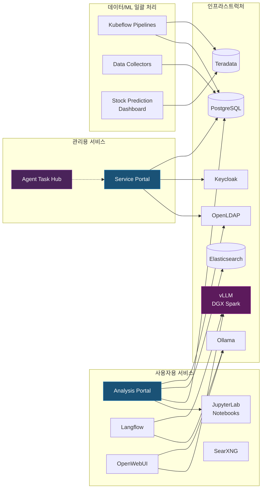

## 개요

[이전 글](/infrastructure/home-lab-architecture/)에서는 집에서 구축한 소규모 데이터센터(홈랩)의 하드웨어와 전반적인 소프트웨어 구성을 살펴보았습니다. 이번 글에서는 그 인프라 구조 위에서 실제로 구동하고 있는 여러 서비스들을 소개하려 합니다.

운영 중인 서비스는 크게 세 가지로 나눌 수 있습니다.

1. **사용자용 서비스**: 데이터 분석 환경이나 인공지능(AI) 도구 등 일반 사용자가 직접 접속하여 사용하는 서비스입니다.
2. **관리용 서비스**: 전체 시스템의 상태를 모니터링하거나 내부에서 동작하는 AI 프로그램(에이전트)들의 작업을 조율하는 등 시스템 운영을 목적으로 하는 서비스입니다.
3. **데이터 수집 및 ML 워크플로우**: 사용자가 보지 않는 이면(백그라운드)에서 매일 주식 등 데이터를 모으고, 기계학습 모델의 학습을 진행하는 자동화된 서비스들입니다.

---

## 사용자용 서비스

### Analysis Portal (분석 포털)

Kubeflow[^kubeflow]를 시각적으로 쉽게 사용할 수 있도록 만든 맞춤형 웹 화면(포털)입니다. 사용자가 직접 서버 사양(CPU/메모리/그래픽 카드)과 필요한 분석 프로그램 환경(기본형, 데이터 과학용, 고급형)을 선택해 요청하면, 관리자가 이를 승인하여 즉시 나만의 구획된 분석 환경을 만들어주는 구조입니다.

기본 Kubeflow 화면만으로는 사용자별 접근 권한이나 사용 가능한 자원을 세밀하게 통제하기 어려워 별도로 개발하게 되었습니다. 주요 기능은 다음과 같습니다.

- **작업 환경 관리**: 새로운 분석 공간 생성 요청부터 승인, 실행, 중지, 그리고 삭제까지 모든 단계를 관리합니다.
- **데이터베이스 연동**: 사용자를 새롭게 등록하면, 내부 데이터베이스(PostgreSQL)에도 해당 사용자의 계정이 자동으로 만들어집니다. 화면에서 데이터베이스 접근 권한을 클릭 한 번으로 배분할 수 있으며, 전체 사용자의 권한 상태를 한눈에 볼 수도 있습니다.
- **벡터 데이터베이스(Vector DB) 관리**: 텍스트 정보를 수치화하여 보관하는 데이터베이스(Elasticsearch, CouchDB)의 사용자 관리와 권한 부여도 연동해 두었습니다.
- **공유 폴더 제공**: 관리자가 자료를 올리면 사용자는 읽기만 가능한 네트워크 공유 폴더(NFS)를 제공하여 자료 배포가 쉽도록 구성했습니다.
- **사용자 안내서 내장**: 시스템 사용법, 데이터베이스 연동법, 자주 묻는 질문(FAQ) 등을 화면 내에서 바로 넘겨보며 확인할 수 있습니다.

이 포털은 HTMX[^htmx]라는 기술을 사용하여 만들었습니다. 관리 화면의 특성상 복잡한 화면 전환이나 연출보다는 서버와의 명확하고 안정적인 데이터 통신이 더 중요하다고 보았기 때문입니다.

### JupyterLab 노트북 환경

분석 포털에서 승인받아 만들어진 개인 분석 환경(JupyterLab[^jupyterlab])에는 유용한 도구들이 미리 세팅되어 있습니다.

- **Jupyternaut (주피터너트)**: 분석 창 옆에서 코드를 작성해주는 AI 도우미입니다. 한국어를 잘 이해하는 모델로 설정해 두었으며, 외부 인터넷이 아닌 홈랩 내부망의 AI 서버(Ollama)에 바로 연결됩니다.
- **임베딩(Embedding) 서버 연동**: 문서 내용을 검색하기 위해 수치 데이터로 변환하는 전용 서버가 기본으로 연결되어 있어 즉각적인 문서 검색 기능을 만들 수 있습니다.
- **공용 데이터베이스 접속**: 관리자가 포털에서 허락한 데이터베이스(예: 주식 데이터 등)에 바로 접속할 수 있습니다.
- **버전 관리 시스템(Git) 연동**: 작업한 코드를 안전하게 백업할 수 있도록 사내 코드 저장소 플랫폼(GitLab)에 별도의 암호 입력 없이 연동되게 구성했습니다.

### Langflow

코드(프로그래밍 언어)를 복잡하게 짜지 않고도 블록을 조립하듯 AI의 작업 순서를 설계할 수 있는 로우코드(Low-code) 도구입니다. 코딩 방식의 거대 언어 모델(LLM) 활용에 익숙하지 않은 사람도 시각적인 화면에서 쉽게 나만의 AI 검색 문서 시스템(RAG[^rag])을 테스트해 볼 수 있습니다.

내부망 전용 서비스로 별도의 로그인 과정 없이 바로 쓸 수 있도록 개방해 두었습니다. 제가 구축한 여러 대형/소형 인공지능 모델과 벡터 데이터베이스들이 기본적으로 쉽게 연결될 수 있게 사전 설정 작업을 마쳐두었습니다.

### OpenWebUI

ChatGPT와 거의 똑같이 생긴 대화형 웹 인터페이스입니다. 홈랩의 강력한 대형 장비(DGX Spark)에서 돌아가는 거대한 인공지능이나, 가벼운 서버에서 띄워진 소형 인공지능 모두 이 하나의 창에서 골라 대화할 수 있습니다. 밖에서도 접속하여 사용할 수 있도록 통로를 열어두었습니다.

### SearXNG

여러 주요 검색 엔진(구글, 빙 등)의 검색 결과를 한 번에 모아서 보여주지만, 개인이 무엇을 검색했는지 회사들이 추적할 수 없게 차단하는 사생활 보호(프라이버시) 메타 검색 엔진입니다. 집에서 일하는 여러 AI 프로그램들이 필요한 정보를 스스로 검색할 때, 외부 API 요청에 의존하지 않고 사용할 수 있게 하려고 구축했습니다.

### ComfyUI

거대한 인공지능 이미지 생성기(Stable Diffusion)를 시각적인 노드(선과 점 형태)로 복잡하게 조작할 수 있는 전문가용 이미지 도구입니다. 그래픽 카드가 여러 장 설치된 작업전용 서버에서만 돌아갑니다.

---

## 관리용 서비스

### Service Portal (서비스 포털)

현재 홈랩 내부에 28개 이상의 크고 작은 서비스가 흩어져서 돌아가고 있습니다. 서비스 개수가 많아지다 보니 "어떤 서비스가 몇 번 포트에서 동작 중이지?", "지금 죽어있는 건 없나?"를 매번 터미널을 열어 확인하기 힘들어서 만든 통합 지휘소(대시보드)입니다.

- **실시간 건강 검진**: 매 30초마다 모든 서비스에 신호를 보내 제대로 켜져 있는지와 응답 속도를 검사합니다.
- **버튼식 원격 제어**: 관리자가 접속하여 버튼 하나로 클릭하면 곧바로 서비스를 강제 재시작하거나 중단할 수 있습니다.
- **시스템 자동 발견**: 쿠버네티스 위에 새롭게 띄워진 프로그램이 있으면 이를 스스로 감지하고 버튼 한 번에 관리 목록으로 들여옵니다.
- **연결망 지도 구현**: 어느 서비스가 데이터베이스인지, 어느 것이 모니터링 도구인지 레이어(계층) 형식의 지도로 28개 서비스 전체 상황판을 그려냅니다.
- **자원 사용량 요약표**: 데이터센터 전체 서버들 각각의 CPU와 메모리 사용 현황 정보를 한곳에 모아 보여줍니다.
- **자동 복구 시스템**: 만약 30초 검사에서 서비스가 죽은 것으로 판명 나면 자동으로 다시 켜지도록(재시작) 명령을 내리며, 복구에 실패하면 저에게 알림을 보냅니다. 주요 인프라 서비스들은 이 자동 명령을 받지 않도록 예외 처리되어 안전을 더했습니다.

이 화면은 사용자의 동작에 실시간으로, 매끄럽게 수많은 데이터 지표가 바뀌어야 하므로 React[^react]라는 기술을 사용해 화면의 변화를 민감하게 반응하도록 구성했습니다. 또한 여러 AI 에이전트들이 스스로 서비스가 잘 돌아가는지 파악할 때 사용하는 표준 통신(MCP)도 이 포털을 통해 지원합니다.

### Agent Task Hub (ATH)

제가 집에서 만든 여러 인공지능 코딩 도우미 프로그램(에이전트)들이 서로 싸우지 않고 함께 일할 수 있게 만드는 일종의 '중앙 업무 관제탑'입니다.

동시에 여러 AI에게 일을 시켰더니 같은 코드를 동시에 고쳐버리거나 서너 번 같은 삽질을 반복하는 비효율적인 문제가 일어났습니다. 그래서 시스템 내규(Agent Task Hub)를 도입했습니다.

- **작업 계획 보고서 작성**: 에이전트는 무언가 고치기 전에 반드시 자신이 하려는 일의 제목과 내용을 중앙에 신고(등록)해야 합니다.
- **학습 내용 공유 게시판**: 개발 과정에서 서버 설정 방법이나 오류 해결법을 깨달으면 게시판(지식 베이스)에 저장해 다른 AI와 기억을 공유합니다.
- **작업 파일 자물쇠(Lock)**: 파일을 뜯어고칠 때는 먼저 이 파일에 이름표를 붙여 다른 AI가 동시에 건드리지 못하게 원천 차단합니다. 5분이 지나면 이름표는 자동으로 떨어집니다.
- **포커스 관리**: 현재 각 에이전트가 어떤 작업에 집중하고 있는지 서로에게 알립니다.
- **통합 상황판 (대시보드)**: 모든 에이전트의 현재 목표, 해결한 문제, 활동 로그를 사람이 한눈에 넘겨볼 수 있는 웹 화면을 제공합니다.

가볍게 만들기 위해 파일 형식의 데이터베이스(SQLite)를 연결하여 구축했습니다. 시스템 곳곳에 에이전트용 규율(가이드라인) 파일을 뿌려두어, 모든 에이전트가 반드시 작업 전에 보고하도록 통제하고 있습니다.

### 로그 분석기 (Log Analyzer)

모든 장비들이 뱉어내는 텍스트 로그 기록들을 한데 모아 에러의 징후를 보여주는 전용 상황 화면(Streamlit 기반)입니다. 단순히 로그를 모으고 보여주는 데 그치지 않고, 다음과 같은 지능형 분석 기능이 탑재되어 있습니다.

- **시스템 헬스 자동 수집**: 5분 단위로 전체 시스템의 CPU, 프로세스 상태, 메모리 과다 사용 현상 등을 기록합니다.
- **개인정보 침해 방지(PII 마스킹)**: 로그에 이메일, IP 주소, 비밀번호 등 민감 정보가 남게 되는 경우 자동으로 이를 찾아내 마스크(별표 등) 처리한 뒤에만 화면에 보여주어 데이터 보안을 지킵니다.
- **과거 해결책 인공지능(RAG) 매칭**: 이 시스템에 이전에 해결했던 오류 수리법을 저장해 두고 있다가, 에러가 터지면 수많은 로그 텍스트를 인공지능적 수치(Vector)로 환산시켜 찾아냅니다. 오류와 해결책이 가장 흡사한 내용 순으로 추천(RAG 검색)하여 관리자에게 알려줍니다.

---

## 데이터 수집기 및 ML 파이프라인

### 주식 데이터 수집기

컴퓨터가 알아서 정해진 시간에 켜져 매일 반복해서 일을 끝내고 휴면 상태로 돌아가는 자동 수집기 목록입니다.

| 수집 기계 | 수집 대상 | 실행 주기 |
|--------|------|--------|
| KR Stock Collector | 한국 주식 가격 데이터 (yfinance 이용) | 매일 |
| US Stock Collector | 미국 주식 가격 데이터 (yfinance 이용) | 매일 |
| Exchange Rate Collector | 한국수출입은행 환율 정보 | 매일 |
| Index Collector | 글로벌 공포 지수 (VIX) 등 세계 지표 | 매일 |
| Market Cap Collector | 미국 주요 기업 총가치(시가총액) 기록 | 매일 |
| Stock Data Sync | 1차 저장소(PostgreSQL) -> 2차 빅데이터 플랫폼(Teradata) 동기화 | 매일 |

모인 데이터는 우선 기본 데이터베이스(PostgreSQL)에 적재되고, 그다음 자동화된 프로그램(Stock Data Sync)이 이를 통째로 떠서 분석 특화 시스템(Teradata)으로 보내 분석을 준비하게 됩니다.

### Stock Prediction (주가 예측) 기계학습 파이프라인

어떤 방식이 인공지능 학습 체계(ML 파이프라인) 운영에 가장 효율적인지 알아보기 위해 매일 돌려보는 4가지 방식의 주가 예측 프로그램입니다. 

| 파이프라인 | 데이터베이스 연결 방식 | 계산에 사용되는 장치 |
|-----------|------------|--------|
| teradatasql-cpu | 고전적인 텍스트 명령(SQL) 방식 | 중앙 처리 장치 (CPU) |
| teradatasql-gpu | 고전적인 텍스트 명령(SQL) 방식 | 그래픽 카드 가속 (GPU) |
| teradataml-cpu | 데이터베이스 내부에서의 즉각적인 처리 방식 | 중앙 처리 장치 (CPU) |
| teradataml-gpu | 데이터베이스 내부에서의 즉각적인 처리 방식 | 그래픽 카드 가속 (GPU) |

이들의 목적은 놀랍게도 정확한 주가를 맞히는 것이 아닙니다. 구식 데이터베이스 쿼리 방식과 신식 데이터베이스 내부 연산 방식 간의 성능 차이, 그리고 연산에 CPU와 GPU를 쓸 때의 시간 차이가 어마어마하다는 것을 실전 데이터를 통해 테스트하는 연구 목적이 더 큽니다. 상세한 테스트 기록은 향후 다른 글로 찾아뵙겠습니다.

### Docling Extractor API

휴대폰 창 등에서 사진이나 스캔된 PDF 문서 등을 던져주면 글씨(텍스트)만 깔끔하게 빼내 주는(OCR 기술 기반) 가벼운 연동 프로그램(API)입니다. 

### Teradata Vector PoC

최근 유행인 인공지능 문서 검색(벡터 검색) 엔진을 시험해 볼 수 있게 테스트용으로 만든 임시 화면입니다. 문서를 업로드해 인공지능 데이터베이스로 넣고, 유사한 문장을 검색해 결과가 나오는 걸 보여주는 기술 과시용 시제품 성격이 강합니다.

---

## 서비스 간 연결 관계

---

## 마무리

아직 인프라 시스템 구축은 끝이 아니며 당장 진행하려는 작업들이 꽤 쌓여있습니다.

- **단일 로그인 서비스(Keycloak SSO) 전면 통합**: 모니터링, 관리 포털 등 사내의 수많은 도구마다 아이디를 별도로 치는 귀찮음을 없애고, 한 번 로그인하면 모두 뚫고 들어갈 수 있게 만드는 작업 한창입니다.
- **GitLab 자동화 체계(CI/CD) 모노레포 확대**: 소스 코드를 올리면 알아서 서버에 변경된 화면이 배포되는 체계를 다른 서비스 전체로 연쇄 적용할 계획입니다.
- **Agent Chat Hub**: 검은 터미널 창 대신 손쉽게 인공지능 에이전트와 웹에서 채팅하는 전용 통합 포털을 만들고 있습니다.

다음 시리즈부터는 개별 프로젝트들에서 제가 만났던 기술적 벽과 성취를 하나하나 떼어서 깊게 적어볼 예정입니다.

---

[^kubeflow]: 머신러닝 시스템을 구축하고 배포하는 작업을 자동화하고 쉽게 관리할 수 있도록 구글에서 주도하여 만든 오픈소스 플랫폼입니다.
[^htmx]: 자바스크립트를 최소한으로 쓰면서도, HTML 문서 안에 직접 명령어 코드를 넣어 서버와 데이터를 빠르고 쉽게 통신할 수 있게 돕는 최신 웹 도구입니다.
[^jupyterlab]: 데이터를 분석하거나 코딩할 때 노트 필기하듯 코드를 짜고 즉시 결과를 옆에서 확인할 수 있는 데이터 분석에 최적화된 웹 기반 개발 도구입니다.
[^rag]: 검색 증강 생성(Retrieval-Augmented Generation)의 줄임말로, 거대 인공지능 모델이 사용자에게 대답하기 전에 회사별 내부 데이터베이스나 문서 파일을 미리 한 번 더 읽어보고 대답하게 해서 답변의 신뢰성을 극대화시키는 인공지능 검색법입니다.
[^react]: 아주 복잡한 웹 대시보드 환경에서 수많은 정보를 새로 고침 없이 실시간으로 부드럽게 화면의 일부분만 바꿔 그릴 수 있도록 메타(페이스북)에서 만든 화면 그리기 라이브러리입니다.
