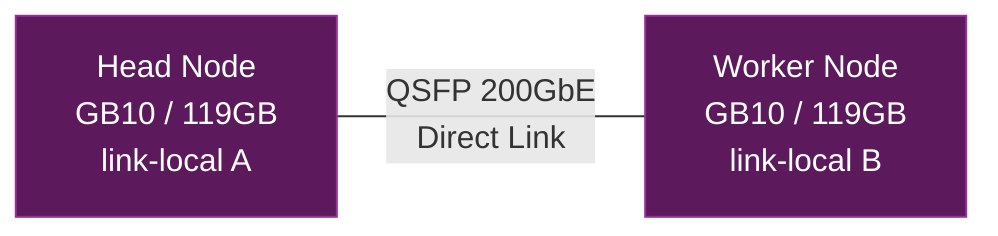

## 왜 DGX Spark인가

200B 이상 규모의 LLM을 로컬에서 서빙하려면 대용량 메모리가 필수다. AWQ 4-bit로 양자화하더라도 200B급 MoE 모델은 100GB 이상의 가중치를 적재해야 한다.

일반적인 방법은 VRAM이 큰 GPU를 여러 장 꽂는 것인데, A100 80GB 4장이면 320GB, H100 80GB 4장이면 320GB. 하지만 홈랩에서 이런 구성은 전력, 냉각, 비용 면에서 현실적이지 않다.

DGX Spark는 다른 접근법을 제공한다. Blackwell 아키텍처 기반 GB10 GPU가 ARM CPU와 **통합 메모리 아키텍처(UMA)**를 사용한다. 일반 GPU처럼 별도의 VRAM이 있는 것이 아니라, CPU와 GPU가 119GB의 시스템 메모리를 공유한다. 두 대를 묶으면 약 240GB의 메모리 풀을 GPU 연산에 활용할 수 있다.

이 글에서는 DGX Spark 두 대로 vLLM 분산 추론 클러스터를 구축한 과정을 정리한다.

---

## 하드웨어 이해

### 스펙

두 대 모두 동일한 사양이다:

| 항목 | 사양 |
|------|------|
| GPU | NVIDIA GB10 (Blackwell) |
| CPU | ARM Cortex-X925 (10C, 4.0GHz) + Cortex-A725 (10C, 2.86GHz) |
| RAM | 119 GiB (UMA, CPU/GPU 공유) |
| 스토리지 | 916GB NVMe |
| OS | Ubuntu 24.04.3 LTS, aarch64 |
| CUDA | 13.0 |
| 드라이버 | 580.x |

### UMA의 의미

일반 GPU 서버에서는 `nvidia-smi`로 GPU VRAM 사용량을 확인할 수 있다. DGX Spark에서는 `Memory-Usage: Not Supported`가 정상이다. GPU 전용 메모리가 없기 때문이다. 이것은 NVIDIA 공식 Known Issues에도 명시되어 있다.

UMA는 장단점이 있다:
- **장점**: 시스템 메모리 전체를 모델 로딩에 사용할 수 있어 스펙 대비 큰 모델을 올릴 수 있다
- **단점**: GPU와 CPU가 메모리 대역폭을 공유하므로, 전용 HBM을 가진 데이터센터 GPU에 비해 처리량(throughput)이 제한된다

실측 기준으로 200B급 MoE 모델에서 12~16 tokens/sec 정도의 생성 속도를 보인다. 대화형 사용에는 충분하지만, 대량의 배치 추론에는 적합하지 않다.

### C2C 모드

DGX Spark의 GB10 GPU에는 **C2C(Chip-to-Chip)** 모드가 활성화되어 있다. 이는 GPU와 CPU 간의 캐시 일관성(cache coherence)을 유지하는 모드로, UMA 환경에서 GPU가 시스템 메모리에 효율적으로 접근하는 데 필수적이다.

---

## 네트워크 구성

두 대를 클러스터로 묶으려면 노드 간 고속 통신이 필요하다. DGX Spark에는 QSFP 포트가 내장되어 있어 직접 케이블을 연결하면 된다.

### QSFP 다이렉트 연결

두 대를 QSFP 케이블로 직접 연결하고, link-local 주소를 할당했다. 별도의 스위치 없이 포인트 투 포인트로 연결하는 구조다.



### MTU 최적화

기본 MTU(1500)로도 동작하지만, 대형 텐서를 노드 간에 전송할 때 성능을 위해 Jumbo Frame(MTU 9000)을 설정했다:

```bash
sudo ip link set enp1s0f1np1 mtu 9000
```

이 설정은 재부팅 시 초기화되므로, netplan이나 systemd-networkd 설정에 영구화하는 것이 좋다.

### SSH 키 교환

vLLM은 Ray를 분산 백엔드로 사용하는데, Ray가 노드 간 통신을 할 때 QSFP 인터페이스의 link-local 주소를 사용한다. 이를 위해 양방향 SSH 키 교환이 필요하다.

---

## Docker 이미지 빌드

DGX Spark는 aarch64(ARM) 아키텍처이고 CUDA 13.0을 사용한다. 공식 vLLM Docker 이미지는 x86_64 + CUDA 12.x 기반이라 그대로 사용할 수 없다.

### spark-vllm-docker

커뮤니티에서 DGX Spark 전용 vLLM Docker 이미지를 빌드할 수 있는 프로젝트([spark-vllm-docker](https://github.com/eugr/spark-vllm-docker))를 사용했다. 이 프로젝트는 DGX Spark의 NGC 베이스 이미지 위에 vLLM을 빌드하는 스크립트를 제공한다.

빌드 과정:

```bash
git clone https://github.com/eugr/spark-vllm-docker.git
cd spark-vllm-docker
./build-and-copy.sh --use-wheels -c
```

- `--use-wheels`: 미리 빌드된 wheel 파일을 사용하여 빌드 시간 단축
- `-c`: Worker 노드로 이미지 자동 복사
- 빌드 시간: 약 30~50분
- 이미지 크기: 약 22GB

빌드가 실패하면 `--use-wheels` 플래그를 제거하고 소스에서 직접 빌드할 수 있지만, 시간이 훨씬 오래 걸린다.

---

## 모델 다운로드

### 용량과 대역폭

AWQ 4-bit 양자화된 200B급 모델은 약 100~120GB다. HuggingFace에서 다운로드한 후 Worker 노드로 복사해야 하므로, 전체 과정에서 약 240GB의 데이터 이동이 발생한다.

QSFP 링크를 통해 노드 간 복사하면 로컬 네트워크보다 빠르다. `rsync`로 QSFP link-local 주소를 사용하여 동기화한다.

### HuggingFace Hub 활용

```bash
# Head 노드에서 모델 다운로드
./hf-download.sh <model-id> -c <worker-link-local-ip> --copy-parallel
```

`--copy-parallel` 옵션은 다운로드와 Worker 노드로의 복사를 병렬로 진행하여 전체 시간을 단축한다.

### SafetensorError 트러블슈팅

모델 다운로드 중 네트워크 불안정으로 파일이 손상되면 다음과 같은 에러가 발생한다:

```
safetensors_rust.SafetensorError: invalid JSON in header: EOF while parsing a value
```

해결 과정:
1. **손상 파일 식별**: Python 스크립트로 각 `.safetensors` 파일을 열어 유효성 검사
2. **손상된 blob 삭제**: HuggingFace 캐시의 blobs 디렉토리에서 해당 파일 삭제
3. **재다운로드**: `hf download` 명령으로 누락된 파일만 다시 다운로드
4. **Worker 동기화**: QSFP를 통해 수정된 파일을 Worker로 rsync

이 과정에서 Worker 노드가 심볼릭 링크 대신 실제 파일로 저장하는 경우가 있어, 파일 삭제 후 심볼릭 링크를 재생성해야 하는 상황도 있었다.

---

## 클러스터 시작

### Docker 컨테이너 구조

양쪽 노드에서 `vllm_node`라는 이름의 Docker 컨테이너가 실행된다:

- **Head 노드**: `--role head`로 Ray Head 프로세스를 시작하고, 이 위에서 vLLM serve를 실행
- **Worker 노드**: `--role worker`로 Ray Worker 프로세스를 시작하여 Head에 연결

```bash
# Head 노드: 컨테이너 생성
docker run -d --name vllm_node --network host --ipc host --gpus all \
  --restart unless-stopped \
  -v ~/.cache/huggingface:/root/.cache/huggingface \
  vllm-node:latest \
  ./run-cluster-node.sh --role head --host-ip <head-link-local> \
  --eth-if enp1s0f1np1 --ib-if rocep1s0f1,roceP2p1s0f1
```

`--network host`는 컨테이너가 호스트 네트워크를 그대로 사용하게 하여 QSFP link-local 통신을 가능하게 한다. `--ipc host`는 공유 메모리 접근을 허용하여 Ray의 object store 성능을 보장한다.

### vLLM Serve 실행

컨테이너가 준비되면 Head 노드에서 vLLM serve를 실행한다:

```bash
docker exec -d vllm_node bash -c 'VLLM_HOST_IP=<head-link-local> \
  vllm serve <model-id> \
  --port 8000 --host 0.0.0.0 \
  --gpu-memory-utilization 0.90 \
  -tp 2 \
  --distributed-executor-backend ray \
  --max-model-len 196608 \
  --trust-remote-code \
  --attention-backend flashinfer'
```

핵심 파라미터:

| 파라미터 | 값 | 의미 |
|----------|-----|------|
| `-tp 2` | 2 | Tensor Parallel -- 모델을 GPU 2개에 분할 |
| `--gpu-memory-utilization` | 0.90 | GPU 메모리의 90%를 KV 캐시에 할당 |
| `--max-model-len` | 196608 | 최대 컨텍스트 길이 (192K tokens) |
| `--distributed-executor-backend ray` | - | Ray로 분산 실행 |
| `--attention-backend flashinfer` | - | FlashInfer attention 커널 사용 |

`VLLM_HOST_IP` 환경변수는 vLLM이 Ray 클러스터와 통신할 때 사용할 IP를 지정한다. 이것이 QSFP의 link-local 주소를 가리켜야 노드 간 텐서 전송이 QSFP를 통해 이루어진다.

### 시작 시간

모델 로딩부터 서빙 준비까지 약 3~5분이 소요된다. `curl /health` 또는 `curl /v1/models`로 정상 시작을 확인할 수 있다.

---

## 재부팅 후 복구

DGX Spark는 시스템 업데이트 시 Docker 컨테이너가 삭제될 수 있다. `--restart unless-stopped`를 설정해도 보장되지 않기 때문에, 재부팅 후 복구 절차를 문서화해두는 것이 중요하다.

복구 순서:
1. Head 노드에서 `vllm_node` 컨테이너 재생성 (head 역할)
2. Worker 노드에서 `vllm_node` 컨테이너 재시작
3. Head 노드에서 vLLM serve 실행
4. 약 3분 대기 후 API 헬스체크

이 절차를 셸 스크립트로 만들어 관리하고 있다.

---

## 마무리

이 글에서는 DGX Spark의 하드웨어 특성을 이해하고, 2노드 분산 클러스터를 구축하는 과정을 다뤘다.

다음 글에서는 이 클러스터 위에서 실제로 어떤 모델들을 서빙했는지, 모델 전환 과정에서 겪은 문제들, llama.cpp와 SGLang 등 대안 런타임을 시도한 경험, 그리고 tool calling과 reasoning 설정까지의 운영 이야기를 정리한다.
