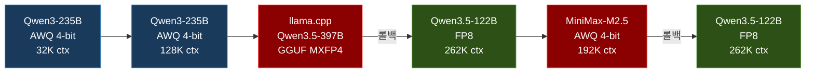

## 개요

[이전 글](/infrastructure/llm-serving-cluster/)에서 DGX Spark 2노드 클러스터 구축 과정을 다뤘다. 이 글에서는 그 클러스터 위에서 어떤 모델들을 서빙했고, 왜 바꿨고, 어떤 문제를 만났는지를 정리한다.

결론을 먼저 말하면, 현재는 **Qwen3.5-122B-A10B-FP8**을 **262K 컨텍스트**로 서빙하고 있다. 여기까지 오는 데 6단계의 모델 전환이 있었다. 가장 최근의 전환은 MiniMax-M2.5에서의 롤백이다.

---

## 모델 전환 타임라인



---

## 1단계: Qwen3-235B AWQ -- 첫 배치 (32K)

클러스터를 구축하고 처음 올린 모델은 `AIDXteam/Qwen3-235B-A22B-Instruct-2507-AWQ`다. AWQ 4-bit 양자화된 235B MoE(실제 활성 22B) 모델이다.

초기에는 `--max-model-len 32768`로 보수적으로 시작했다. DGX Spark 환경에서 대형 모델이 안정적으로 동작하는지 확인하는 것이 먼저였다.

주요 설정:
- `gpu-memory-utilization`: 0.85
- `max-model-len`: 32768 (32K)
- `load-format`: fastsafetensors

이 단계에서는 tool calling 없이 순수 chat completion만 사용했다.

---

## 2단계: 컨텍스트 확장 (128K -> 192K)

모델이 안정적으로 동작한다는 것을 확인한 후, 컨텍스트 길이를 확장했다. 코딩 에이전트로 사용하려면 큰 파일이나 여러 파일의 맥락을 한 번에 넘겨야 하므로 컨텍스트가 길수록 좋다.

### 128K 확장

- `max-model-len`: 32768 -> 131072
- `gpu-memory-utilization`: 0.85 -> 0.90

이때 **tool calling도 활성화**했다. vLLM의 `--enable-auto-tool-choice` 옵션과 `--tool-call-parser hermes`를 추가하여, AI 코딩 에이전트에서 함수 호출이 가능하도록 했다.

### 192K 확장

Qwen3-235B의 `max_position_embeddings`는 262144(256K)이지만, 무작정 최대치로 설정하면 OOM이 발생할 수 있다. 실제로 테스트해보면서 DGX Spark 2노드(~240GB)에서 안정적으로 동작하는 최대치가 196608(192K)임을 확인했다.

---

## 3단계: llama.cpp 시도 -- 그리고 롤백

vLLM이 안정적이었지만, 더 큰 모델을 시도해보고 싶었다. `Qwen3.5-397B-A17B` 모델이 GGUF 포맷(MXFP4 양자화)으로 공개되었고, 201GB 크기로 DGX Spark 2노드에 올라갈 수 있었다.

### 왜 llama.cpp였나

vLLM은 GGUF 포맷을 지원하지 않는다. safetensors 기반의 양자화 포맷(AWQ, GPTQ, FP8 등)만 지원한다. GGUF를 서빙하려면 llama.cpp의 `llama-server`를 사용해야 했다.

### 결과

```
생성 속도: 11.5 tokens/sec
```

397B는 235B보다 모델 규모가 크고, MXFP4 양자화도 AWQ 4-bit보다 정밀도가 높아 가중치 크기가 더 컸다. 결과적으로 생성 속도가 체감할 수 있을 정도로 느렸다.

더 큰 문제는 llama.cpp 환경에서 tool calling을 설정하는 것이 vLLM만큼 간단하지 않았다는 점이다. AI 코딩 에이전트의 핵심 기능인 함수 호출이 안정적으로 동작하지 않으면 실용성이 크게 떨어진다.

### 롤백 결정

속도와 tool calling 안정성을 고려하여 vLLM으로 롤백하기로 결정했다. llama.cpp 바이너리와 Qwen3.5-397B 모델 파일(202GB)을 완전 삭제하고, 기존 Qwen3-235B AWQ로 복원했다.

**교훈**: 모델 크기보다 토큰 생성 속도와 기능 안정성이 더 중요하다. 특히 인터랙티브한 코딩 에이전트 용도에서는.

---

## SGLang 검토

llama.cpp 외에 SGLang도 검토했다. SGLang은 vLLM의 대안으로 떠오르는 추론 프레임워크로, 일부 벤치마크에서 vLLM보다 높은 처리량을 보였다.

하지만 DGX Spark 환경에서 SGLang을 사용하지 않기로 한 이유는 두 가지다:

1. **CUDA 13 호환성**: DGX Spark의 GB10은 CUDA 13.0을 사용한다. SGLang의 CUDA 13 지원이 아직 불안정했다
2. **안정성**: vLLM은 DGX Spark 전용 Docker 빌드(spark-vllm-docker)가 있어 검증된 상태였다. SGLang은 DGX Spark에서의 테스트 사례가 부족했다

추후 SGLang의 ARM/CUDA 13 지원이 성숙해지면 다시 검토할 예정이다.

---

## 4단계: Qwen3.5-122B FP8 -- 경량화

Qwen3.5 시리즈가 출시되면서 122B(활성 10B) MoE 모델을 FP8 포맷으로 시도했다. 235B에서 122B로 규모를 줄였지만, 모델 아키텍처 개선으로 실제 성능은 유사하거나 일부 벤치마크에서 더 나았다.

### 변경 사항

| 항목 | 이전 (Qwen3-235B AWQ) | 변경 (Qwen3.5-122B FP8) |
|------|----------------------|------------------------|
| 모델 크기 | 235B (활성 22B) | 122B (활성 10B) |
| 양자화 | AWQ 4-bit | FP8 |
| 컨텍스트 | 192K | 262K |
| gpu-memory-utilization | 0.90 | 0.90 |
| tool-call-parser | hermes | qwen3_coder |
| reasoning-parser | 없음 | qwen3 (신규) |

이 단계에서 **reasoning parser**를 처음 도입했다. vLLM의 `--reasoning-parser` 옵션을 사용하면 모델이 답변 전에 사고 과정(thinking)을 먼저 생성하고, 이를 별도의 필드로 분리하여 반환한다. AI 코딩 에이전트에서 모델의 사고 과정을 추적할 수 있어 디버깅에 유용하다.

### FP8의 특성

FP8은 AWQ 4-bit보다 정밀도가 높다(8-bit vs 4-bit). 같은 모델이라면 FP8이 더 많은 메모리를 사용하지만, 122B는 235B보다 원본 크기가 작아서 FP8로도 DGX Spark에 안정적으로 올라갔다. 컨텍스트를 262K까지 늘릴 수 있을 만큼 여유가 있었다.

---

## 5단계: MiniMax-M2.5 AWQ -- 벤치마크의 함정

`QuantTrio/MiniMax-M2.5-AWQ`(229B MoE, AWQ 4-bit)로 전환했다.

### 전환 이유

MiniMax-M2.5가 SWE-Bench에서 80.2%를 기록하며 코딩 벤치마크에서 강한 성능을 보였다. AI 코딩 에이전트가 주 사용 목적이므로 코딩 성능은 모델 선택의 가장 중요한 기준이었다.

### tool calling 설정

vLLM에서 tool calling을 활성화하려면 모델별로 적합한 파서를 지정해야 한다. MiniMax-M2.5의 경우:

- `--enable-auto-tool-choice`: 모델이 tool call이 필요한지 자동 판단
- `--tool-call-parser`: 모델의 출력에서 함수 호출 부분을 파싱하는 파서 지정
- `--reasoning-parser`: 사고 과정(thinking)과 실제 답변을 분리하는 파서 지정

파서 선택은 모델마다 다르다. 모델 전환 시마다 공식 문서나 커뮤니티를 확인하여 해당 모델에 맞는 파서를 찾아야 한다.

### 실사용에서 드러난 문제점

SWE-Bench 점수와 달리, 실제 일상 사용에서는 심각한 문제들이 드러났다:

1. **문맥 이해력 부족**: Agentic한 도구 호출 능력은 우수했지만, 사용자의 지시사항에 대한 문장 맥락 이해가 떨어졌다. 복잡한 요구사항을 전달하면 핵심을 놓치거나 의도와 다른 방향으로 작업하는 경우가 빈번했다
2. **코드 오탈자 빈발**: 생성하는 코드에 오탈자가 많았다. 변수명 오타, 괄호 불일치, import 경로 오류 등이 자주 발생하여 매번 수동 수정이 필요했다
3. **언어 혼합 미교정**: 한국어로 응답하도록 지시해도 영어가 혼합되거나, 코드 주석과 설명이 언어 간에 무작위로 전환되는 문제가 교정되지 않았다

이러한 문제들은 코딩 에이전트의 사용 편의성을 크게 저하시켰다. 벤치마크에서 측정하는 "코드 패치를 올바르게 생성하는 능력"과 "사용자와 자연스럽게 협업하는 능력"은 다른 차원의 문제라는 것을 체감했다.

---

## 6단계: Qwen3.5-122B FP8 복귀 -- 현재 운영 모델

MiniMax-M2.5의 실사용 문제들로 인해, 4단계에서 안정적으로 운영했던 Qwen3.5-122B FP8으로 롤백하기로 결정했다.

### 롤백 결정

MiniMax-M2.5를 약 2주간 사용하면서 문맥 이해, 코드 품질, 언어 일관성 세 가지 영역 모두에서 개선 기미가 보이지 않았다. 프롬프트 엔지니어링으로 일부 완화할 수 있었지만, 근본적인 해결은 아니었다.

Qwen3.5-122B FP8은 규모는 작지만(122B vs 229B), 실사용에서의 안정성이 입증된 모델이었다. 특히:
- 지시사항 이행 정확도가 높았다
- 코드 생성 시 오탈자가 현저히 적었다
- 한국어/영어 언어 전환이 자연스러웠다
- FP8 양자화 덕분에 262K 컨텍스트까지 활용 가능했다

**교훈**: 벤치마크 점수는 모델 선택의 필요조건이지 충분조건이 아니다. 특히 코딩 에이전트 용도에서는 SWE-Bench 같은 자동화된 평가보다, 지시 이행 정확도·코드 오류율·언어 일관성 같은 실사용 지표가 더 중요하다.

### 현재 설정

| 항목 | 값 |
|------|-----|
| 모델 | Qwen3.5-122B-A10B-Instruct-FP8 |
| 규모 | 122B MoE (활성 10B), FP8 |
| 컨텍스트 | 262144 tokens (256K) |
| Tensor Parallel | 2 (Head + Worker) |
| gpu-memory-utilization | 0.90 |
| attention-backend | flashinfer |
| tool-call-parser | qwen3_coder |
| reasoning-parser | qwen3 |
| Tool Calling | 활성화 |
| Reasoning | 활성화 |

---

## 클라이언트 연동

vLLM은 OpenAI 호환 API를 제공하므로, 기존 OpenAI API를 지원하는 모든 도구에서 엔드포인트만 변경하면 바로 사용할 수 있다.

현재 연동된 클라이언트:

| 클라이언트 | 용도 |
|-----------|------|
| OpenWebUI | 웹 채팅 인터페이스 |
| OpenClaw (Mac) | 텔레그램 봇 기반 에이전트 (Qwen3.5-122B, vLLM) |
| Antigravity | IDE 통합 코딩 에이전트 |
| Claude Code | CLI 기반 코딩 에이전트 |
| JupyterLab (jupyter-ai) | 노트북 내 AI 어시스턴트 |

모든 클라이언트는 `api_key`에 아무 값이나 넣어도 동작한다. 내부 네트워크 전용이므로 별도의 인증 없이 사용한다.

---

## 운영에서 배운 것들

### OOM 대응

GPU 메모리 부족(OOM)이 발생하면 vLLM 프로세스가 갑자기 종료된다. UMA 환경에서는 `nvidia-smi`로 메모리 사용량을 모니터링할 수 없어 예측이 어렵다.

대응 방법:
- `--gpu-memory-utilization`을 0.85~0.90 사이에서 조절. 0.95 이상은 OOM 위험이 높다
- `--max-model-len`을 낮추면 KV 캐시 사용량이 줄어 OOM 가능성이 낮아진다
- `--enforce-eager` 모드는 CUDA graph를 비활성화하여 메모리를 절약하지만 성능이 떨어진다

### 모델 전환 시 체크리스트

모델을 교체할 때마다 다음을 확인해야 한다:

1. **모델 다운로드 및 양쪽 노드 동기화**
2. **vLLM 재시작 옵션 변경** (파서, 컨텍스트 길이, 메모리 설정)
3. **클라이언트 설정 업데이트** (모델 ID, 컨텍스트 토큰 수)
4. **API 헬스체크** (`/health`, `/v1/models`)
5. **추론 테스트** (실제 프롬프트로 응답 확인)
6. **Tool calling 테스트** (함수 호출이 정상 동작하는지)
7. **문서 업데이트** (시스템 명세, 운영 가이드, 롤백 스크립트)
8. **롤백 스크립트 준비** (새 모델에 문제가 있을 때 즉시 복구)

### 폴백 전략

DGX Spark 클러스터가 장애인 경우의 폴백 전략도 마련해두었다:

1. **Head 노드만 장애**: Worker가 정상이면 Worker에서 단독 서빙 시도
2. **양쪽 모두 장애**: K3s 클러스터의 Ollama(소형 모델)로 폴백. 성능은 떨어지지만 작업 중단은 방지
3. **외부 API 폴백**: 최후 수단으로 외부 API 사용 (비용 발생)

---

## 성능 비교 요약

| 모델 | 런타임 | 양자화 | 생성 속도 | 컨텍스트 | Tool Calling | 실사용 평가 |
|------|--------|--------|-----------|----------|-------------|------------|
| Qwen3-235B | vLLM | AWQ 4-bit | ~14 t/s | 192K | hermes | 안정적 |
| Qwen3.5-397B | llama.cpp | MXFP4 | ~11.5 t/s | - | 불안정 | 속도 부족 |
| Qwen3.5-122B | vLLM | FP8 | ~18 t/s | 262K | qwen3_coder | **현재 운영** |
| MiniMax-M2.5 | vLLM | AWQ 4-bit | ~15 t/s | 192K | 전용 파서 | 문맥이해 부족 |

> 속도는 단일 사용자 기준 체감 수치이며, 프롬프트 길이와 생성 길이에 따라 달라진다.

---

## 마무리

DGX Spark 두 대로 200B+ LLM을 로컬에서 서빙하는 것은 충분히 가능하다. 다만 데이터센터 GPU와 달리 UMA 기반이라 처리량에 한계가 있고, ARM 아키텍처로 인한 소프트웨어 호환성 문제도 있다.

6번의 모델 전환을 거치면서 얻은 가장 큰 교훈은 두 가지다:

1. **벤치마크 ≠ 실사용 품질**: SWE-Bench 점수가 높아도 문맥 이해, 코드 오류율, 언어 일관성 등 실사용 지표에서 떨어지면 생산성이 오히려 낮아진다
2. **기능 안정성 > 모델 규모**: 229B 모델보다 122B 모델이 실제 작업에서 더 나은 결과를 낼 수 있다. 모델 크기가 아닌, 사용자 지시 이행 정확도와 출력 품질의 일관성이 핵심이다

현재 Qwen3.5-122B-FP8 + vLLM 조합은 262K 컨텍스트, tool calling, reasoning을 모두 안정적으로 지원하며, AI 코딩 에이전트들이 동시에 사용하는 환경에서 실용적으로 동작하고 있다.
