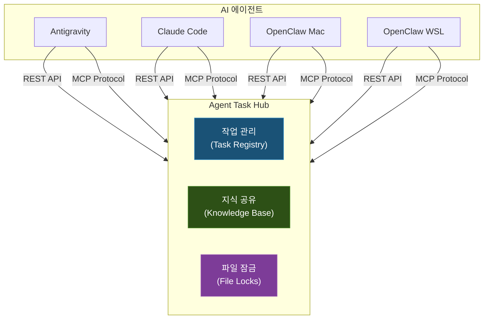
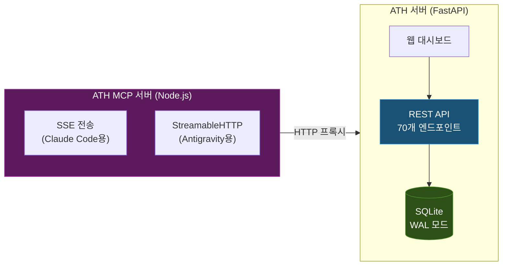
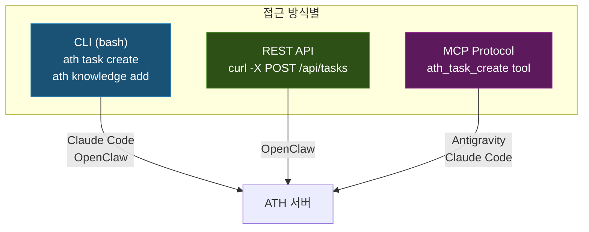

## 배경: 왜 멀티 에이전트인가

홈랩에서 운영하는 서비스가 30개를 넘으면서, 한 번에 여러 작업을 동시에 진행해야 하는 상황이 잦아졌다. 서비스 포털 버그를 고치면서 동시에 ML 파이프라인을 마이그레이션하고, 그 사이에 DGX Spark의 vLLM 설정도 바꿔야 하는 식이다.

AI 코딩 에이전트 하나로는 이런 병렬 작업이 불가능하다. 에이전트는 기본적으로 하나의 대화 세션에서 순차적으로 작업하기 때문이다. 그래서 여러 에이전트를 동시에 돌리기 시작했다.

현재 운영 중인 에이전트는 다음과 같다:

| 에이전트 | 기반 모델 | 주요 강점 | 접근 방식 |
|----------|-----------|-----------|-----------|
| Antigravity | Google Gemini | 브라우저 자동화, 웹 개발, 이미지 생성, 대규모 분석 | 대화 기반 |
| Claude Code | Anthropic Claude | 코드 생성/리팩토링, 디버깅, 아키텍처 설계 | 작업 기반 |
| OpenClaw (Mac) | 로컬 LLM (Qwen3.5-122B, vLLM) | 텔레그램 원격 작업, 로컬 인프라 관리 | 워크플로우 기반 |
| OpenClaw (WSL) | ChatGPT 5.4 | 텔레그램 원격 작업, 외부 API 연동 | 워크플로우 기반 |

초기에는 OpenCode(Codex), OpenCode(Local) 에이전트도 운영했지만, OpenClaw의 텔레그램 기반 워크플로우가 더 실용적이어서 사실상 폐기했다. OpenClaw는 두 가지 변종이 있는데, Mac 환경에서는 DGX Spark 클러스터의 Qwen3.5-122B(로컬 LLM)를, WSL 환경에서는 ChatGPT 5.4(외부 API)를 각각 활용한다.

로컬 LLM 기반 에이전트는 [이전 글](/infrastructure/llm-serving-models/)에서 소개한 DGX Spark 클러스터의 Qwen3.5-122B FP8 모델을 활용한다. 한때 MiniMax-M2.5(229B)를 사용했으나 문맥 이해력 부족, 코드 오탈자, 언어 혼합 문제로 롤백했다.

---

## 문제: 동시 작업의 충돌

에이전트를 여러 개 돌리기 시작하니 바로 문제가 드러났다.

### 파일 동시 수정

가장 빈번한 문제다. Claude Code가 `app/main.py`를 리팩토링하는 동안, Antigravity가 같은 파일에 새 API 엔드포인트를 추가하면 한쪽의 변경 사항이 덮어써진다. Git으로 관리한다 해도, 같은 브랜치에서 작업하면 충돌은 피할 수 없다.

### 중복 작업

에이전트 A에게 "서비스 포털 헬스체크 기능 수정"을 시키고, 까먹고 에이전트 B에게도 비슷한 요청을 하면 두 에이전트가 동일한 작업을 각자의 방식으로 진행한다. 나중에 어느 쪽 결과를 쓸지 정해야 하고, 한쪽의 작업 시간은 완전히 낭비된다.

### 컨텍스트 단절

에이전트 A가 디버깅 과정에서 "이 버그의 원인은 Kubernetes의 DNS 캐시 TTL 때문이다"라는 사실을 발견했다. 하지만 에이전트 B는 이 사실을 모른 채 같은 문제를 처음부터 다시 조사한다. 각 에이전트의 발견이 다른 에이전트에게 전달되지 않는 것이다.

이런 문제들을 반복해서 겪으면서, **에이전트 간의 작업 조율이 필수**라는 결론에 도달했다.

---

## 설계: Agent Task Hub (ATH)

### 설계 원칙

ATH를 설계할 때 세운 원칙은 세 가지다:

1. **에이전트 독립성**: 특정 에이전트에 종속되지 않아야 한다. 새 에이전트가 추가되더라도 규칙만 주입하면 바로 참여할 수 있어야 한다
2. **경량성**: 홈랩 환경이므로 별도의 메시지 큐나 분산 데이터베이스 없이, 단일 SQLite로 충분해야 한다
3. **강제성**: 에이전트에게 "권장"이 아닌 "필수"로 규칙을 주입해야 한다. 선택적이면 에이전트는 높은 확률로 무시한다

### 핵심 기능

ATH의 핵심 기능은 세 가지다:



#### 1. 작업 관리 (Task Registry)

에이전트가 작업을 시작하기 전에 반드시 Task를 등록한다. 다른 에이전트가 진행 중인 작업 목록을 확인하고, 중복된 작업이 있으면 시작하지 않는다.

Task는 다음 정보를 포함한다:
- **ID**: `YYYY-MMDD-NNN` 형식 (예: `2026-0327-001`)
- **상태**: `queue` → `in_progress` → `review` → `completed` / `cancelled`
- **담당 에이전트**: 누가 이 작업을 맡고 있는지
- **우선순위**: `critical`, `high`, `medium`, `low`
- **카테고리**: `development`, `infrastructure`, `bugfix`, `analysis`, `documentation`
- **단계(Steps)**: 작업의 세부 단계와 각 단계의 상태
- **의존성(depends_on)**: 다른 Task가 완료되어야 시작할 수 있는 관계

#### 2. 지식 공유 (Knowledge Base)

에이전트가 작업 중 발견한 사실, 내린 결정, 해결한 오류, 발견한 패턴을 등록한다. 다른 에이전트가 관련 작업을 할 때 기존 지식을 검색하여 활용할 수 있다.

지식은 네 가지 유형으로 분류된다:

| 유형 | 용도 | 예시 |
|------|------|------|
| `finding` | 조사/분석 결과 | "DGX Spark의 nvidia-smi Memory-Usage: Not Supported는 정상" |
| `decision` | 의사결정 기록 | "SGLang 대신 vLLM을 유지하기로 결정" |
| `error` | 오류 해결 기록 | "SafetensorError는 blob 파일 손상이 원인" |
| `pattern` | 반복 패턴/모범 사례 | "모델 전환 시 반드시 따라야 할 8단계 체크리스트" |

#### 3. 파일 잠금 (File Locks)

에이전트가 특정 파일을 수정하기 전에 잠금을 획득한다. 다른 에이전트는 해당 파일에 잠금이 걸려 있으면 수정을 피하거나 대기한다.

잠금은 advisory 방식이다. OS 수준의 강제 잠금이 아니라, 에이전트가 자발적으로 규칙을 따르는 구조다. 만료 시간이 있어 에이전트가 비정상 종료해도 5분(기본값) 후 자동으로 잠금이 해제된다.

---

## 구현: 서버 아키텍처

### 기술 스택

ATH 서버는 두 개의 컴포넌트로 구성된다:



#### ATH 서버 (FastAPI + SQLite)

- **FastAPI**: REST API 70개 엔드포인트를 제공한다. Tasks, Knowledge, Locks, Focus, Logs, Agents, Health Checks, Usage Stats 등의 CRUD를 담당한다.
- **SQLite (WAL 모드)**: 별도의 DB 서버 없이 파일 기반 데이터베이스를 사용한다. WAL(Write-Ahead Logging) 모드를 활성화하여 읽기와 쓰기가 동시에 가능하도록 했다. 단일 프로세스가 접근하므로 동시성 문제가 없다.
- **웹 대시보드**: 에이전트 상태, 작업 현황, 지식 베이스를 한눈에 볼 수 있는 관리 UI를 제공한다.

SQLite를 선택한 이유는 간단하다. 에이전트가 아무리 많아도 동시 접속은 사실상 10개 미만이고, 초당 수십 건의 쿼리이므로 PostgreSQL 같은 서버형 DB는 과하다. 백업도 파일 하나만 복사하면 된다.

#### ATH MCP 서버 (Node.js)

MCP(Model Context Protocol)는 AI 에이전트가 외부 도구와 통신하는 표준 프로토콜이다. ATH MCP 서버는 ATH REST API를 MCP 도구로 노출하여, 에이전트가 프로토콜을 통해 직접 작업을 등록하고 지식을 검색할 수 있게 한다.

MCP 서버가 두 가지 전송 방식을 동시에 지원하는 이유가 있다:

- **SSE(Server-Sent Events)**: Claude Code가 MCP 서버와 통신할 때 사용하는 방식
- **StreamableHTTP**: Antigravity(Gemini)가 사용하는 새로운 MCP 전송 방식

하나의 HTTP 서버에서 두 가지 전송을 동시에 처리하고, 각각의 세션 TTL(SSE 30분, HTTP 1시간)과 만료 세션 자동 정리 로직을 구현했다.

### Kubernetes 배포

ATH 서버는 K3s 클러스터에 배포된다. NodePort로 노출되어 모든 에이전트가 동일한 내부 엔드포인트로 접근한다. MCP 서버도 별도 NodePort로 배포된다.

---

## 에이전트 규칙 주입

ATH 시스템이 정상 동작하려면 에이전트가 규칙을 **반드시** 따라야 한다. 이는 각 에이전트의 시스템 프롬프트에 규칙을 직접 삽입하는 방식으로 강제한다.

### 규칙 주입 메커니즘

각 AI 코딩 에이전트는 시작할 때 고유한 설정 파일을 읽는다:

| 에이전트 | 설정 파일 | 형식 |
|----------|-----------|------|
| Antigravity | `~/.gemini/GEMINI.md` | Markdown |
| Claude Code | `~/.claude/CLAUDE.md` | Markdown |
| OpenClaw (Mac) | `.agent/skills/` | 스킬 디렉토리 |
| OpenClaw (WSL) | `.agent/skills/` | 스킬 디렉토리 |

이 설정 파일에 ATH 관련 규칙을 삽입한다. 핵심은 **"작업 시작 전에 반드시 ATH Task를 등록하라"**는 규칙이다:

```markdown
> 🚨 **[CRITICAL] 실제 작업 요청 수신 즉시 — 첫 번째 행동으로 ATH Task를 등록하세요!**
>
> 단순 조회/질문이 아닌 **모든 실행 작업**은 아래 명령으로 즉시 등록합니다:
> Task 등록 없이 코드 작성·파일 수정·명령 실행을 시작하는 것은 **지침 위반**입니다.
```

이 규칙이 에이전트의 시스템 프롬프트 최상단에 위치하기 때문에, 에이전트는 사용자의 작업 요청을 받으면 코드를 작성하기 전에 먼저 ATH에 Task를 등록한다.

### 에이전트별 접근 방식

에이전트마다 ATH에 접근하는 방식이 다르다:



- **CLI**: `ath` 명령을 셸에서 실행하여 Task/Knowledge/Lock을 관리. 터미널 접근이 가능한 에이전트(Claude Code, OpenClaw)가 사용한다.
- **REST API**: HTTP 요청으로 직접 API를 호출. OpenClaw가 텔레그램 봇에서 내부적으로 사용한다.
- **MCP Protocol**: MCP 서버를 통해 에이전트가 도구로서 ATH 기능을 호출. Antigravity, Claude Code가 사용하며 가장 자연스러운 방식이다.

---

## 에이전트 레지스트리

각 에이전트의 특성과 적합한 작업을 레지스트리에 등록해둔다. 이를 통해 작업을 적합한 에이전트에 배분할 수 있다.

```yaml
agents:
  antigravity:
    name: "Antigravity"
    type: "Google Deepmind"
    strengths:
      - "browser_automation"
      - "web_development"
      - "image_generation"
      - "large_context_analysis"
      - "parallel_tool_execution"
    suitable_tasks:
      - "웹 개발 및 UI 구현"
      - "브라우저 자동화 테스트"
      - "대규모 코드 분석"

  claude-code:
    name: "Claude Code"
    type: "Anthropic Claude"
    strengths:
      - "code_generation"
      - "refactoring"
      - "debugging"
      - "architecture_design"
      - "terminal_persistence"
    suitable_tasks:
      - "복잡한 코드 리팩토링"
      - "디버깅 및 문제 해결"
      - "아키텍처 설계"
```

이 레지스트리를 기반으로 에이전트 간 헬스체크도 수행한다. 각 에이전트의 실행 환경(K8s Pod, tmux 세션 등)을 주기적으로 확인하여 대시보드에 온라인/오프라인 상태를 표시한다.

---

## 에이전트 별명(Alias) 처리

실전에서 에이전트들이 자신의 ID를 일관되게 사용하지 않는다는 문제를 발견했다. Claude Code가 어떤 때는 `claude`, 어떤 때는 `claude-code`로 자신을 식별하고, OpenCode는 `opencode`, `opencode-local`, `opencode-codex` 등 다양한 이름을 사용했다.

이를 해결하기 위해 서버 측에서 별명(alias)을 정규 ID로 자동 변환하는 로직을 구현했다:

```python
AGENT_ALIASES = {
    "claude": "claude-code",
    "opencode": "opencode-openai",
    "opencode-codex": "opencode-localllm",
    "opencode-local": "opencode-openai",
    "opencode-locallm": "opencode-localllm",
}
```

Task 생성, Knowledge 등록, Lock 획득, Focus 업데이트, 헬스체크 등 에이전트 ID를 받는 모든 API에서 이 정규화가 적용된다. 덕분에 에이전트가 어떤 이름을 쓰든 정확한 에이전트로 매핑된다.

---

## 실전 운용 패턴

### 동시 작업 시나리오

실제로 자주 발생하는 패턴은 이렇다:

1. **사용자**: Antigravity에게 서비스 포털 UI 개선을 요청
2. **Antigravity**: ATH에 Task 등록 → 관련 파일에 Lock 획득 → 작업 시작
3. **사용자**: Claude Code에게 ML 파이프라인 마이그레이션을 요청
4. **Claude Code**: ATH에 Task 등록 → 기존 Task 목록 확인(충돌 없음) → 작업 시작
5. **Claude Code**: 작업 중 "KFP v2에서 cron 표현식은 6-field 형식이어야 한다"는 사실 발견 → Knowledge에 등록
6. **Antigravity**: (나중에) KFP 관련 작업 시 Knowledge 검색 → Claude Code의 발견 내용 활용

### 작업 위임 (Handoff)

하나의 에이전트가 작업을 시작했지만, 해당 작업이 다른 에이전트의 강점에 더 적합한 경우 인계가 발생한다.

예를 들어 Claude Code가 서비스 포털의 버그를 수정한 후, UI 확인이 필요한 경우:
1. Claude Code가 코드 수정 완료
2. Handoff 노트 작성: "버그 수정 완료. 브라우저에서 UI 동작 확인 필요"
3. Antigravity가 브라우저 자동화로 UI 테스트 수행

### 포커스 관리

현재 각 에이전트가 어떤 영역에 집중하고 있는지를 Focus로 공유한다. 새 에이전트가 작업을 시작할 때 먼저 Focus를 확인하면 현재 시스템 전체의 작업 상황을 파악할 수 있다.

---

## 운영에서 배운 것들

### 규칙 준수율

에이전트가 ATH 규칙을 100% 따르지는 않는다. 체감상 다음과 같다:

| 항목 | 준수율 | 비고 |
|------|--------|------|
| Task 등록 | ~90% | 시스템 프롬프트 최상단에 배치하면 대부분 따른다 |
| Knowledge 등록 | ~60% | 발견이 있어도 등록하지 않고 넘어가는 경우가 있다 |
| File Lock | ~40% | 가장 잘 지켜지지 않는 규칙. Advisory 방식의 한계 |
| Focus 업데이트 | ~70% | 작업 시작 시에는 잘 따르지만 완료 시 잊는 경우가 있다 |

File Lock의 준수율이 낮은 주된 이유는, 에이전트가 파일을 수정하기 직전에 Lock을 확인하는 것이 자연스러운 흐름이 아니기 때문이다. 코드 수정은 에이전트의 핵심 동작이라 모든 수정 전에 API 호출을 추가하는 것이 마찰이 크다.

### 규칙 강화 방법

규칙 준수율을 높이기 위해 시도한 방법들:

1. **시스템 프롬프트 위치**: 규칙을 프롬프트 최상단에 배치할수록 준수율이 높다. 중간이나 하단에 넣으면 무시되는 비율이 높아진다.
2. **경고 강도**: `[CRITICAL]`, `🚨`, `**지침 위반**` 등 강한 표현을 사용하면 준수율이 올라간다.
3. **구체적 명령**: "ATH를 확인하세요"보다 "다음 bash 명령을 실행하세요: `ath task create ...`"가 효과적이다.
4. **MCP 도구 제공**: CLI 명령을 직접 실행하라는 것보다, MCP 도구로 제공하면 에이전트가 더 자연스럽게 호출한다.

### 예상치 못한 효과

ATH를 도입한 후 예상하지 못한 긍정적 효과도 있었다:

- **작업 이력 축적**: 모든 에이전트의 작업이 기록되므로, "지난주에 어떤 작업을 했지?"를 ATH에서 바로 확인할 수 있다
- **디버깅 참고**: Knowledge Base에 축적된 오류 해결 기록이 새로운 문제 해결 시 참고 자료가 된다
- **에이전트 성능 비교**: Usage Stats로 어떤 에이전트가 어떤 유형의 작업을 얼마나 수행했는지 통계를 볼 수 있다

---

## API 설계

ATH 서버의 REST API는 다음과 같이 구성된다:

| 영역 | 주요 엔드포인트 | 기능 |
|------|----------------|------|
| Tasks | `POST /api/tasks` | 작업 등록 |
|  | `GET /api/tasks?status=in_progress` | 진행 중 작업 조회 |
|  | `PUT /api/tasks/{id}` | 상태/단계 업데이트 |
|  | `POST /api/tasks/{id}/close` | 작업 완료 처리 |
| Knowledge | `POST /api/knowledge` | 지식 등록 |
|  | `GET /api/knowledge/search?q=keyword` | 지식 검색 |
|  | `GET /api/knowledge/conflicts` | 상충 지식 확인 |
| Locks | `POST /api/locks` | 파일 잠금 획득 |
|  | `DELETE /api/locks/by-file` | 잠금 해제 |
|  | `POST /api/locks/cleanup` | 만료 잠금 정리 |
| Focus | `GET /api/focus` | 현재 포커스 조회 |
|  | `PUT /api/focus` | 포커스 업데이트 |
| Agents | `GET /api/agents` | 에이전트 목록 |
|  | `PUT /api/agents/{id}/heartbeat` | 에이전트 헬스체크 |
|  | `GET /api/agents/relationships` | 에이전트 간 관계 |
| Logs | `GET /api/logs` | 활동 로그 조회 |
| Usage | `GET /api/usage/summary` | 사용 통계 |

모든 API에서 에이전트 ID는 alias를 허용하며 서버에서 정규화된다.

---

## 대시보드

ATH 대시보드는 단일 HTML 페이지로 구현된 웹 UI다. 에이전트 상태, 진행 중 작업, 최근 지식 항목, 활동 로그를 한 화면에서 확인할 수 있다.

주요 화면 구성:
- **에이전트 현황**: 각 에이전트의 온라인/오프라인 상태, 마지막 활동 시각, 진행 중 작업 수
- **작업 보드**: 상태별(queue/in_progress/review/completed) 작업 카드 뷰
- **지식 피드**: 최근 등록된 finding, decision, error, pattern 목록
- **활동 타임라인**: 에이전트별 활동 로그의 시간순 타임라인

---

## 마무리

ATH는 "AI 에이전트를 동시에 여러 개 돌리면 생기는 문제"를 해결하기 위해 만든 실용적인 시스템이다. 완벽하지는 않다. 파일 잠금 준수율이 낮고, 에이전트가 지식을 등록하는 것을 잊기도 한다.

하지만 Task 등록만으로도 중복 작업 방지 효과는 확실하다. 그리고 Knowledge Base에 축적되는 발견과 결정 기록은 시간이 갈수록 가치가 커진다. 한 에이전트가 삽질해서 찾은 해결법을 다른 에이전트가 바로 활용할 수 있기 때문이다.

ATH를 만들 때는 혼자 여러 에이전트를 돌리는 상황만 고려했지만, 운영하다 보니 **여러 사람이 각자의 에이전트를 사용하는 팀 환경에서도 동일한 문제가 발생한다**는 것을 깨달았다. 팀원 A의 에이전트가 수정한 파일을 팀원 B의 에이전트가 동시에 건드리는 상황, 한 사람이 해결한 문제를 다른 사람의 에이전트가 다시 조사하는 상황 모두 동일하다. 오히려 사람 간에는 슬랙이나 구두로 조율할 수 있지만, 에이전트는 명시적인 시스템 없이는 조율이 불가능하다. AI 코딩 에이전트 사용이 확산될수록, 이런 종류의 오케스트레이션 시스템의 필요성은 더 커질 것이다.

멀티 에이전트 운용에 관심이 있다면 핵심은 이것이다: **에이전트의 시스템 프롬프트에 규칙을 강하게 주입하고, 규칙을 따를 수 있는 도구(CLI, API, MCP)를 제공하라.** 규칙만 있고 도구가 없으면 준수율이 떨어지고, 도구만 있고 규칙이 없으면 아예 사용하지 않는다.
