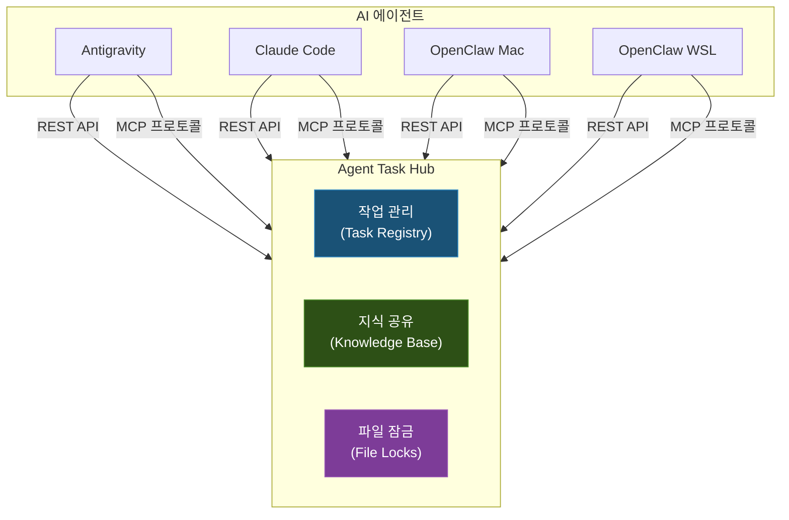
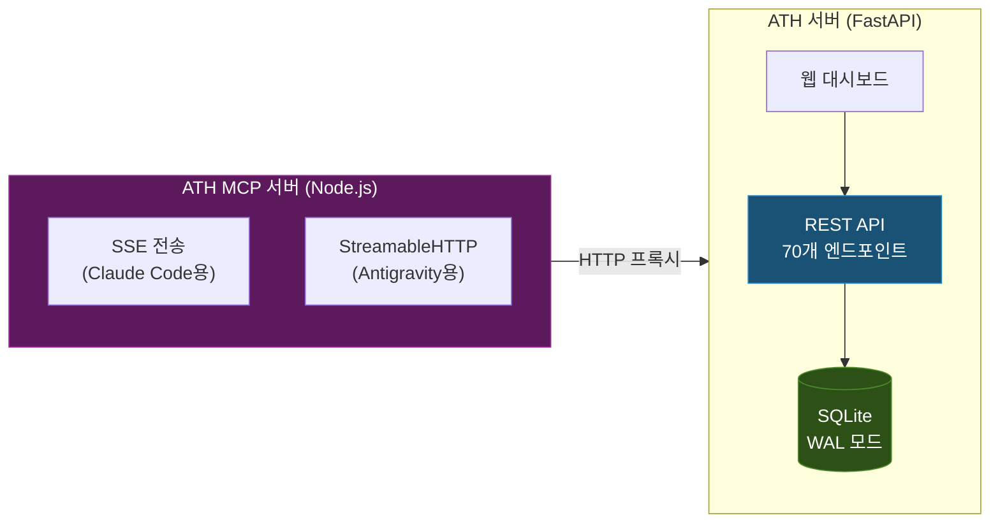

## 배경: 왜 멀티 에이전트인가

개인 인프라인 홈랩[^homelab]에서 운영하는 서비스가 30개를 넘으면서, 한 번에 여러 작업을 동시에 진행해야 하는 상황이 잦아졌습니다. 서비스 포털의 버그를 수정하면서 동시에 단위 데이터 파이프라인을 이전하고, 그 사이에 DGX Spark[^dgx-spark]의 vLLM[^vllm] 설정도 같이 변경해야 하는 식입니다.

기존의 AI 코딩 에이전트 단일 구성으로는 이런 병렬 작업이 어렵습니다. 에이전트는 기본적으로 하나의 대화 세션에서 순차적으로 작업을 처리하기 때문입니다. 이러한 이유로 여러 에이전트를 동시에 운용하기 시작했습니다.

현재 운영 중인 에이전트 구성은 다음과 같습니다:

| 에이전트 | 기반 모델 | 주요 강점 | 접근 방식 |
|----------|-----------|-----------|-----------|
| Antigravity | Google Gemini | 브라우저 자동화, 웹 개발, 이미지 생성, 대규모 분석 | 대화 기반 |
| Claude Code | Anthropic Claude | 코드 생성 및 리팩토링, 디버깅, 아키텍처 설계 | 작업 기반 |
| OpenClaw (Mac) | 로컬 LLM (Qwen 3.5 122B, vLLM) | 텔레그램 원격 작업, 로컬 인프라 관리 | 워크플로우 기반 |
| OpenClaw (WSL) | ChatGPT 5.4 | 텔레그램 원격 작업, 외부 환경 연동 | 워크플로우 기반 |

과거에는 다양한 다른 체계도 실험해보았으나, OpenClaw의 워크플로우 기반 원격 작업 방식이 실용적이어서 현재의 구성으로 정착했습니다. 특히 내부망에 접근하는 Mac 환경은 강력한 로컬 거대 언어 모델을, 보다 유연한 외부 접근이 필요한 WSL 환경은 외부 상용 API를 활용하여 역할을 분담합니다.

---

## 문제: 동시 작업의 충돌

에이전트를 여러 개 병행하여 운용하기 시작하자 곧바로 다음과 같은 문제들이 나타났습니다.

### 파일 동시 수정

가장 빈번하게 일어나는 문제입니다. 한 에이전트가 특정 파일의 구조를 개선하는 동안, 다른 에이전트가 같은 파일에 새로운 기능을 추가하려고 하면 한쪽의 변경 사항이 사라질 위험이 큽니다. 버전 관리 시스템으로 묶여있더라도, 같은 범위의 내용을 수정하면 충돌을 일일이 해결해주어야 합니다.

### 중복 작업

에이전트 A에게 특정 기능 수정을 지시한 것을 깜빡하고, 에이전트 B에게 비슷한 요청을 다시 하게 되면 두 에이전트가 동일한 작업을 각자의 방식으로 중복해서 수행합니다. 이로 인해 불필요한 컴퓨팅 자원과 시간이 낭비됩니다.

### 컨텍스트(문맥) 단절

에이전트 A가 시스템 문제를 확인하면서 특정 설정 값이 원인이라는 사실을 짚어냈음에도, 에이전트 B는 그 사실을 공유받지 못해 같은 문제를 발생 초기 단계부터 다시 짚어보게 됩니다. 각자의 발견이 서로에게 도움이 되지 못하는 상황입니다.

이러한 문제들을 경험하면서, **에이전트 간의 작업 조율 시스템이 반드시 필요하다**는 결론을 얻었습니다.

---

## 설계: Agent Task Hub (ATH)

### 설계 원칙

정보를 조율하는 중앙 서버인 ATH를 설계하며 다음 세 가지 원칙을 세웠습니다:

1. **에이전트 독립성**: 특정 에이전트나 모델에 종속되지 않아야 합니다. 언제든 새로운 에이전트가 추가되더라도 정해진 규칙만 알려주면 바로 참여할 수 있는 개방형이어야 합니다.
2. **경량성**: 대규모 기업망이 아닌 규모를 감안하여, 무거운 데이터베이스 시스템 설치 없이 파일 기반 데이터베이스 하나로 가볍게 구현합니다.
3. **강제성**: 에이전트에게 상황에 맞게 쓰라는 '권고'가 아닌 '필수 규칙'으로 주입해야 합니다. 선택권을 주면 대다수의 에이전트가 절차를 편의에 따라 무시해버립니다.

### 핵심 기능

ATH의 핵심 기능은 세 줄기로 요약됩니다:



#### 1. 작업 관리 (Task Registry)

에이전트가 실제 작업을 시작하기 전 반드시 작업 이력을 선등록해야 합니다. 시스템에서 다른 에이전트가 이미 진행 중인 내역을 조회해 볼 수 있고, 서로 겹치는 활동을 예방합니다.

#### 2. 지식 공유 (Knowledge Base)

에이전트가 조사 중 알아낸 사실, 중요한 판단 내역, 오류 극복 방법 등을 짤막한 기록으로 남깁니다. 다른 에이전트가 연관된 작업을 수행할 때 먼저 지식을 훑어보고 적용하여, 두 번 고생하는 일을 막아줍니다. 이 기록은 통상 조사결과(finding), 판단방향(decision), 오류수정(error), 공통패턴(pattern) 등 네 종류로 나누어 정리합니다.

#### 3. 파일 잠금 (File Locks)

에이전트가 특정 파일을 뜯어고치기 전에 잠금(Lock)을 요청합니다. 파일이 이미 잠긴 상태라면 일정 시간 기다리거나, 우회하는 방향을 택합니다. 시스템 차원의 강압적인 잠금이 아니라 자발적으로 잠금 여부를 묻고 조심하는 자율 규제에 가깝습니다. 만약 에이전트가 비정상 종료되더라도 몇 분 후에는 잠금이 자동 해제되도록 구성했습니다.

---

## 구현: 서버 아키텍처

### 기술 스택

ATH 서버는 내부적으로 두 가지 응용 프로그램으로 나뉩니다:



#### ATH 서버 (FastAPI + SQLite)

**FastAPI**[^fastapi]를 사용하여 여러 기능을 조작할 수 있는 통신 창구(API) 70여 개를 갖추었습니다. 정보 저장은 파일 하나로 작동하는 **SQLite**를 씁니다. 동시에 데이터를 조회하고 기록해도 충돌하지 않도록 WAL(Write-Ahead Logging) 기능을 켜두었습니다. 대규모 접속이 발생하지 않는 홈랩의 특징을 살려, 백업과 유지보수가 가장 쉬운 구조를 채택했습니다.

#### ATH MCP 서버 (Node.js)

MCP(Model Context Protocol)[^mcp]는 AI가 외부 도구와 원활하게 대화하기 위한 요즘 시대의 통신 표준입니다. ATH 시스템의 여러 기능을 이 표준 형식으로 포장해서, 각 AI 에이전트들이 복잡한 코드 없이도 도구로서 자연스럽게 접근하도록 돕습니다. 실시간 양방향 통신(SSE)과 단발성 통신 방식을 에이전트 성향에 맞춰 모두 대응합니다.

### Kubernetes 배포

ATH 서버와 MCP 서버는 내부 클러스터 환경에 배포되어, 모든 에이전트가 고정된 주소로 안정적으로 접속할 수 있도록 설계되었습니다.

---

## 에이전트 규칙 주입

잘 만든 중앙 시스템도 에이전트가 절차를 누락하면 소용이 없습니다. 그래서 에이전트들에게 "적극적으로 ATH를 써라"라고 지시하기 위해, 기동 시 읽게 되는 기본 명령어(시스템 프롬프트)의 가장 강조되는 영역에 규칙을 끼워넣습니다.

### 규칙 주입 메커니즘

다음과 같은 아주 강한 표현을 사용합니다:

```markdown
> [CRITICAL] 실제 작업 요청 수신 즉시 — 첫 번째 행동으로 ATH 작업(Task)을 등록할 것!
>
> 단순히 찾아보거나 질문에 답하는 수준이 아닌, 무언가를 바꾸는 모든 작업은 등록해야 합니다.
> 작업 등록 없이 파일 구성을 고치거나 터미널 명령을 수행하는 일은 중대한 지침 위반입니다.
```

이렇게 명시해두면, 에이전트들은 지시받은 즉시 최우선으로 ATH에 스스로의 작업 내역을 알리고 승인을 구하는 형태로 행동반경을 교정합니다.

### OpenClaw 권한 제어 및 위임 (Handoff)

여기서 더 나아가 시스템 전체에 직접적으로 권한을 행사할 수 있는 OpenClaw 등에 대해서는 더욱 엄격한 제한을 둡니다.

1. **사전 검증 (Verify Check)**: 인프라 구성이나 보안 관련 작업을 시작하기 전, 에이전트는 반드시 교차 검증 도구를 이용해 위험 요소가 없는지 자체 심사 받아야 합니다.
2. **권한 상승 제한**: 시스템 방화벽을 변경하거나 중요 관리 권한(sudo)이 동반되는 명령 실행을 감지하면, 직접 실행하지 못하고 사용자에게 스크립트 형태로 승인을 요구하는 안전망을 적용하고 있습니다.
3. **태스크 위임 체계**: 웹 화면 중심의 Antigravity 에이전트가 로컬 서버의 특정 파일 제거나 수정이 필요한 경우 직접 억지로 수행하지 않습니다. 대신 ATH를 통해 권한을 가진 OpenClaw 에이전트 측으로 해당 작업을 위임(Handoff)하도록 경로를 만들어 두었습니다.

이러한 접근법을 통해 각 에이전트별 접근 경로를 구분하고 있습니다.

```mermaid
graph TD
    subgraph "접근 방식별"
        CLI["명령어 (CLI)"]
        REST["웹 요청 (REST API)"]
        MCP["MCP 프로토콜"]
    end

    CLI --> |OpenClaw\nClaude Code| ATH[ATH 서버]
    REST --> |OpenClaw (알림봇)| ATH
    MCP --> |Antigravity\nClaude Code| ATH

    style CLI fill:#1a5276,stroke:#2e86c1,color:#fff
    style REST fill:#2d5016,stroke:#4a8c2a,color:#fff
    style MCP fill:#5c1a5c,stroke:#9b2d9b,color:#fff
```

---

## 에이전트 레지스트리

각 에이전트마다 잘하는 분야를 미리 백과사전처럼 시스템에 등록해 둡니다. 

```yaml
agents:
  antigravity:
    name: "Antigravity"
    type: "Google Deepmind"
    strengths:
      - "브라우저 및 테스트 화면 자동화"
      - "UI 구현 상세 작업"
      - "넓고 깊게 연관된 거대 문맥 점검"
  claude-code:
    name: "Claude Code"
    type: "Anthropic Claude"
    strengths:
      - "알고리즘 및 기초 코드 생성"
      - "장시간의 원인 추적(디버깅)"
```

이 정보를 바탕으로 작업의 적합성을 따져 서로 간의 업무 배분을 유도하며, 에이전트들이 잘 깨어있는지 온라인 상태도 함께 점검합니다.

---

## 에이전트 식별자(Alias) 자동 변환 처리

도입 초반에는 각 AI가 때때로 자신을 부르는 호칭을 혼용해서 불필요한 오류가 생겼습니다. 같은 에이전트임에도 어느 날은 `claude`, 다른 날은 `claude-code`라고 이름을 대면서 정보를 남기는 식입니다.

이를 방지하기 위해 서버 측 코드에서 들어오는 여러 명칭(별명)들을 유일한 정규 식별자로 자동 수렴되게끔 안전망을 적용해 두었습니다.

```python
AGENT_ALIASES = {
    "claude": "claude-code",
    "opencode": "opencode-openai",
    # 여러 혼용된 별칭들을 단일한 식별자로 강제 매핑합니다.
}
```

이제는 에이전트가 어떠한 명목으로 자신을 호출하더라도 문제없이 하나의 주체로 통합 기록됩니다.

---

## 실전 운용 패턴

### 동시 작업 시나리오

여러 주체들이 다음과 같은 흐름으로 문제를 풀어냅니다:

1. **사용자**: UI 중심의 일을 Antigravity에게 의뢰
2. **Antigravity**: 절차에 따라 ATH에 작업 등록 → 수정할 파일에 임시 잠금(Lock) 설정 → UI 구현 시작
3. **사용자**: 이번엔 서버 단의 파이프라인 수정을 Claude Code에게 의뢰
4. **Claude Code**: 절차에 따라 ATH 조회 → 겹치는 파일이나 작업이 없음을 인지 → 서버단 로직 개편 시작
5. **Claude Code**: 작업 중, "일정 스케줄 등록은 특정한 날짜 형식을 지켜야만 서버가 동작한다"는 사실을 발견하여 공통 지식(Knowledge)으로 전송
6. **Antigravity**: 다음 날 업무 진행 중 날짜 관련 스케줄 처리 구현 시, ATH를 검색해보고 Claude Code가 남겼던 사실을 즉시 참고하여 오류 없이 코딩 구현 완료.

### 작업의 위임(Handoff)

위에서 말씀드린 것처럼 강점이 다른 영역일 때 자발적으로 바통을 터치하는 과정입니다. Claude Code가 서버단 오류를 모두 수정한 후, "원인 수정은 끝났으니 실제 눈에 보이는 웹브라우저 동작 확인이 필요합니다" 라는 메모를 적어 ATH에 올려두면, 화면 테스트에 장점이 있는 Antigravity 영역으로 작업이 순조롭게 이관됩니다.

### 포커스 관리

팀 프로젝트처럼 각 인공지능이 현재 매진하고 있는 집중 영역(Focus)을 전광판처럼 띄어둡니다. 새 에이전트가 일을 처음 시작하기 전에 이 포커스를 확인하면 시스템 안에서 현재 주요하게 벌어지는 흐름을 방해하지 않고 우회할 무대가 생깁니다.

---

## 운영에서 배운 것들

### 시스템 규칙의 자율적 준수율

시스템 지침을 세운다고 해서 AI가 언제나 100% 이를 수용하는 것은 아니었습니다.

| 항목 | 준수율 비율 | 비고 |
|------|--------|------|
| 작업 (Task) 등록 | ~90% | 가장 강력한 명령으로 지시하면 대부분 순응합니다. |
| 지식 공유 (Knowledge) | ~60% | 작업에 몰두하다가 새롭게 알게 된 사실이 있어도 무심히 지나치곤 합니다. |
| 파일 잠금 (File Lock) | ~40% | 코드를 열기 직전에 자율적으로 문을 잠그고 하라는 절차가 흐름을 끊어 자주 생략됩니다. |
| 포커스 업데이트 | ~70% | 시작할 때는 신고하지만, 일이 끝난 뒤 상태를 원상 복구하는 일에는 소홀한 편입니다. |

### 통제율을 높이는 실무적인 해답

- **강도 높은 텍스트의 배치**: 중요 지침일수록 지시문 제일 앞에, 위험하거나 자극적인 표현방식을 사용할수록 훨씬 더 경각심을 갖고 잘 반영합니다.
- **MCP 도구의 적극 도입**: 복잡한 구문 조합보다 단일 기능화된 도구를 마련해주면 귀찮은 일이 덜해져 규칙 준수율이 눈에 띄게 좋아졌습니다.

### 뜻밖의 긍정적인 효과

- **꼼꼼한 기록 저장소**: 수십 개의 에이전트 작업이 쌓이다 보니 나중에 장애가 발생했을 때 "어떤 에이전트가 어떤 모듈을 건드렸었지?" 하고 추적할 가장 정확한 내역서로 활용되고 있습니다.
- **문제 해결의 도서관**: 남겨진 시행착오 기록 자체가 향후 비슷한 시스템 오류를 만났을 때 바로 참고해 풀 수 있는 양질의 백과사전이 되었습니다.

---

## API 및 대시보드 구조

### 통신 규격(API) 설계

작업을 7개 영역으로 나누어 약 70여 개의 규격화된 URL 채널을 구성했습니다. 작업 등록부터 상태 관리, 지식조회, 잠금 및 해제 등 일반적인 웹 개발 철학과 일치하게 정비하여 관리하기 편하도록 구축했습니다.

### 관리용 대시보드

ATH 대시보드는 단일 웹페이지(SPA) 형태로 접속 가능한 직관적인 화면을 제공합니다. 
진행 중인 에이전트별 작업 구역, 상태별로 나열된 작업 패널, 시시각각 올라오는 최신 지식 현황들과 에이전트의 활동 시간대별 로그를 한눈에 볼 수 있어 관제 센터의 역할을 충실히 해냅니다.

---

## 마무리

Agent Task Hub(ATH)는 홈랩 안에서 통제 없이 행동하는 다양한 모델들에게 일종의 "교통정리"를 하기 위해 시작한 시도입니다. 파일 잠금 기능 등 에이전트 자율성에 의존하는 일부 과정은 여전히 채우고 보완해 나가야 할 숙제로 남아 있습니다.

하지만 최소한 "내가 어디서 어떤 일을 시작하겠다"라는 작업 등록 기능만으로도 상호 간 작업 충돌이 혁신적으로 줄어들었으며, 한 번 찾은 지식을 서로 돌려쓰면서 전체적인 업무 속도와 안정성이 체감될 만큼 향상되었습니다. 

향후 다수의 인원이 모여 프로젝트를 진행할 때 각자의 조수격인 AI 에이전트들이 투입된다면, 사람 간의 이메일이나 메신저 이상으로 **시스템적으로 에이전트 간 행동반경을 교통정리해 주는 이러한 중앙 오케스트레이션 시스템의 역할은 필수불가결할 것**입니다.

---

[^homelab]: 홈랩(Home Lab): 학습, 실험 등을 목적으로 개인이 가정 내에 자체적으로 구축한 서버 및 네트워크 인프라 환경.
[^dgx-spark]: DGX Spark: 홈랩 내에서 AI 모델 구동 등을 위해 사용되는 NVIDIA GPU 기반의 고성능 연산 노드.
[^vllm]: vLLM: 대규모 언어 모델(LLM)을 보다 빠르고 메모리 효율적으로 실행할 수 있도록 돕는 추론 전용 프레임워크.
[^fastapi]: FastAPI: 최신 문법을 활용해 고성능의 API 서버를 빠르고 쉽게 작성할 수 있는 Python 도구.
[^mcp]: MCP (Model Context Protocol): AI 모델이 외부 시스템 내 파일이나 도구와 안전하게 대화하며 조작하기 위해 합의된 통신 규약.
