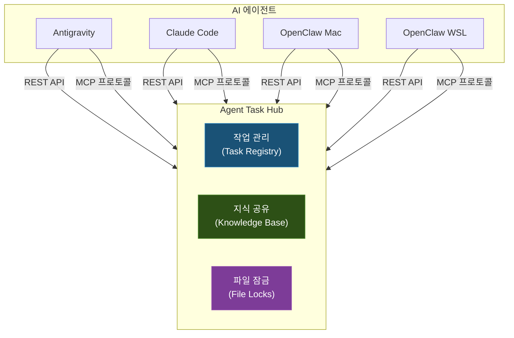
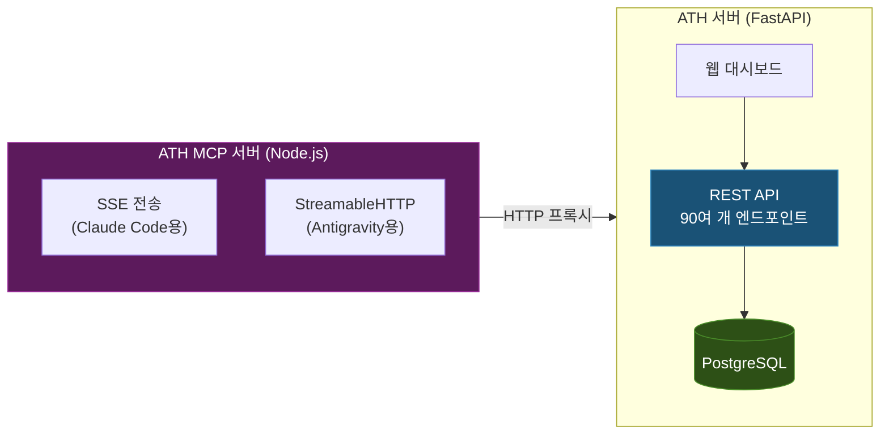

> **관련 글:**
> - [ATH 고도화 — 신뢰도 관리, Wiki 컴파일러, 시맨틱 검색](/development/ath-advanced-features/)
> - [MCP 실전 활용기](/development/mcp-practical-guide/)

## 배경: 왜 멀티 에이전트인가

개인 인프라인 홈랩[^homelab]에서 운영하는 서비스가 30개를 넘으면서, 한 번에 여러 작업을 동시에 진행해야 하는 상황이 잦아졌다. 서비스 포털의 버그를 수정하면서 동시에 단위 데이터 파이프라인을 이전하고, 그 사이에 DGX Spark[^dgx-spark]의 vLLM[^vllm] 설정도 같이 변경해야 하는 식이다.

기존의 AI 코딩 에이전트 단일 구성으로는 이런 병렬 작업이 어렵다. 에이전트는 기본적으로 하나의 대화 세션에서 순차적으로 작업을 처리하기 때문이다. 이러한 이유로 여러 에이전트를 동시에 운용하기 시작했다.

현재 운영 중인 에이전트 구성은 다음과 같다:

| 에이전트 | 기반 모델 | 주요 강점 | 접근 방식 |
|----------|-----------|-----------|-----------|
| Antigravity | Google Gemini | 브라우저 자동화, 웹 개발, 이미지 생성, 대규모 분석 | 대화 기반 |
| Claude Code | Anthropic Claude Opus 4.6 | 코드 생성 및 리팩토링, 디버깅, 아키텍처 설계 | 작업 기반 |
| OpenClaw (Mac) | 로컬 LLM (Qwen3-235B, vLLM) | 디스코드 원격 작업, 로컬 인프라 관리 | 워크플로우 기반 |
| OpenClaw (WSL) | GPT-OSS-120B (Ollama) | 디스코드 원격 작업, 외부 환경 연동 | 워크플로우 기반 |

과거에는 다양한 다른 체계도 실험했으나, OpenClaw의 워크플로우 기반 원격 작업 방식이 실용적이어서 현재의 구성으로 정착했다. Mac 환경은 강력한 로컬 거대 언어 모델을, WSL 환경은 Ollama에서 구동되는 로컬 모델을 활용하여 역할을 분담한다.

---

## 문제: 동시 작업의 충돌

에이전트를 여러 개 병행하여 운용하기 시작하자 곧바로 다음과 같은 문제들이 나타났다.

### 파일 동시 수정

가장 빈번하게 일어나는 문제다. 한 에이전트가 특정 파일의 구조를 개선하는 동안, 다른 에이전트가 같은 파일에 새로운 기능을 추가하려고 하면 한쪽의 변경 사항이 사라질 위험이 크다. 버전 관리 시스템으로 묶여있더라도, 같은 범위의 내용을 수정하면 충돌을 일일이 해결해주어야 한다.

### 중복 작업

에이전트 A에게 특정 기능 수정을 지시한 것을 깜빡하고, 에이전트 B에게 비슷한 요청을 다시 하게 되면 두 에이전트가 동일한 작업을 각자의 방식으로 중복해서 수행한다. 불필요한 컴퓨팅 자원과 시간이 낭비된다.

### 컨텍스트(문맥) 단절

에이전트 A가 시스템 문제를 확인하면서 특정 설정 값이 원인이라는 사실을 짚어냈음에도, 에이전트 B는 그 사실을 공유받지 못해 같은 문제를 발생 초기 단계부터 다시 짚어보게 된다. 각자의 발견이 서로에게 도움이 되지 못하는 상황이다.

이러한 문제들을 경험하면서, **에이전트 간의 작업 조율 시스템이 반드시 필요하다**는 결론을 얻었다.

---

## 설계: Agent Task Hub (ATH)

### 설계 원칙

정보를 조율하는 중앙 서버인 ATH를 설계하며 다음 세 가지 원칙을 세웠다:

1. **에이전트 독립성**: 특정 에이전트나 모델에 종속되지 않는 개방형 인터페이스를 제공하여, 언제든 새로운 형태의 에이전트가 시스템에 연동될 수 있도록 한다.
2. **경량성**: 홈랩 인프라 환경을 고려하여, 관계형 데이터베이스 시스템(RDBMS) 대신 파일 기반 데이터베이스인 SQLite를 채택했다.
3. **강제성**: 에이전트 시스템 프롬프트(System Prompt)에 규정 준수를 의무화한 정책을 지속 주입하여 통제력을 강화한다.

### 핵심 기능

ATH의 핵심 기능은 세 줄기로 요약된다:



#### 1. 작업 관리 (Task Registry)

에이전트가 작업을 수행하기 전 반드시 Task를 등록한다. 이를 통해 작업 상태를 시스템에 공유하고 각 에이전트 간 중복 작업 진행을 방지한다.

#### 2. 지식 공유 (Knowledge Base)

에이전트는 작업 중 확인한 정보, 설계 결정, 오류 해결 방법을 저장한다. 타 에이전트가 연관 작업을 수행할 때 이 지식베이스를 참조하여 의사결정을 효율화한다. 이는 조사결과(finding), 판단방향(decision), 오류수정(error), 공통패턴(pattern) 등의 카테고리로 정리된다.

#### 3. 파일 잠금 (File Locks)

동시 파일 수정 시 발생하는 충돌을 방지하기 위해 작업 타겟 파일에 대한 Lock을 요청한다. 파일 락은 권한 기반 강제 제어가 아닌 에이전트의 확인 절차에 기반한 논리적 잠금 구조다. 에이전트 종료 시 잠금이 일정 시간 후 자동 해제(TTL)된다.

---

## 구현: 서버 아키텍처

### 기술 스택

ATH 서버는 내부적으로 두 가지 응용 프로그램으로 나뉜다:



#### ATH 서버 (FastAPI + PostgreSQL)

**FastAPI**[^fastapi]를 기반으로 약 90여 개의 REST API 엔드포인트를 제공한다. 초기에는 SQLite(WAL 모드)로 시작했으나, 동시성 처리 안정성과 데이터 무결성 확보를 위해 PostgreSQL로 마이그레이션했다. 에이전트 도메인 외에 피드백, 에이전트 신뢰도 관리, 가이드라인, 교차 검증, 컨텍스트 브리핑 등의 고도화 도메인이 추가되었다.

#### ATH MCP 서버 (Node.js)

MCP(Model Context Protocol)[^mcp]는 AI 모델과 외부 시스템 간의 통신 표준이다. ATH 기능을 MCP 서버로 노출하여 에이전트가 표준화된 인터페이스로 시스템 리소스 및 도구에 접근할 수 있도록 지원한다. SSE와 HTTP 통신 방식을 모두 지원하여 접속하는 에이전트 특성에 맞게 조정된다.

### Kubernetes 배포

ATH 서버와 MCP 서버는 내부 클러스터 환경에 배포되어, 모든 에이전트가 고정된 주소로 안정적으로 접속할 수 있도록 구성했다.

---

## 에이전트 규칙 주입

잘 구축된 중앙 시스템이라 할지라도 에이전트가 프로세스를 누락하면 무결성이 손상된다. 따라서 에이전트의 워크플로우를 통제하기 위해, 시스템 프롬프트(System Prompt)에 ATH 사용 규칙을 명시적으로 주입한다.

### 규칙 주입 메커니즘

다음과 같은 아주 강한 표현을 사용한다:

```markdown
> [CRITICAL] 실제 작업 요청 수신 즉시 — 첫 번째 행동으로 ATH 작업(Task)을 등록할 것!
>
> 단순히 찾아보거나 질문에 답하는 수준이 아닌, 무언가를 바꾸는 모든 작업은 등록해야 한다.
> 작업 등록 없이 파일 구성을 고치거나 터미널 명령을 수행하는 일은 중대한 지침 위반이다.
```

이러한 규칙 주입을 통해 에이전트는 작업 수행 전 ATH에 태스크를 등록하고 트래킹하는 절차를 강제로 준수하게 된다.

### OpenClaw 권한 제어 및 위임 (Handoff)

인프라 제어 권한을 가진 에이전트(예: OpenClaw)에 대해서는 추가적인 보안 및 권한 제어를 적용한다.

1. **사전 검증 (Verify Check)**: 인프라 구성이나 보안 관련 작업을 시작하기 전, 에이전트는 반드시 교차 검증 도구를 통해 위험 요소를 자체 심사해야 한다.
2. **권한 상승 제어**: 시스템 설정 변경 및 관리자 권한(sudo)이 요구되는 명령은 자동 실행을 차단하고, 사용자 승인 절차(Human-in-the-loop)를 거치도록 통제한다.
3. **태스크 위임(Task Handoff)**: 환경적 제약이나 권한 문제로 특정 에이전트가 직접 수행 불가능한 작업(예: Antigravity의 내부 서버 파일 수정 등)은 ATH를 통해 수행 권한이 있는 타 에이전트에 위임하도록 파이프라인을 구축했다.

이러한 접근법을 통해 각 에이전트별 접근 권한 및 범위를 물리적/논리적으로 구분한다.

```mermaid
graph TD
    subgraph "접근 방식별"
        CLI["명령어 (CLI)"]
        REST["웹 요청 (REST API)"]
        MCP["MCP 프로토콜"]
    end

    CLI --> |OpenClaw\nClaude Code| ATH[ATH 서버]
    REST --> |OpenClaw (알림봇)| ATH
    MCP --> |Antigravity\nClaude Code| ATH

    style CLI fill:#1a5276,stroke:#2e86c1,color:#fff
    style REST fill:#2d5016,stroke:#4a8c2a,color:#fff
    style MCP fill:#5c1a5c,stroke:#9b2d9b,color:#fff
```

---

## 에이전트 레지스트리

시스템 내 각 에이전트의 특성과 주 역할을 레지스트리에 설정한다. 

```yaml
agents:
  antigravity:
    name: "Antigravity"
    type: "Google Deepmind"
    strengths:
      - "브라우저 및 테스트 화면 자동화"
      - "UI 구현 상세 작업"
      - "넓고 깊게 연관된 거대 문맥 점검"
  claude-code:
    name: "Claude Code"
    type: "Anthropic Claude"
    strengths:
      - "알고리즘 및 기초 코드 생성"
      - "장시간의 원인 추적(디버깅)"
```

이 정보를 바탕으로 작업의 적합성을 따져 서로 간의 업무 배분을 유도하며, 에이전트들이 잘 깨어있는지 온라인 상태도 함께 점검한다.

---

## 에이전트 식별자(Alias) 자동 변환 처리

초기 운영 시 데이터 상 에이전트 식별자(Identifier)가 일관되지 않게 기록되는 문제(예: `claude`와 `claude-code` 혼용)가 발생했다.

이를 해결하기 위해 쿼리 인입 시 분산된 별칭(Alias) 정보를 정규화된 식별자로 매핑하는 로직을 서버에 추가했다.

```python
AGENT_ALIASES = {
    "claude": "claude-code",
    "opencode": "opencode-openai",
    # 혼용되는 에이전트 명칭을 단일 식별자로 매핑
}
```

이 정책 적용 이후 에이전트 식별을 통합하여 일관된 작업 로깅이 이뤄지고 있다.

---

## 실전 운용 패턴

### 동시 작업 시나리오

다중 에이전트는 다음과 같은 프로세스로 협업한다:

1. **사용자**: 신규 UI 개발 요소 분석 및 코딩 작업을 Antigravity에게 할당
2. **Antigravity**: 프로토콜에 따라 ATH에 작업 등록 → 대상 파일 락 획득 → 화면 UI 컴포넌트 구현
3. **사용자**: API 백엔드 로직 디버깅 작업을 Claude Code에게 할당
4. **Claude Code**: ATH 조회 후 락 및 작업 간섭 여부 스캔 → API 로직 수정
5. **Claude Code**: 작업 중 확인된 시스템 제약 사항(예: 특정한 날짜 포맷 필요)을 추출하여 지식베이스(Knowledge Base)에 패턴(Pattern)으로 등록
6. **Antigravity**: 다음 웹 화면 스케줄링 요소 연동 작업 시 지식베이스를 조회하여, 사전에 등록된 날짜 제약 사항을 인지하고 정상적으로 코드 연동 처리 완료

### 작업의 위임(Handoff)

에이전트에게 부족한 접근 권한이나 로컬 특수 환경이 요구되는 작업의 경우 에이전트 간 위임 체계를 활용한다. 예를 들어, API 오류 수정을 완료한 후 해당 서비스의 화면 테스트 및 검증을 윈도우 UI 접근 권한이 있는 Antigravity 프로세스로 할당할 수 있도록 ATH에 명시하여 유도하는 형태다.

### 포커스 관리

에이전트 별 현재 작업 영역(Focus)을 시스템에 선언 및 등록한다. 에이전트들은 작업 전 시스템의 포커스 상태를 조회하여, 이미 프로세싱 중인 작업 컨텍스트와 상호 간섭하지 않고 독립 공간에서 진행할 수 있다.

---

## 운영에서 배운 것들

### 시스템 규칙의 자율적 준수율

시스템 지침을 세운다고 해서 AI가 언제나 100% 이를 수용하는 것은 아니었다.

| 항목 | 준수율 | 비고 |
|------|--------|------|
| 작업 (Task) 등록 | ~95% | 시스템 프롬프트를 통한 최상위 강제 규칙일 경우 높은 준수율을 보인다. MCP 도구 제공 후 개선되었다. |
| 지식 공유 (Knowledge) | ~70% | 컨텍스트 브리핑을 통한 자동 주입으로 활용률이 상승했다. |
| 파일 잠금 (File Lock) | ~50% | 코드 접근 전 락 획득 절차가 컨텍스트 분석 워크플로우에 의해 생략되는 경향이 여전히 있다. |
| 포커스 업데이트 | ~80% | 작업 시작 시 상태 선언율은 높으나, 완료 후 초기화(해제) 관리 비율이 다소 낮다. |

### 시스템 통제율 향상 방안

- **시스템 프롬프트 명시성 강화**: 가장 핵심적인 지침일수록 프롬프트 상단에 배치하고 명시적이고 강한 조건절을 지정할 때 준수가 향상됨을 확인했다.
- **MCP 통합 도구 제공**: 복합적인 호출 패턴이 아닌, 단일 책임을 가진 MCP 도구를 제공하여 에이전트 사용 비용(Cost)을 최소화했을 때 규칙 적용률이 증가했다.

### 도입 성과

- **오류 추적을 위한 감사 로그 기능**: 수립된 모든 작업 레코드가 ATH에 기록되어, 장애 발생 시 원인이 된 코드 변경 트러블슈팅과 트레이싱 정보로 기능하고 있다.
- **자율 생성 지식베이스 축적**: 에이전트들이 수행하여 누적한 이슈 히스토리가 시스템 모범 정책(Best Practices) 문서로 자생하여, 재발생 오류 접근 및 문제 해결 시간을 단축한다.

---

## API 및 대시보드 구조

### 통신 규격(API) 설계

주요 제어 도메인을 10여 개로 분류하고 90여 개의 REST 엔드포인트를 제공한다. Task Lifecycle 관리, Knowledge CRUD 및 시맨틱 검색, 파일 Lock 운영, 피드백 기록, 에이전트 신뢰도 관리, 가이드라인 동적 주입, 교차 검증, 컨텍스트 브리핑 등 핵심 기능을 표준화된 인터페이스로 노출하여 통합 관리 구조를 구현했다.

### 관리 대시보드

ATH 시스템 대시보드는 SPA 환경으로 설계되어 전체 현황에 대한 모니터링 환경을 제공한다. 
에이전트 포커스 현황, 상태별 Task 관리 내역, 실시간 최신 Knowledge 현황 및 에이전트 로그를 시각화하여 종합적인 오케스트레이션 관제가 가능하다.

---

## 마무리

Agent Task Hub(ATH)는 다중 에이전트 환경에서 발생하는 리소스 경합 및 컨텍스트 단절 문제를 통제하기 위해 자체 구현한 오케스트레이션 시스템이다. 초기 SQLite 기반에서 PostgreSQL로 마이그레이션하고, 지식베이스에 시맨틱 검색을 도입하며, 에이전트 신뢰도 관리로 에이전트의 신뢰도를 수치화하는 등 지속적인 고도화를 거쳐 왔다. 이러한 고도화의 상세 과정은 [별도 아티클](/development/ath-advanced-features/)에서 다룬다.

에이전트의 룰 자율 준수에 높은 의존성을 갖는 일부 파일 오퍼레이션 제어 과정 등은 향후 개선이 필요한 영역이다.

사전 Task 등록 체계를 도입함으로써 동시 작업의 충돌율을 크게 낮추고, 지식 공유를 통한 중복 실행을 최소화하여 시스템 유지보수의 전체 생산성이 높아지고 있다.

향후 AI 에이전트를 기반으로 팀 단위 개발을 보조하는 환경이 확산될수록, 이러한 에이전트 간의 상태 동기화 및 락(Lock) 매니지먼트를 전담하는 중앙 오케스트레이션 아키텍처는 인프라 관리의 핵심 요소가 될 것이다.

---

## 업데이트 내역

| 날짜 | 내용 |
|------|------|
| 2026-03-27 | 초판 작성 |
| 2026-04-08 | 전문적 어투로 리팩토링, OpenClaw 샌드박스 정책 반영 |
| 2026-04-13 | 에이전트 목록 갱신(Qwen3-235B, GPT-OSS-120B, Claude Opus 4.6, 디스코드 전환), ATH PostgreSQL 전환/API 90여 개 확장/신뢰도 관리·교차검증 언급, 준수율 데이터 최신화, 문체 "~다" 체 통일 |

---

[^homelab]: 홈랩(Home Lab): 학습, 실험 등을 목적으로 개인이 가정 내에 자체적으로 구축한 서버 및 네트워크 인프라 환경.
[^dgx-spark]: DGX Spark: 홈랩 내에서 AI 모델 구동 등을 위해 사용되는 NVIDIA GPU 기반의 고성능 연산 노드.
[^vllm]: vLLM: 대규모 언어 모델(LLM)을 보다 빠르고 메모리 효율적으로 실행할 수 있도록 돕는 추론 전용 프레임워크.
[^fastapi]: FastAPI: 최신 문법을 활용해 고성능의 API 서버를 빠르고 쉽게 작성할 수 있는 Python 도구.
[^mcp]: MCP (Model Context Protocol): AI 모델이 외부 시스템 내 파일이나 도구와 안전하게 대화하며 조작하기 위해 합의된 통신 규약.
