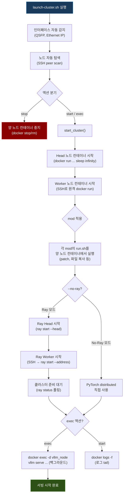
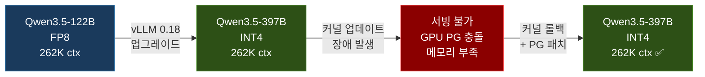

## 개요

[이전 글](/infrastructure/llm-serving-models/)에서 Qwen3-235B부터 MiniMax-M2.5를 거쳐 Qwen3.5-122B-FP8로 돌아오기까지의 모델 전환 여정을 다뤘다. 이 글은 그 이후의 이야기다.

vLLM 0.18로 업그레이드하면서 이전에는 올릴 수 없었던 **Qwen3.5-397B**(MoE, 17B 활성, INT4) 모델을 262K 컨텍스트로 서빙하는 데 성공했다. 하지만 같은 날 시스템 패키지 업데이트(apt upgrade)로 인해 서빙이 완전히 불가능해지는 장애를 겪었고, 커널 롤백으로 복구했다.

이 글에서는 세 가지를 다룬다:

1. vLLM 0.18의 어떤 기능이 397B 서빙을 가능하게 했는가
2. 커널 업데이트가 왜 LLM 서빙을 망가뜨렸는가
3. 디버깅 과정에서 발견한 vLLM v1 엔진의 구조적 버그와 해결

---

## 왜 397B를 올리고 싶었는가

이전 글에서 언급했듯이, 122B-FP8(활성 10B)은 안정적이었지만 코딩 에이전트로서의 역량에 한계가 있었다. 복잡한 멀티파일 리팩터링이나 아키텍처 설계 같은 작업에서는 모델 규모의 벽이 느껴졌다.

Qwen3.5-397B-A17B는 MoE 구조로 전체 397B 파라미터 중 요청당 17B만 활성화된다. INT4(AutoRound) 양자화를 적용하면 모델 가중치가 약 100GB로, DGX Spark 2노드(~240GB)에 올라갈 수 있는 크기다.

문제는 "올라갈 수 있다"와 "서빙할 수 있다"는 다르다는 것이었다. 모델 가중치 100GB를 적재하고 나면 KV 캐시에 할당할 메모리가 거의 남지 않았다. 이전 vLLM 버전에서는 이 조합이 불가능했다.

---

## vLLM 0.18 -- 무엇이 달라졌는가

### FP8 KV 캐시

vLLM 0.18의 가장 중요한 변경점은 **FP8 KV 캐시**의 안정화다. 이전 버전에서도 FP8 KV 캐시를 지원했지만, 0.18에서 Blackwell 아키텍처(GB10)에 대한 호환성이 개선되었다.

KV 캐시는 추론 시 각 토큰의 Key/Value 텐서를 저장하는 공간이다. 컨텍스트가 길어질수록, 동시 요청이 많아질수록 KV 캐시는 더 많은 메모리를 소비한다.

| KV 캐시 dtype | 토큰당 메모리 | 동일 메모리 대비 컨텍스트 |
|--------------|-------------|----------------------|
| FP16 | 기준 | 기준 |
| FP8 | **50%** | **2배** |

모델 가중치 100GB를 적재한 후 남는 ~12GB에서, FP16이었다면 짧은 컨텍스트만 가능했겠지만 FP8 KV 캐시 덕분에 2배의 컨텍스트를 확보할 수 있었다.

```bash
--kv-cache-dtype fp8  # FP8 KV 캐시 활성화
```

### gpu-memory-utilization-gb

기존 vLLM의 `--gpu-memory-utilization` 파라미터는 비율(0.0~1.0)로 GPU 메모리 사용량을 지정한다. 예를 들어 `0.90`은 "전체 GPU 메모리의 90%를 사용하겠다"는 의미다.

DGX Spark의 UMA(통합 메모리) 환경에서 이것은 문제가 된다. `nvidia-smi`가 VRAM을 `N/A`로 보고하므로, vLLM이 "전체 GPU 메모리"를 정확히 파악하지 못할 수 있다. 비율 기반 설정은 환경에 따라 예측 불가능한 결과를 낳는다.

vLLM 0.18에서 추가된 `--gpu-memory-utilization-gb` 파라미터는 **절대값(GiB)**으로 메모리 사용량을 지정한다:

```bash
--gpu-memory-utilization-gb 112  # 정확히 112GB 사용
```

DGX Spark의 물리 메모리 128GB 중 112GB를 GPU에 할당하면:
- 모델 가중치: ~100GB
- KV 캐시: ~12GB (FP8)
- 시스템 예약: ~16GB

이 조합으로 262K 컨텍스트가 가능해졌다. 비율 기반(`0.90`)이었다면 "128GB의 90% = 115GB"인지, "감지된 값의 90%"인지 불확실했을 것이다.

> 참고: `gpu-memory-utilization-gb` 파라미터는 vLLM 공식 빌드에는 포함되어 있지 않다. DGX Spark 전용 커뮤니티 프로젝트([spark-vllm-docker](https://github.com/eugr/spark-vllm-docker))에서 mod(패치) 시스템을 통해 제공하는 기능이다.

### v1 엔진 아키텍처

vLLM 0.18은 **v1 엔진**이 기본값이다. v0 엔진과의 주요 차이:

- **APIServer와 EngineCore 분리**: APIServer는 HTTP 요청을 처리하고, EngineCore는 별도 프로세스(multiprocessing)로 실행되어 실제 추론을 담당한다
- **SchedulerOutput 최적화**: 청크 프리필(chunked prefill)과 prefix caching이 개선되었다
- **Compiled DAG 지원**: Ray를 통한 분산 실행 시 컴파일된 DAG로 오버헤드를 줄인다

이 아키텍처 변경은 성능에 긍정적이었지만, 나중에 예상치 못한 버그의 원인이 되기도 했다.

### 분산 추론 백엔드: Ray

DGX Spark 2노드로 397B 모델을 서빙하려면 **Tensor Parallelism(TP)**이 필수다. 하나의 GPU에 모델 전체를 올릴 수 없으므로, 모델 가중치를 2개 GPU에 분할하고 추론 시 AllReduce로 동기화해야 한다.

vLLM은 이를 위해 [Ray](https://docs.ray.io/)를 분산 실행 백엔드로 사용한다. Ray는 Python 기반 분산 컴퓨팅 프레임워크로, 주요 개념은 다음과 같다:

- **Ray Cluster**: Head 노드(스케줄러)와 Worker 노드(실행기)로 구성된다. 우리 환경에서는 228이 Head, 237이 Worker다
- **Placement Group**: GPU, CPU 같은 리소스를 논리적으로 묶어 예약하는 단위다. vLLM은 TP 수만큼의 GPU를 placement group으로 예약하여 다른 프로세스가 사용하지 못하게 보호한다
- **Actor**: Ray에서 상태를 가진 원격 객체다. vLLM은 각 GPU에서 실행되는 `RayWorkerWrapper`를 Actor로 생성하여 모델 추론을 수행한다

이 구조에서 핵심은 **placement group이 GPU 리소스의 독점적 예약을 보장**한다는 점이다. 이것이 나중에 문제가 된다.

---

## launch-cluster.sh -- 클러스터 시작 과정

DGX Spark에서 vLLM을 서빙하기 위해 [spark-vllm-docker](https://github.com/eugr/spark-vllm-docker) 프로젝트의 `launch-cluster.sh` 스크립트를 사용한다. 822줄짜리 이 스크립트가 수행하는 작업을 순서도로 정리하면 다음과 같다:



핵심 포인트는 **mod 시스템**이다. `--apply-mod` 옵션으로 지정한 디렉토리 안의 `run.sh`가 컨테이너 내부에서 실행되어, vLLM 소스 코드를 실행 시점에 패치한다. 이를 통해 vLLM 이미지를 다시 빌드하지 않고도 기능을 추가하거나 버그를 수정할 수 있다:

- `gpu-mem-util-gb`: `--gpu-memory-utilization-gb` 파라미터 지원 추가
- `fix-qwen3.5-autoround`: Qwen3.5 모델의 AutoRound INT4 양자화 호환성 패치
- `fix-qwen3.5-chat-template`: Unsloth 포맷 채팅 템플릿 적용
- `fix-ray-gpu-check`: stale placement group 자동 정리 (이번 장애에서 새로 생성)

---

## 397B 서빙 성공 -- 그리고 장애

### 첫 서빙 성공

vLLM 0.18로 업그레이드하고 Qwen3.5-397B-INT4를 올렸다. 약 12분의 시작 시간(모델 로딩 6분 + KV 캐시 프로파일링 + CUDA 그래프 컴파일) 후 서빙이 시작되었다.

```
vLLM 0.18.1rc1.dev222
모델: Intel/Qwen3.5-397B-A17B-int4-AutoRound
컨텍스트: 262,144 tokens (262K)
KV Cache: FP8
GPU 메모리: 112GB
Tensor Parallel: 2 (228 Head + 237 Worker)
```

OpenClaw(디스코드 봇 에이전트)를 통해 정상 동작을 확인했다. tool calling과 reasoning 모두 정상이었다.

### apt upgrade -- 장애의 근본적 원인

같은 날 오후, 시스템 패키지 업데이트를 실행했다:

```bash
sudo apt upgrade
```

이 명령 하나가 NVIDIA 드라이버와 커널을 모두 업그레이드했다:

| 패키지 | 변경 전 | 변경 후 |
|--------|--------|--------|
| nvidia-driver-580-open | 580.126.09 | 580.142 |
| linux-image-nvidia | 6.17.0-1008 | 6.17.0-1014 |
| libnvidia-compute-580 | 580.126.09 | 580.142 |

재부팅 후 vLLM 서비스가 자동으로 시작되었지만, API가 응답하지 않았다. `docker logs`를 확인하니:

```
ValueError: Current node has no GPU available.
current_node_resource={'accelerator_type:GB10': 1.0, 'CPU': 2.0, ...}
```

GPU가 분명히 존재하는데(accelerator_type:GB10이 보인다) "GPU가 없다"는 에러. 여기서부터 6시간의 디버깅이 시작됐다.

---

## 디버깅 -- 세 개의 버그가 겹쳐 있었다

### 버그 1: Ray Placement Group 충돌

vLLM v1 엔진은 APIServer와 EngineCore를 별도 프로세스로 실행한다. EngineCore가 Ray 클러스터에 연결할 때, 이전 EngineCore(또는 다른 vLLM 인스턴스)가 생성한 **placement group이 GPU 리소스를 전량 점유**하고 있으면 "GPU 없음" 에러가 발생한다.

```python
# ray_utils.py (vLLM v0.18.x)
current_node_resource = available_resources_per_node()[current_node_id]
if current_node_resource.get("GPU", 0) < 1:
    raise ValueError("Current node has no GPU available.")
```

`available_resources_per_node()`는 placement group에 할당된 리소스를 제외한 "사용 가능한" 리소스를 반환한다. 이전 프로세스의 placement group이 정리되지 않으면, 실제로는 GPU가 있어도 0으로 보고된다.

**해결**: stale placement group을 감지하여 자동으로 정리하는 패치를 작성했다. `ray.cluster_resources()`로 클러스터 전체의 GPU 존재를 확인한 후, stale PG를 제거하고 새 PG를 생성한다. 이 패치는 `fix-ray-gpu-check`라는 이름의 mod로 launch-cluster.sh에 통합했다.

### 버그 2: systemd 서비스의 이중 실행

vLLM 클러스터를 관리하는 systemd 서비스(`vllm-cluster.service`)가 `Restart=on-failure`로 설정되어 있었다. vLLM이 placement group 에러로 실패하면, 30초 후 systemd가 재시작을 시도한다. 이 재시작된 프로세스와 수동으로 실행한 프로세스가 **동시에 GPU를 놓고 경쟁**하면서 서로의 placement group을 "stale"로 판단하고 제거하는 악순환이 발생했다.

디버깅 과정에서 컨테이너 내부에 4~6개의 vLLM 프로세스가 동시에 실행되는 것을 발견했다. 각각이 서로의 Ray placement group을 제거하며 끝없이 재시작을 반복했다.

```bash
# 컨테이너 내부 프로세스 목록 (발견 당시)
PID 610  vllm serve ... --gpu-memory-utilization-gb 112  # 수동 실행
PID 3055 vllm serve ... --gpu-memory-utilization-gb 100  # systemd 자동 실행
PID 4987 vllm serve ... --gpu-memory-utilization-gb 100  # systemd 재시작
PID 5477 vllm serve ... --gpu-memory-utilization-gb 100  # systemd 재시작
```

**해결**: systemd 서비스 타입을 `Type=forking`에서 `Type=oneshot` + `RemainAfterExit=yes`로 변경했다.

여기서 systemd의 서비스 타입이 왜 중요한지 짚고 넘어가자:

| Type | 동작 방식 | 적합한 경우 |
|------|----------|------------|
| `simple` | ExecStart로 지정한 프로세스가 **메인 프로세스**다. 이 프로세스가 종료되면 systemd는 서비스가 중단된 것으로 판단한다 | 프로세스가 포그라운드에서 계속 실행되는 경우 (예: `nginx`, `node server.js`) |
| `forking` | ExecStart 프로세스가 **자식 프로세스를 fork**하고 부모는 종료된다. systemd는 fork된 자식을 메인 프로세스로 추적한다 | 전통적인 데몬 (예: `sshd`, `apache2`) |
| `oneshot` | ExecStart가 **한 번 실행되고 종료**된다. `RemainAfterExit=yes`와 함께 사용하면, 프로세스가 종료되어도 서비스를 "active" 상태로 유지한다 | 초기화 스크립트, 일회성 설정 작업 |

`launch-cluster.sh -d`는 컨테이너 내부에서 `docker exec -d`로 vLLM을 백그라운드 실행하고 **즉시 종료**한다. 이때:
- `Type=forking`이면: 부모 프로세스(launch-cluster.sh)가 종료되었으나 fork된 자식이 없으므로 systemd가 "실패"로 판단 → ExecStop 실행 → 서비스 중지
- `Type=simple`이면: 메인 프로세스가 종료되었으므로 역시 "중지"로 판단 → Restart=on-failure 작동 → 무한 재시작
- `Type=oneshot` + `RemainAfterExit=yes`면: 스크립트 정상 종료(exit 0) 후 서비스를 "active" 상태로 유지 → 재시작 없음

### 버그 3: 커널/드라이버 업그레이드에 의한 메모리 관리 변경

placement group 문제를 해결하고 나니, **새로운 문제**가 드러났다:

```
ValueError: No available memory for the cache blocks.
Available KV cache memory: -3.93 GiB
```

`--gpu-memory-utilization-gb 100`으로 100GB를 할당했는데, 모델이 ~104GB를 사용하여 KV 캐시에 할당할 메모리가 **-3.93GB**(부족)였다. 아침에는 같은 설정으로 정상 동작했는데?

원인은 **NVIDIA 드라이버 580.126.09 → 580.142 업그레이드와 커널 6.17.0-1008 → 1014 업그레이드**였다. 새 드라이버/커널 조합에서 UMA 메모리 관리 방식이 변경되어, 동일한 모델에 더 많은 GPU 메모리가 필요해졌다.

#### 커널 업데이트 전후 비교

| 항목 | 커널 1008 + 드라이버 580.126 | 커널 1014 + 드라이버 580.142 |
|------|----------------------------|----------------------------|
| 모델 적재 메모리 | ~100GB | ~104GB |
| gpu-mem-gb 100 KV 캐시 | 양수 (충분) | **-3.93GB** (부족) |
| gpu-mem-gb 112 KV 캐시 | ~12GB | ~8GB |
| CUDA 그래프 컴파일 | ~5분 | **50분+ (멈춤)** |
| `--enforce-eager` 필요 | 불필요 | **필요** |
| 262K 컨텍스트 | 가능 | **32K만 가능** (112GB에서도) |

새 커널/드라이버에서는 `--enforce-eager`(CUDA 그래프 비활성화) 없이는 서버가 시작조차 되지 않았다. CUDA 그래프 컴파일이 50분 이상 CPU 100%로 실행되다가 결국 타임아웃되는 현상이 발생했다. `--enforce-eager`를 추가하면 서버는 시작되지만, KV 캐시 메모리 제약으로 `--max-model-len`을 32768로 크게 낮춰야 했다.

32K 컨텍스트는 코딩 에이전트로서 치명적인 제한이다. 시스템 프롬프트, 도구 정의, 대화 히스토리, 코드 컨텍스트를 합하면 쉽게 32K를 초과한다. 결국 122B-FP8을 쓰던 이유가 "262K 컨텍스트"였는데, 397B로 올리면서 오히려 컨텍스트가 줄어든다면 본말이 전도된 것이다.

---

## 해결 -- 커널 롤백

결론은 단순했다. **이전 커널로 롤백**하는 것이다.

### GRUB 설정

DGX Spark은 UEFI GRUB을 사용한다. 이전 커널(`6.17.0-1008-nvidia`)이 아직 설치되어 있었으므로, GRUB 기본 부팅 커널을 변경했다.

DGX Spark의 GRUB 메뉴는 submenu 구조로 되어 있어, 단순히 `GRUB_DEFAULT=2` 같은 인덱스로는 동작하지 않는다. menuentry의 ID를 `submenu>entry` 형식으로 지정해야 한다:

```bash
# 228 서버 (UUID: 66606008...)
sudo grub-set-default "gnulinux-advanced-66606008-...>gnulinux-6.17.0-1008-nvidia-advanced-66606008-..."
sudo sed -i "s/GRUB_DEFAULT=.*/GRUB_DEFAULT=saved/" /etc/default/grub
sudo update-grub

# 237 서버 (UUID: 08692ac5...) -- 디스크 UUID가 다르므로 주의
sudo grub-set-default "gnulinux-advanced-08692ac5-...>gnulinux-6.17.0-1008-nvidia-advanced-08692ac5-..."
sudo sed -i "s/GRUB_DEFAULT=.*/GRUB_DEFAULT=saved/" /etc/default/grub
sudo update-grub
```

한 가지 주의: DGX Spark의 `grub.cfg`는 기본적으로 비어있다. 커널 업데이트 후 `sudo update-grub`을 실행하지 않으면 GRUB 메뉴가 생성되지 않는다. 이 경우 GRUB은 fallback 동작으로 가장 최신 커널을 자동 부팅한다.

### 롤백 결과

양 노드 재부팅 후 `uname -r`로 커널 확인:

```
228: 6.17.0-1008-nvidia ✅
237: 6.17.0-1008-nvidia ✅
```

vLLM을 원래 파라미터로 시작하자 **12분 만에 262K 컨텍스트로 서빙이 시작**되었다. `--enforce-eager` 없이, CUDA 그래프 컴파일도 정상적으로 완료되었다.

---

## 최종 구성

| 항목 | 값 |
|------|-----|
| 모델 | Intel/Qwen3.5-397B-A17B-int4-AutoRound |
| 규모 | 397B MoE (활성 17B), INT4 양자화 |
| 컨텍스트 | 262,144 tokens (262K) |
| KV 캐시 | FP8 |
| GPU 메모리 할당 | 112GB (절대값) |
| Tensor Parallel | 2 (Head + Worker) |
| 분산 백엔드 | Ray |
| Tool Calling | qwen3_coder 파서 |
| Reasoning | qwen3 파서 |
| 커널 | 6.17.0-1008-nvidia (고정) |
| NVIDIA 드라이버 | 580.126.09 |



---

## 교훈

### 1. apt upgrade는 LLM 서빙 서버에서 신중하게

NVIDIA 드라이버와 커널은 GPU 메모리 관리에 직접적인 영향을 미친다. 특히 UMA 환경에서는 드라이버의 메모리 할당 정책이 바뀌면 동일한 설정에서도 모델이 올라가지 않을 수 있다.

권장 사항:
- LLM 서빙 서버에서는 `apt upgrade` 대신 **보안 패치만 선별 적용**
- NVIDIA 관련 패키지는 `apt-mark hold`로 버전 고정
- 업그레이드 전 반드시 현재 커널/드라이버 버전을 기록하고, 이전 커널이 GRUB에 남아있는지 확인

```bash
# NVIDIA 패키지 버전 고정
sudo apt-mark hold nvidia-driver-580-open libnvidia-compute-580 \
  linux-image-nvidia-hwe-24.04 linux-headers-nvidia-hwe-24.04
```

### 2. systemd 서비스 설계 시 프로세스 라이프사이클 이해

`launch-cluster.sh -d`처럼 daemon 모드로 프로세스를 백그라운드에 띄우고 즉시 종료하는 스크립트에는 `Type=oneshot` + `RemainAfterExit=yes`가 적합하다. 앞서 설명한 것처럼 `Type=forking`이나 `Type=simple`은 이런 패턴의 스크립트와 궁합이 맞지 않아 의도치 않은 재시작이나 서비스 중지를 유발한다.

또한 `Restart=on-failure`는 편리하지만, 실패 원인이 리소스 경합(placement group 충돌 등)인 경우 오히려 상황을 악화시킨다. 재시작 간격(`RestartSec`)을 충분히 길게 설정하거나, 재시작 전 정리 로직을 추가해야 한다.

### 3. 디버깅 시 근본 원인과 파생 문제를 구분하라

이번 장애에서는 세 개의 버그가 겹쳐 있었다:
- **근본 원인**: 커널/드라이버 업그레이드로 인한 메모리 관리 변경
- **파생 문제 1**: Ray placement group 충돌 (v1 엔진 구조적 이슈)
- **파생 문제 2**: systemd의 이중 실행

처음에는 placement group 문제만 보였고, 이를 해결하니 메모리 문제가 드러났고, 메모리를 조정하니 systemd 이중 실행이 발견됐다. 각 문제를 개별적으로 해결하면서 6시간을 소비했는데, 처음부터 "아침에 됐던 것이 왜 안 되는가?"라는 질문에 집중했다면 커널 롤백이라는 답에 더 빨리 도달했을 것이다.

---

## 다음 과제

커널 롤백은 임시 조치다. 이전 커널(6.17.0-1008)은 보안 패치가 중단될 수 있고, 새 커널에서 제공하는 성능 개선이나 하드웨어 지원을 활용하지 못한다.

### 단기: 새 커널 호환성 확보

- 새 커널에서 `--gpu-memory-utilization-gb` 값을 높이거나 `--enforce-eager` 조합으로 262K 컨텍스트를 확보하는 방법을 계속 탐색
- vLLM 업스트림에 DGX Spark UMA 환경에서의 placement group 이슈를 보고
- NVIDIA 드라이버 580.142에서의 UMA 메모리 할당 변경사항을 추적

### 중장기: TurboQuant를 통한 KV 캐시 메모리 혁신

이번 장애의 본질적 원인은 **397B 모델 가중치가 GPU 메모리의 대부분을 차지하여 KV 캐시에 할당할 여유가 부족**하다는 것이다. FP8 KV 캐시로 2배의 효율을 얻었지만, 262K 컨텍스트에서는 여전히 빠듯하다.

[TurboQuant](https://research.google/blog/turboquant-redefining-ai-efficiency-with-extreme-compression/)는 Google이 ICLR 2026에서 발표한 KV 캐시 압축 알고리즘으로, 이 문제에 대한 근본적인 해법이 될 수 있다:

- **KV 캐시를 3-bit(Key) + 2-bit(Value)로 극단적 압축**: FP8(8-bit) 대비 약 3배 추가 절약, FP16 대비 약 **6배** 메모리 절약
- **학습/파인튜닝 불필요**: 추론 시점에 KV 캐시에만 적용하므로 기존 모델을 그대로 사용
- **정밀도 유지**: PolarQuant(극좌표 변환)와 QJL(1-bit 오차 보정) 두 단계로 압축하여, 일부 벤치마크에서 full-precision과 동등한 성능

현재 FP8 KV 캐시로 262K 컨텍스트에 ~12GB를 사용하고 있는데, TurboQuant를 적용하면 동일 메모리에서 이론적으로 **~750K+ 컨텍스트**가 가능해진다. 또는 동일 컨텍스트에서 더 많은 동시 요청을 처리할 수 있다.

vLLM에는 아직 공식 통합되지 않았으나([관련 이슈](https://github.com/vllm-project/vllm/issues/38171)), Google의 공식 구현이 2026년 Q2에 공개될 예정이며, 독립 개발자들의 Triton 커널 기반 구현도 이미 존재한다. TurboQuant + vLLM 조합은 DGX Spark처럼 메모리가 제한된 환경에서 초거대 모델을 서빙하면서도 충분한 컨텍스트를 확보하는 핵심 기술이 될 것이다.

---

현재 구성은 안정적으로 동작하고 있으며, AI 코딩 에이전트들(Claude Code, OpenClaw, Antigravity)이 397B 모델을 262K 컨텍스트로 활용하고 있다.
