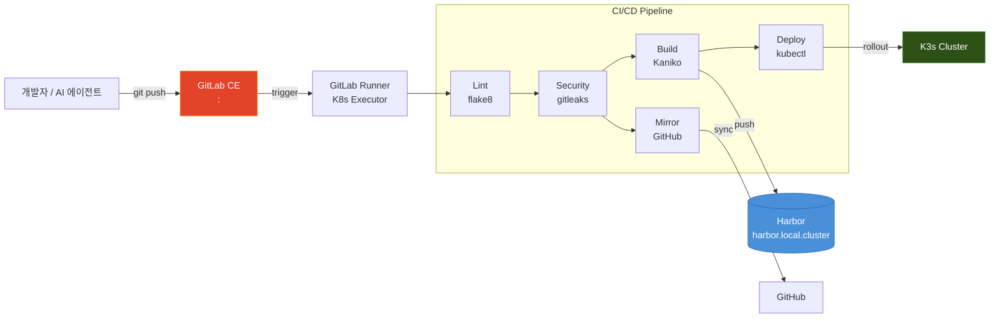

## 들어가며

[홈랩 아키텍처 1편](/infrastructure/home-lab-architecture/)에서 "GitLab + Kaniko CI/CD"를 소개한 적이 있다. 이 글에서는 그 파이프라인을 실제로 어떻게 구축했는지, 어떤 문제에 부딪혔고 어떻게 해결했는지를 구체적으로 다룬다.

핵심 요구사항은 세 가지였다:

1. **Docker 데몬 없이 컨테이너 이미지 빌드** — K3s 환경에서 DinD는 보안 부담이 크다
2. **자체 레지스트리(Harbor)에 TLS 인증서 기반으로 push** — `--skip-tls-verify`는 쓰지 않는다
3. **모노레포 구조에서 변경된 서비스만 빌드/배포** — 전체 빌드는 시간 낭비

최종 결과물은 `feature/*` 브랜치에서 MR을 생성하고 main에 merge하면, 변경된 서비스의 이미지가 자동으로 빌드되어 Harbor에 push되고, K3s에 배포까지 완료되는 파이프라인이다.

---

## 아키텍처



---

## GitLab 서버 배포

GitLab CE를 K3s 위에 단일 Pod(Omnibus)로 배포했다. Helm Chart 대신 직접 manifest를 작성한 이유는, GitLab Helm Chart가 수십 개의 마이크로서비스로 분리되어 리소스 소비가 과도하기 때문이다. Omnibus는 모든 컴포넌트가 하나의 컨테이너에 포함되어 관리가 단순하다.

```yaml
# 리소스 설정 (deployment.yaml 발췌)
resources:
  requests:
    memory: "10Gi"
    cpu: "2000m"
  limits:
    memory: "20Gi"
    cpu: "8000m"
```

### 데이터 영속성

Longhorn PVC 3개로 데이터를 분리 관리한다:

| PVC | 마운트 경로 | 용도 |
|-----|-----------|------|
| gitlab-config-pvc (10Gi) | /etc/gitlab | 설정 파일 |
| gitlab-data-pvc | /var/opt/gitlab | Git 저장소, DB, 업로드 |
| gitlab-logs-pvc | /var/log/gitlab | 로그 |

### LDAP 연동

모든 내부 서비스가 동일한 LDAP 계정을 사용한다. GitLab도 마찬가지:

```ruby
# GITLAB_OMNIBUS_CONFIG 발췌
gitlab_rails['ldap_servers'] = {
  'main' => {
    'host'     => 'openldap.openldap.svc.cluster.local',
    'port'     => 389,
    'uid'      => 'uid',
    'base'     => 'dc=local,dc=cluster',
    'bind_dn'  => 'cn=admin,dc=local,dc=cluster',
  }
}
```

LDAP 사용자가 GitLab에 처음 로그인하면 자동으로 계정이 생성된다. SSH 키 등록, 프로젝트 접근 권한 등은 GitLab UI에서 관리한다.

### 트러블슈팅: OOMKill과 keywatcher EOF

배포 초기, GitLab 백업 실행 시 메모리 피크로 Pod이 OOMKill(exit code 137)되는 문제가 반복됐다. 동시에 `gitlab-workhorse` 로그에서 `keywatcher: pubsub receive: EOF`가 반복 출력됐다.

원인은 두 가지였다:
- Puma 워커 프로세스와 Sidekiq 동시성이 기본값으로 과도하게 설정됨
- Redis의 `timeout 60` 설정으로 pubsub 유휴 연결이 주기적으로 끊김

해결:

```ruby
puma['worker_processes'] = 4
puma['min_threads'] = 4
puma['max_threads'] = 4
sidekiq['concurrency'] = 10
redis['timeout'] = 0
redis['tcp_timeout'] = 0
```

리소스 상한도 `16Gi → 20Gi`로 올렸다. 이후 백업이 정상 완료되고, keywatcher EOF도 재발하지 않았다.

---

## GitLab Runner: Kubernetes Executor

GitLab Runner는 별도 네임스페이스(`gitlab-runner`)에 Helm Chart로 배포했다:

```
$ kubectl get pods -n gitlab-runner
NAME                            READY   STATUS    RESTARTS   AGE
gitlab-runner-f55f77b45-tmz56   1/1     Running   0          10d
```

Kubernetes Executor를 사용한다. 즉, CI/CD 잡이 실행될 때마다 Runner가 K3s 클러스터에 임시 Pod을 생성하고, 빌드를 실행한 뒤 Pod을 삭제한다. 전용 빌드 서버를 운영할 필요가 없다.

Runner 등록 시 핵심 설정:

- `privileged: false` — 보안을 위해 특권 모드 비활성화
- Kaniko 빌드를 위한 Harbor CA 인증서는 CI Variable로 주입

---

## 모노레포 구조

여러 서비스의 소스코드를 하나의 GitLab 프로젝트(`hyunjam/ai-agent-scm`)에서 관리한다.

```
ai-agent-scm/
├── services/
│   ├── agent-hub-server/
│   │   ├── Dockerfile
│   │   ├── main.py
│   │   └── ...
│   ├── service-portal-backend/
│   │   ├── Dockerfile
│   │   └── ...
│   ├── service-portal-frontend/
│   │   ├── Dockerfile
│   │   └── ...
│   └── agent-chat-backend/
│       ├── Dockerfile
│       └── ...
├── k8s/
│   ├── agent-hub/
│   ├── service-portal/
│   └── ...
├── .gitlab-ci.yml
└── README.md
```

모노레포를 택한 이유:

1. **변경 원자성**: 백엔드 API와 프론트엔드, K8s 매니페스트를 하나의 MR에서 함께 변경 가능
2. **CI/CD 통합**: `.gitlab-ci.yml` 하나로 서비스별 조건부 빌드 제어
3. **AI 에이전트 친화적**: 에이전트가 하나의 리포지토리에서 전체 맥락을 파악할 수 있음

---

## .gitlab-ci.yml 파이프라인 설계

### 스테이지 구성

```yaml
stages:
  - l3-lint
  - l3-security
  - build-prod
  - deploy-k8s
```

| 스테이지 | 잡 | 트리거 조건 | 설명 |
|---------|---|-----------|------|
| l3-lint | l3-lint-python | `feature/*`, `fix/*` | flake8 코드 품질 검사 |
| l3-security | l3-secret-scan | `feature/*`, `fix/*` | gitleaks 시크릿 스캔 |
| build-prod | kaniko-build-* | `main` + 서비스 파일 변경 | Kaniko 이미지 빌드 → Harbor push |
| deploy-k8s | kubectl-deploy-* | `main` + 서비스 파일 변경 | kubectl 롤링 업데이트 |
| deploy-k8s | mirror-to-github | `main`, `staging` | GitHub 미러링 |

### 서비스별 조건부 빌드

모노레포에서 핵심은 **변경된 서비스만 빌드**하는 것이다. `changes` 키워드를 활용한다:

```yaml
kaniko-build-agent-hub:
  stage: build-prod
  rules:
    - if: $CI_COMMIT_BRANCH == "main"
      changes:
        - services/agent-hub-server/**/*
  # ...
```

`services/agent-hub-server/` 디렉토리 내 파일이 변경되었을 때만 해당 서비스의 빌드 잡이 트리거된다. 10개 서비스가 있어도 변경된 1개만 빌드되므로 파이프라인 시간이 단축된다. 이미지 빌드는 `services/` 아래 Dockerfile 기준으로 이루어지고, 배포는 `k8s/` 아래 매니페스트 또는 기존 Deployment에 대한 image tag 변경으로 처리한다.

다만 공용 모듈, 루트 레벨 설정, 공통 베이스 이미지 변경은 `changes` 규칙만으로 감지하기 어려울 수 있다. 실제 운영에서는 서비스별 규칙과 공용 경로 규칙을 함께 관리해야 한다.

---

## Kaniko 빌드

### Docker 데몬 없이 빌드하기

Kaniko는 Docker 데몬 없이 Dockerfile을 빌드하는 Google 오픈소스 도구다. K3s 환경에서 DinD(Docker-in-Docker)를 피하기 위해 선택했다.

```yaml
kaniko-build-agent-hub:
  stage: build-prod
  image:
    name: gcr.io/kaniko-project/executor:latest
    entrypoint: [""]
  script:
    - /kaniko/executor
      --context "${CI_PROJECT_DIR}/services/agent-hub-server"
      --dockerfile "${CI_PROJECT_DIR}/services/agent-hub-server/Dockerfile"
      --destination "harbor.local.cluster/library/agent-hub-server:${CI_COMMIT_SHORT_SHA}"
      --destination "harbor.local.cluster/library/agent-hub-server:latest"
```

### Harbor TLS 인증서 처리

Kaniko에서 Harbor로 push할 때 TLS 인증서 검증이 필요하다. `--skip-tls-verify`는 보안상 사용하지 않기로 했다. 대신 GitLab CI Variable에 Harbor CA 인증서를 저장하고, 빌드 전에 시스템 인증서 번들에 추가한다:

```yaml
before_script:
  - echo "${HARBOR_CA_CERT}" >> /etc/ssl/certs/ca-certificates.crt
```

이 한 줄이 동작하기까지 여러 시행착오가 있었다:

1. CI Variable의 개행 문자가 깨지는 문제 → Variable type을 `File`이 아닌 `Variable`로 설정
2. Kaniko 이미지의 인증서 경로가 일반 Linux와 다른 문제 → `/etc/ssl/certs/ca-certificates.crt`가 맞음
3. CI Variable에 PEM 전체를 넣어야 하는데, 처음에 `-----BEGIN CERTIFICATE-----`와 `-----END CERTIFICATE-----` 사이의 base64만 넣었던 실수

---

## 자동 배포

### kubectl Deploy Job

빌드가 완료되면 kubectl을 사용하여 K3s 클러스터에 배포한다:

```yaml
kubectl-deploy-agent-hub:
  stage: deploy-k8s
  image:
    name: bitnami/kubectl:latest
    entrypoint: [""]
  script:
    - kubectl set image deployment/agent-hub-server
        agent-hub-server=harbor.local.cluster/library/agent-hub-server:${CI_COMMIT_SHORT_SHA}
        -n agent-hub
    - kubectl rollout status deployment/agent-hub-server -n agent-hub --timeout=120s
```

`kubectl set image`로 이미지 태그만 변경하면 Kubernetes가 롤링 업데이트를 수행한다. `rollout status`로 배포 완료를 대기하고, 120초 내에 완료되지 않으면 실패로 처리한다.

kubectl이 K3s 클러스터에 접근하기 위해서는 kubeconfig가 필요한데, 이것도 CI Variable로 관리한다.

현재는 단순성과 속도를 위해 `kubectl set image` 기반으로 운영하지만, 선언형 GitOps(ArgoCD)와 비교하면 drift 관리가 약하다. 장기적으로는 ArgoCD와의 역할 분리를 더 정리할 필요가 있다.

### GitHub 미러링

내부 GitLab은 외부에서 접근할 수 없으므로, 공개할 프로젝트는 GitHub으로 미러링한다:

```yaml
mirror-to-github:
  stage: deploy-k8s
  image:
    name: alpine/git:latest
    entrypoint: [""]
  rules:
    - if: $CI_COMMIT_BRANCH == "main" || $CI_COMMIT_BRANCH == "staging"
  script:
    - git remote add github "https://${GITHUB_TOKEN}@github.com/${GITHUB_REPO}.git" || true
    - git push github HEAD:${CI_COMMIT_BRANCH} --force
```

GitHub 미러는 GitLab 브랜치를 기준으로 상태를 강제 동기화하는 용도이므로, mirror 대상 브랜치에 한해 `--force`를 사용한다. GitLab에서 rebase나 force push가 발생하면 GitHub 측 히스토리와 달라질 수 있는데, 이 경우 일반 push로는 실패하기 때문이다.

`alpine/git:latest` 이미지는 entrypoint 오버라이드(`entrypoint: [""]`)가 필수다. 이 설정이 없으면 GitLab Runner가 잡을 시작하지 못한다.

---

## YAML 삽질 모음

GitLab CI/CD에서 YAML 관련으로 겪은 예상치 못한 문제들:

### 1. YAML Merge Key 지원 중단

GitLab 18.x에서 `<<:` (YAML merge key)가 deprecated 되었다:

```yaml
# ❌ 더 이상 권장되지 않음
.common: &common
  stage: build

job:
  <<: *common
  script: echo "hello"

# ✅ extends 사용
.common:
  stage: build

job:
  extends: .common
  script: echo "hello"
```

### 2. 스크립트에서 콜론+공백

YAML 파서가 `echo "XXX: yyy"`를 매핑으로 해석하는 문제:

```yaml
# ❌ YAML 파싱 에러
script:
  - echo "Harbor URL: https://harbor.local.cluster"

# ✅ 따옴표로 감싸기
script:
  - 'echo "Harbor URL: https://harbor.local.cluster"'
```

이 에러는 GitLab의 YAML lint에서도 잡히지 않고, 파이프라인 실행 시에야 발견되어 디버깅에 시간이 걸렸다.

---

## 파이프라인 실행 흐름 예시

Service Portal 백엔드를 수정하는 실제 워크플로우:

```
1. feature/fix-health-check 브랜치 생성
2. services/service-portal-backend/ 코드 수정
3. git push → GitLab에 MR 자동 생성
4. Pipeline #1: l3-lint (flake8) ✅ → l3-security (gitleaks) ✅
5. MR 리뷰 후 main에 Merge
6. Pipeline #2: kaniko-build (이미지 빌드 + Harbor push) ✅
                → kubectl-deploy (롤링 업데이트) ✅
                → mirror-to-github ✅
7. kubectl rollout status 확인 — 새 Pod Running
```

전체 파이프라인 소요 시간은 서비스에 따라 다르지만, 보통 빌드 2~4분 + 배포 30초 정도다.

---

## 보안 고려사항

### gitleaks 시크릿 스캔

모든 MR에서 gitleaks가 실행되어 하드코딩된 API 키, 비밀번호, 토큰 등을 탐지한다. 실제로 몇 번 commit 전에 `.env` 파일이 포함된 것을 잡아냈다.

### CI Variable 관리

민감 정보는 모두 GitLab CI/CD Variable로 관리한다:

| Variable | 용도 | Protected | Masked |
|----------|------|:---------:|:------:|
| HARBOR_CA_CERT | Harbor TLS 인증서 | ✅ | ❌ |
| KUBECONFIG | K3s 접근 | ✅ | ✅ |
| GITHUB_TOKEN | GitHub 미러링 | ✅ | ✅ |

`Protected` 설정으로 main 브랜치에서만 사용 가능하게 하고, `Masked`로 로그에 노출되지 않도록 한다.

---

## 마무리

온프레미스에서 CI/CD를 구축하면 클라우드 서비스(GitHub Actions, GitLab.com)와 달리 인프라 전체를 직접 관리해야 한다. GitLab 서버 메모리, Runner 리소스, Harbor 스토리지, TLS 인증서까지. 하지만 그만큼 전체 플로우를 완전히 이해하고 제어할 수 있다.

현재 이 파이프라인을 통해 관리되는 서비스:
- Agent Task Hub (Backend)
- Service Portal (Backend + Frontend)
- Agent Chat Hub (Backend + Frontend)

앞으로 더 많은 서비스를 모노레포에 편입시켜 CI/CD 커버리지를 넓힐 예정이다.

다음 글에서는 이 인프라의 또 다른 축인 [MCP(Model Context Protocol) 서버](/development/mcp-practical-guide/)를 다룬다. AI 코딩 에이전트가 ATH와 Service Portal에 직접 접근하는 인터페이스를 어떻게 설계하고 구현했는지 정리할 예정이다.
