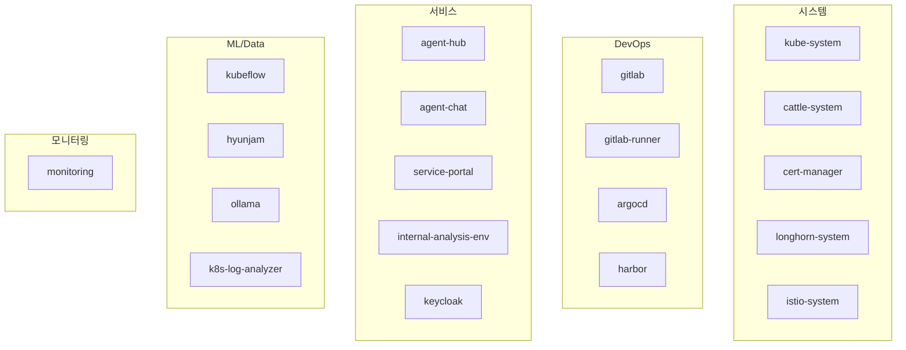

## 들어가며

[홈랩 아키텍처 1편](/infrastructure/home-lab-architecture/)에서 인프라 전체 그림을 소개했다. 이 글에서는 그 중심에 있는 K3s 클러스터의 실제 구축과 운영 과정을 다룬다.

이 글 작성 시점(2026년 3월) 기준으로, 클러스터는 112일째 운영 중이며 2개 노드(마스터 겸 워커 1, 워커 1) 위에 56개 네임스페이스, 60개 이상의 Deployment가 돌아가고 있다. 홈랩이라고 규모가 작지는 않다.

```
$ kubectl get nodes -o wide
NAME          STATUS   ROLES                  AGE    VERSION        INTERNAL-IP
hjjoserver1   Ready    control-plane,master   112d   v1.33.6+k3s1   192.168.0.156
whguswka      Ready    worker                 90d    v1.33.6+k3s1   192.168.0.87
```

---

## 왜 K3s인가

처음에는 kubeadm으로 표준 Kubernetes를 올리려 했다. 하지만 홈랩 환경에서 다음 경험들이 걸렸다:

- etcd 클러스터 관리 — 싱글 마스터인데 etcd를 별도로 관리할 필요가 있나?
- CNI 플러그인 선택과 설치 — Calico? Cilium? 홈랩에서 eBPF까지 필요 없다
- 인증서 갱신이 1년마다 찾아옴
- kube-proxy, CoreDNS 등 개별 컴포넌트 업데이트

K3s는 이 모든 것을 하나의 바이너리에 내장했다. SQLite(또는 내장 etcd) 기반 데이터스토어, Flannel CNI, CoreDNS, Traefik Ingress Controller가 기본 포함된다. 설치는 한 줄이다:

```bash
curl -sfL https://get.k3s.io | sh -
```

다만 모든 것이 한 줄로 끝나지는 않았다. 실제로는 데이터 경로를 커스터마이징하고, kubelet 파라미터를 튜닝해야 안정적으로 운영할 수 있었다.

---

## 설치와 초기 구성

### 마스터 노드 설정

기본 설치 후 커스터마이징이 필요한 부분은 `/etc/rancher/k3s/config.yaml`에 정리했다:

```yaml
data-dir: /data/k3s
kubelet-arg:
  - "eviction-hard=memory.available<500Mi,nodefs.available<15%,imagefs.available<15%"
  - "eviction-soft=memory.available<1Gi,nodefs.available<20%,imagefs.available<20%"
  - "eviction-soft-grace-period=memory.available=1m,nodefs.available=1m,imagefs.available=1m"
```

핵심 설정 세 가지:

1. **`data-dir: /data/k3s`** — K3s의 기본 데이터 경로는 `/var/lib/rancher/k3s`인데, OS 파티션과 분리하기 위해 별도 디스크에 마운트된 `/data`로 변경했다. 컨테이너 이미지와 etcd 데이터가 상당한 디스크를 소비하기 때문에 이 분리는 필수다.

2. **Eviction Hard** — 메모리가 500MB 이하로 떨어지면 Pod을 강제 축출한다. 251GB RAM에서 500MB가 임계치라면 극단적으로 보일 수 있지만, OOM Killer가 랜덤으로 프로세스를 죽이는 것보다 kubelet이 우선순위 기반으로 Pod을 정리하는 것이 낫다.

3. **Eviction Soft** — 1GB 이하에서 1분 유예 후 축출. Hard 전에 비핵심 Pod을 먼저 정리하는 완충 역할이다.

### 워커 노드 추가

마스터에서 node token을 가져와 워커에서 한 줄 실행하면 된다:

```bash
# 마스터에서
cat /var/lib/rancher/k3s/server/node-token

# 워커에서
curl -sfL https://get.k3s.io | K3S_URL=https://192.168.0.156:6443 \
  K3S_TOKEN=<node-token> sh -
```

워커 노드가 `Ready` 상태가 되기까지 약 20초. kubeadm에서 인증서 교환, kubelet 설정, kube-proxy 배포까지 하나하나 셋업하던 것에 비하면 kubeadm 대비 훨씬 단순했다.

---

## 네트워크: Flannel과 NodePort 전략

### Flannel VXLAN

K3s 기본 CNI인 Flannel은 VXLAN 모드로 동작한다. Pod 간 통신을 오버레이 네트워크로 처리하며, BGP 설정이나 네트워크 장비 연동 없이 즉시 작동한다.

홈랩에서 Calico나 Cilium을 고려하기도 했지만, Network Policy 기반의 세밀한 트래픽 제어가 당장 필요하지 않았고, Flannel의 단순함이 트러블슈팅 시간을 절약해준다. 문제가 생겼을 때 "네트워크 문제인가, 애플리케이션 문제인가"의 판단이 빨라진다.

### NodePort 일변도 전략

서비스 노출은 **전면 NodePort**를 사용한다. Ingress(Traefik)는 설치되어 있지만 Harbor 등 극소수 서비스에서만 사용하고, 나머지 28개 이상의 서비스는 모두 NodePort로 노출한다.

이 선택의 이유:

- **직관적인 포트 관리**: `192.168.0.156:31085`가 GitLab임을 한눈에 알 수 있다
- **디버깅 용이**: curl로 바로 확인 가능. Ingress 경로 라우팅 문제를 배제할 수 있다
- **내부망 전용**: 내부 네트워크 전용 서비스가 대부분이어서 현재는 HTTP로 운영 중이다

다만 이 전략은 **내부 네트워크 전용이라는 전제**가 있어야 성립한다. 외부에 공개해야 하는 서비스에는 인증, HTTPS, 접근 제어를 별도로 구성해야 한다. 또한 포트 번호가 늘어나면서 충돌 관리가 필요해졌다. 현재 CLAUDE.md(에이전트 규칙 파일)에 전체 포트 할당표를 유지하고, 서비스 포털에서도 실시간으로 확인할 수 있도록 했다.

현재 할당된 주요 포트 범위:

| 범위 | 용도 |
|------|------|
| 30000~30999 | 인프라/관리 서비스 (PostgreSQL, Grafana, ATH, Elasticsearch 등) |
| 31000~31499 | 애플리케이션 서비스 (Analysis Portal, GitLab, Keycloak 등) |
| 31500~32767 | 보조 서비스 (Longhorn, MinIO, Rancher 등) |

---

## 스토리지: Longhorn

### 선택 이유

Kubernetes에서 StatefulSet이나 데이터베이스를 운영하려면 PersistentVolume이 필요하다. 선택지는 크게 세 가지였다:

| 방식 | 장점 | 단점 |
|------|------|------|
| local-path (K3s 기본) | 설정 불필요 | 노드 고정, 복제 없음 |
| Longhorn | 복제, 스냅샷, 웹 UI | 약간의 오버헤드 |
| Rook-Ceph | 엔터프라이즈급 | 리소스 소비 크고 복잡 |

Longhorn을 택했다. 2노드밖에 없지만 데이터 복제(replica)가 가능하고, 웹 UI에서 볼륨 상태를 시각적으로 확인할 수 있으며, Helm 한 줄로 설치된다.

### StorageClass 전략

기본 `longhorn` StorageClass는 replica 3을 시도하지만, 2노드 환경에서 3개 복제는 불가능하다. 이를 위해 용도별로 StorageClass를 나눴다:

```
$ kubectl get sc
NAME                 PROVISIONER          RECLAIMPOLICY   VOLUMEBINDINGMODE   ALLOWVOLUMEEXPANSION
local-path           rancher.io/local-path Delete         WaitForFirstConsumer true
longhorn (default)   driver.longhorn.io   Delete          Immediate           true
longhorn-single      driver.longhorn.io   Delete          Immediate           true
longhorn-static      driver.longhorn.io   Delete          Immediate           true
```

- **longhorn** (기본): replica 2. 대부분의 워크로드에 사용
- **longhorn-single**: replica 1. 임시 데이터나 캐시용. 디스크 절약
- **longhorn-static**: 특수 용도
- **local-path**: K3s 기본 제공. GPU 워크로드에서 로컬 디스크 직접 접근 시 사용

### 운영 중 겪은 문제

내 환경에서는 디스크 여유가 부족해질 때 Longhorn 볼륨이 `faulted` 상태로 가는 경우가 있었다. 한 번은 Harbor의 이미지 레지스트리(100GB PVC)가 차면서 클러스터 전체의 Longhorn 볼륨이 영향을 받은 적이 있다. 이후 Longhorn 설정에서 `storage-overprovisioning-percentage`를 보수적으로(100%) 잡고, Harbor의 Garbage Collection을 주기적으로 실행하도록 했다.

현재 PV 현황은 약 20개, 총 770GB 이상의 스토리지가 프로비저닝되어 있다.

---

## 컨테이너 레지스트리: Harbor

### 자체 레지스트리가 필요한 이유

Docker Hub의 pull rate limit(익명: 100회/6시간)은 CI/CD에서 빈번히 이미지를 빌드하고 풀할 때 걸림돌이 된다. 또한 내부 네트워크에서 이미지를 풀하는 속도가 외부 대비 수십 배 빠르다.

Harbor를 선택한 구체적인 이유:

- **Trivy 통합**: 이미지 push 시 자동으로 취약점 스캔
- **RBAC**: 프로젝트별 접근 권한 관리
- **Garbage Collection**: 미사용 이미지 레이어 자동 정리
- **Helm Chart**: 설치가 깔끔하고 K8s 네이티브

```
$ helm list -n harbor
NAME    NAMESPACE   REVISION    STATUS      CHART           APP VERSION
harbor  harbor      1           deployed    harbor-1.18.1   2.14.1
```

### TLS 인증서 설정

Harbor는 HTTPS가 기본이다. 자체 CA 인증서를 생성하여 K3s 노드와 CI/CD 파이프라인에서 신뢰하도록 설정했다. 나중에 CI/CD 글에서 더 자세히 다루겠지만, Kaniko 빌드 시 `--skip-tls-verify` 대신 CA 인증서를 명시적으로 추가하는 것이 보안상 올바른 방식이다.

모든 서비스 이미지는 `harbor.local.cluster/library/<서비스명>:<버전>` 경로로 통일한다.

---

## GPU 스케줄링

### NVIDIA Device Plugin + Time-Slicing

워커 노드(192.168.0.87)의 RTX 3090 하나를 가상 2개 GPU로 분할했다. NVIDIA GPU Time-Slicing은 물리 GPU를 시분할하여 여러 Pod이 공유하는 방식이다.

이 구성이 필요했던 이유:

- **Ollama 임베딩 서비스**: 항시 가동. `nomic-embed-text` 모델로 텍스트 임베딩 처리
- **ML 파이프라인 학습**: Kubeflow Recurring Run으로 일배치 실행. XGBoost GPU 학습

두 워크로드가 동시에 물리 GPU를 점유하려 하면 OOM이 발생한다. Time-Slicing으로 `nvidia.com/gpu: 1`씩 요청하면 kubelet이 시간 단위로 GPU를 번갈아 할당한다. 다만 time-slicing은 물리적 분리(MIG)가 아니라 시분할이므로, 워크로드 간 간섭으로 지연시간과 처리량이 예측하기 어려워질 수 있다. 현재 구성에서는 임베딩 서비스가 경량이라 문제가 되지 않았다.

마스터 노드의 A6000(48GB)과 4090(24GB)은 주로 ComfyUI(이미지 생성)와 Kubeflow 노트북의 GPU 워크로드에 사용된다.

---

## Rancher로 클러스터 관리

K3s 위에 Rancher를 올려 웹 UI 기반 클러스터 관리를 한다.

```
$ helm list -n cattle-system
NAME                CHART                   APP VERSION
rancher             rancher-2.13.1          v2.13.1
```

Rancher가 제공하는 가치:

- 터미널 없이 Pod 로그, 셸 접속, 리소스 사용량 확인
- 네임스페이스별 워크로드 현황을 대시보드로 파악
- Helm 차트 배포를 GUI에서 관리

다만 Rancher 자체가 상당한 리소스(cattle-system, cattle-fleet-system 등 10개 이상 네임스페이스)를 소비한다. 홈랩에서 Rancher가 과한 선택인지는 의견이 갈릴 수 있지만, 56개 네임스페이스를 터미널로만 관리하는 것은 현실적으로 어렵다.

---

## Helm으로 관리하는 핵심 인프라

현재 Helm으로 설치/관리 중인 서비스들:

| Chart | Namespace | 용도 |
|-------|-----------|------|
| argo-cd 9.2.3 | argocd | GitOps (현재 일부만 사용) |
| harbor 1.18.1 | harbor | 컨테이너 레지스트리 |
| kube-prometheus-stack 80.9.1 | monitoring | Prometheus + Grafana |
| rancher 2.13.1 | cattle-system | 클러스터 관리 UI |
| traefik 37.1.1 | kube-system | Ingress Controller |
| minio 5.4.0 | velero | 오브젝트 스토리지 (백업용) |

이 외에 Kubeflow, OpenLDAP, GitLab 등은 직접 매니페스트(yaml) 배포 방식을 사용한다. Helm chart가 없거나, 커스터마이징이 과도해서 values.yaml로 제어하기 어려운 경우다.

---

## 네임스페이스 설계

56개 네임스페이스를 용도별로 분류하면 다음과 같다:



네임스페이스 설계 원칙:

1. **서비스 단위 분리**: GitLab은 `gitlab`, Agent Task Hub는 `agent-hub`처럼 서비스 하나당 네임스페이스 하나
2. **Kubeflow 사용자 네임스페이스**: `hyunjam`, `hoseongchoe` 등 사용자별 네임스페이스가 자동 생성됨
3. **시스템 네임스페이스 비분리**: K3s/Rancher가 자동 생성하는 `cattle-*`, `fleet-*`, `p-*` 등은 건드리지 않음

---

## 일상 운영 루틴

### 모니터링 체크 (매일)

```bash
# 노드 리소스 확인
kubectl top nodes

# 비정상 Pod 확인
kubectl get pods --all-namespaces --field-selector=status.phase!=Running,status.phase!=Succeeded

# Longhorn 볼륨 상태
kubectl get volumes.longhorn.io -n longhorn-system | grep -v healthy
```

### 정기 유지보수 (주 1회)

- Harbor Garbage Collection 실행
- Longhorn 스냅샷 정리
- Rancher에서 전체 워크로드 리소스 사용량 리뷰

### 백업

Velero + MinIO 조합으로 클러스터 리소스와 PV 스냅샷을 백업한다. 다만 솔직히 말하면, 완전 자동화된 정기 백업보다는 대규모 변경 전 수동 백업 위주로 운영하고 있다. 이 부분은 개선이 필요하다.

---

## 112일 운영 회고

### 잘된 것

- **K3s의 안정성**: 112일간 K3s 자체의 문제로 장애가 발생한 적은 없다. 업그레이드도 바이너리 교체 수준으로 간단하다.
- **NodePort 전략**: 지금 규모(28개 서비스)에서는 충분히 관리 가능하다. Ingress로 전환할 동기가 아직 없다.
- **Longhorn**: 볼륨 확장, 스냅샷, 웹 UI 모두 기대 이상. 2노드에서도 안정적으로 작동한다.

### 아쉬운 것

- **싱글 마스터 리스크**: Control Plane이 한 대뿐이라 마스터가 죽으면 전체 클러스터가 다운된다. 개인 홈랩이라 감수하고 있지만, 중요도가 높아지면 HA 구성(embedded etcd 3노드)이 필요하다.
- **리소스 경합**: 마스터 노드가 Control Plane + 대부분의 서비스를 모두 호스팅하고 있어 피크 시 메모리가 빠듯하다. 251GB가 부족해지는 날이 올 줄 몰랐다.
- **Rancher 오버헤드**: 편리하지만 `cattle-*` 네임스페이스만 10개 이상 생성된다. 가벼운 대안(Lens, k9s)으로 전환을 고려 중이다.

---

## 마무리

K3s는 홈랩 쿠버네티스의 진입 장벽을 극적으로 낮춰준다. 한 줄 설치, 한 줄 워커 추가, 내장 CNI와 Ingress Controller. 하지만 그 위에서 실제 서비스를 운영하면, 스토리지 관리, GPU 스케줄링, 네임스페이스 설계, 백업 전략 등 표준 Kubernetes와 동일한 운영 과제를 마주하게 된다.

다음 글에서는 이 K3s 클러스터 위에 구축한 [CI/CD 파이프라인](/infrastructure/homelab-cicd-pipeline/)을 다룬다. GitLab과 Kaniko로 Docker 데몬 없이 컨테이너 이미지를 빌드하고, Harbor에 push하고, 자동 배포까지 이어지는 흐름을 정리할 예정이다.
