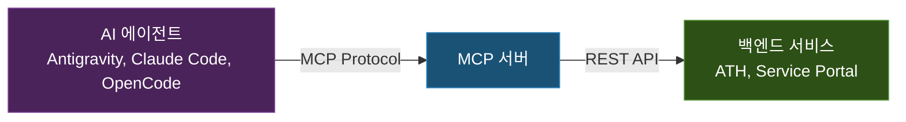

## 들어가며

[멀티 에이전트 운영기](/development/multi-agent-orchestration/)에서 Agent Task Hub(ATH)를 소개했다. ATH에는 REST API가 있고, AI 에이전트들은 CLI(`ath` 명령)를 통해 이 API를 호출한다. CLI는 셸 스크립트 자동화, 파이프라인 연계, SSH 환경에서의 가벼운 사용에 적합하다. 지금도 일부 에이전트는 CLI를 기본 인터페이스로 사용하고 있다.

그러나 에이전트가 CLI를 호출하는 과정에서 구조적인 한계가 드러났다. 에이전트가 `bash` 도구로 `ath task create --title "..."` 명령을 실행하면, 셸 호출 → 스크립트 실행 → HTTP 요청 → 응답 파싱이라는 경로를 거친다. 이 경로의 어디에서든 문제가 생길 수 있고, 에이전트 입장에서는 셸의 exit code와 stdout 문자열을 직접 해석해야 한다. 제목에 특수문자가 포함되면 셸 이스케이핑이 깨지고, 응답 JSON을 제대로 파싱하지 못하는 에이전트도 있었다.

핵심적인 차이는 **도구 발견(discovery)** 문제다. CLI 방식에서는 에이전트의 규칙 파일(GEMINI.md, CLAUDE.md 등)에 "이 CLI를 이렇게 호출하라"고 일일이 기술해야 한다. 규칙 파일이 바뀌면 모든 에이전트의 규칙을 동시에 갱신해야 하고, 에이전트가 규칙을 참조하지 않으면 도구의 존재 자체를 알 수 없다.

이 문제를 해결한 것이 **MCP(Model Context Protocol)**다. MCP 서버를 만들면 에이전트가 ATH의 기능을 네이티브 도구(tool)로 직접 사용할 수 있다. `ath_task_create`가 `grep`이나 `file_read`와 동일한 레벨의 도구가 되는 것이다. 서버가 도구 목록과 파라미터 스키마를 자동으로 노출하므로, 에이전트는 별도 규칙 없이도 사용 가능한 도구를 인식한다.

정리하면, ATH는 CLI와 MCP를 이중 인터페이스로 제공한다:

| | CLI (`ath` 명령) | MCP (네이티브 도구) |
|---|---|---|
| **강점** | 셸 스크립트 연계, SSH 환경 | 구조화된 에러 처리, 도구 자동 발견 |
| **약점** | 셸 이스케이핑, 응답 파싱 | MCP 미지원 클라이언트에서 사용 불가 |
| **사용 에이전트** | OpenClaw (워크플로우 기반) | Antigravity, Claude Code, OpenCode |

이 글에서는 MCP의 핵심 개념을 짧게 정리하고, 실제로 두 개의 MCP 서버를 구현한 과정과 운영 경험을 다룬다.

---

## MCP란 무엇인가

### 핵심 개념

MCP(Model Context Protocol)는 Anthropic이 2024년 11월에 제안하고, 이후 여러 에이전트·도구 생태계가 채택하고 있는 프로토콜이다. AI 에이전트가 외부 시스템을 표준화된 방식으로 호출할 수 있게 해주는 인터페이스라고 보면 된다.



MCP 이전에는 에이전트가 외부 API를 호출하려면:
1. bash로 curl 명령을 실행하거나
2. Python 스크립트를 작성해서 실행하거나
3. 에이전트의 규칙 파일에 API 호출 방법을 장문으로 설명하거나

해야 했다. MCP는 이 과정을 **에이전트의 네이티브 도구**로 추상화한다.

### 세 가지 개념

MCP 서버가 제공할 수 있는 것은 세 가지다:

| 개념 | 설명 | 대응하는 것 |
|------|------|------------|
| **Tool** | 에이전트가 호출할 수 있는 함수 | REST API endpoint |
| **Resource** | 에이전트가 읽을 수 있는 데이터 | 파일, DB 레코드 |
| **Prompt** | 에이전트에게 제공하는 템플릿 | 프롬프트 엔지니어링 |

이 글에서 구현한 두 MCP 서버는 **Tool**만 사용한다. 에이전트가 작업을 등록하고, 지식을 검색하고, 서비스를 조회하는 것은 모두 Tool 호출로 이루어진다.

### 전송(Transport) 방식

MCP는 두 가지 전송 방식을 지원한다:

| Transport | 프로토콜 | 사용 클라이언트 |
|-----------|---------|----------------|
| **SSE** (Server-Sent Events) | HTTP GET(스트림) + POST(메시지) | Claude Code |
| **StreamableHTTP** | HTTP POST 기반 세션형 전송 | Antigravity, OpenCode |

같은 MCP 서버에서 두 방식을 동시에 제공해야 한다. Claude Code는 SSE만 지원하고, Antigravity와 OpenCode는 StreamableHTTP을 사용하기 때문이다.

두 방식을 별도 서버로 분리하는 방법도 있었으나, 그렇게 하면 서버가 2배로 늘어 포트 관리, 배포 파이프라인, 헬스체크가 모두 이중으로 필요해진다. ATH MCP와 Service Portal MCP를 합하면 4개 서버가 되는 셈이다. 단일 서버에서 경로(`/sse`, `/mcp`)로 분기하면 배포 단위는 하나로 유지되면서 두 클라이언트를 모두 지원할 수 있다. 운영 복잡도를 줄이기 위해 듀얼 트랜스포트를 선택했다.

---

## ATH MCP 서버

### 설계 의도

ATH(Agent Task Hub)에는 이미 REST API가 있다. MCP 서버는 이 API를 감싸는(wrapping) 얇은 레이어다. 핵심 역할은:

1. MCP 프로토콜로 에이전트의 도구 호출을 받아서
2. ATH REST API로 변환하여 전달하고
3. 응답을 에이전트가 이해할 수 있는 텍스트로 포맷팅

### 제공하는 도구 (9개)

| 도구 | 설명 | ATH API |
|------|------|---------|
| `ath_task_create` | 작업 등록 | POST /api/tasks |
| `ath_task_list` | 작업 목록 조회 | GET /api/tasks |
| `ath_task_show` | 작업 상세 조회 | GET /api/tasks/:id |
| `ath_task_update` | 작업 상태 업데이트 | PUT /api/tasks/:id |
| `ath_knowledge_add` | 지식 등록 | POST /api/knowledge |
| `ath_knowledge_search` | 지식 검색 | GET /api/knowledge/search |
| `ath_knowledge_list` | 지식 목록 조회 | GET /api/knowledge |
| `ath_focus_show` | 현재 포커스 조회 | GET /api/focus |
| `ath_focus_set` | 포커스 업데이트 | PUT /api/focus |

### 구현

TypeScript + `@modelcontextprotocol/sdk`로 구현했다. 전체 코드는 약 440줄이다.

핵심 구조를 살펴보면:

```typescript
import { McpServer } from "@modelcontextprotocol/sdk/server/mcp.js";
import { SSEServerTransport } from "@modelcontextprotocol/sdk/server/sse.js";
import { StreamableHTTPServerTransport } from "@modelcontextprotocol/sdk/server/streamableHttp.js";
import { z } from "zod";

const ATH_API = process.env.ATH_API_URL ?? "http://localhost:<ath-port>";

// ATH REST API 호출 헬퍼
async function athFetch(method: string, path: string, body?: unknown) {
  const res = await fetch(`${ATH_API}${path}`, {
    method,
    headers: body ? { "Content-Type": "application/json" } : {},
    body: body ? JSON.stringify(body) : undefined,
  });
  if (!res.ok) {
    throw new Error(`ATH API ${method} ${path} → ${res.status}`);
  }
  return res.json();
}
```

도구는 `server.tool()` 메서드로 등록한다. Zod 스키마로 파라미터를 정의하면 MCP SDK가 자동으로 JSON Schema를 생성하고, 에이전트가 이를 보고 올바른 파라미터로 호출할 수 있다:

```typescript
server.tool(
  "ath_task_create",
  "ATH에 새 작업 태스크를 등록합니다. 실제 작업 시작 전 반드시 호출하세요.",
  {
    title: z.string().describe("작업 제목"),
    agent: z.string().describe("담당 에이전트 ID"),
    priority: z.enum(["critical", "high", "medium", "low"]).default("medium"),
    category: z.enum(["development", "infrastructure", "bugfix", "analysis", "documentation"]),
    tags: z.string().optional().describe("태그 (쉼표 구분)"),
  },
  async ({ title, agent, priority, category, tags }) => {
    const body = { title, assigned_agent: agent, priority, category };
    if (tags) body.tags = tags.split(",").map(t => t.trim());
    const result = await athFetch("POST", "/api/tasks", body);
    return {
      content: [{
        type: "text",
        text: `✅ Task 등록 완료\nID: ${result.id}\n제목: ${result.title}`,
      }],
    };
  }
);
```

여기서 도구 설명(`"ATH에 새 작업 태스크를 등록합니다. 실제 작업 시작 전 반드시 호출하세요."`)이 중요하다. 에이전트는 이 설명을 보고 언제 이 도구를 사용할지 판단한다. 설명이 모호하면 에이전트가 도구를 호출하지 않거나, 잘못된 시점에 호출한다.

### 듀얼 트랜스포트

하나의 HTTP 서버에서 SSE와 StreamableHTTP를 동시에 제공하는 것이 이 MCP 서버의 가장 까다로운 부분이었다:

```typescript
const httpServer = createServer(async (req, res) => {
  const url = new URL(req.url, `http://localhost:${PORT}`);

  // SSE — Claude Code용
  if (url.pathname === "/sse" && req.method === "GET") {
    const transport = new SSEServerTransport("/message", res);
    const server = createMcpServer();
    await server.connect(transport);
    return;
  }

  // SSE 메시지 수신
  if (url.pathname === "/message" && req.method === "POST") {
    // sessionId로 세션 매칭 후 처리
  }

  // StreamableHTTP — Antigravity, OpenCode용
  if (url.pathname === "/mcp") {
    const transport = new StreamableHTTPServerTransport({
      sessionIdGenerator: () => crypto.randomUUID(),
    });
    const server = createMcpServer();
    await server.connect(transport);
    await transport.handleRequest(req, res, body);
    return;
  }
});
```

핵심은 `createMcpServer()`를 팩토리 패턴으로 분리한 것이다. SSE는 연결마다 새로운 MCP 서버 인스턴스가 필요하고, StreamableHTTP는 세션 단위로 재사용해야 한다. 단일 MCP 서버 인스턴스를 공유하면 세션 간 상태 충돌이 발생한다.

### 세션 관리와 메모리 누수 방지

SSE는 HTTP 연결이 유지되는 한 세션이 살아있다. 에이전트가 비정상 종료되면 연결이 끊기지 않고 남는 경우가 있다. 이를 위해 TTL 기반 정리를 구현했다:

```typescript
const SSE_SESSION_TTL_MS = 30 * 60 * 1000;   // 30분
const HTTP_SESSION_TTL_MS = 60 * 60 * 1000;  // 1시간

// 1분마다 만료 세션 정리
setInterval(() => {
  for (const [id, session] of sseSessions) {
    const isExpired = Date.now() - session.createdAt > SSE_SESSION_TTL_MS;
    const isDisconnected = session.res.writableEnded || session.res.destroyed;
    if (isExpired || isDisconnected) {
      sseSessions.delete(id);
    }
  }
}, 60_000);
```

이 정리 로직이 없으면 장시간 운영 시 세션이 계속 쌓여 메모리가 증가한다.

---

## Service Portal MCP 서버

### 설계 의도

Service Portal은 28개 이상의 내부 서비스를 관리하는 대시보드다. AI 에이전트가 새 서비스를 배포하면 Service Portal에 등록해야 하는데, 이를 에이전트가 직접 할 수 있도록 MCP 서버를 만들었다.

### 제공하는 도구 (3개)

| 도구 | 설명 |
|------|------|
| `service_portal_registry_list` | 등록된 서비스 목록 조회 |
| `service_portal_registry_upsert` | 서비스 등록 또는 수정 |
| `service_portal_registry_remove` | 서비스 삭제 |

ATH MCP의 9개 도구에 비해 단순하다. Service Portal MCP는 레지스트리 CRUD에만 집중한다.

### 인증 처리

Service Portal API는 인증이 필요하다. MCP 서버 내부에서 `X-Internal-Key` 헤더로 인증을 처리한다:

```javascript
async function portalFetch(method, path, body) {
  const headers = {};
  if (SERVICE_PORTAL_INTERNAL_KEY) {
    headers["X-Internal-Key"] = SERVICE_PORTAL_INTERNAL_KEY;
  }
  // ...
}
```

에이전트는 인증을 신경 쓸 필요 없이 도구만 호출하면 된다. 인증 키는 MCP 서버의 환경변수로 관리되므로 에이전트에게 노출되지 않는다.

### 구현 특이점: JavaScript

ATH MCP는 TypeScript인데 Service Portal MCP는 순수 JavaScript로 작성했다. 초기 구현 속도를 우선해 JavaScript로 작성했고, 현재 운영에는 무리가 없어서 유지 중이다.

두 MCP 서버의 구조는 거의 동일하다:

| 항목 | ATH MCP | Service Portal MCP |
|------|---------|-------------------|
| 언어 | TypeScript | JavaScript |
| 도구 수 | 9개 | 3개 |
| 코드량 | 437줄 | 218줄 |
| 트랜스포트 | SSE + StreamableHTTP | SSE + StreamableHTTP |
| 세션 TTL | 30분(SSE) / 1시간(HTTP) | 없음 (개선 필요) |

---

## 에이전트별 MCP 연결 설정

각 에이전트는 자신의 설정 파일에서 MCP 서버 연결을 정의한다.

### Antigravity (Gemini)

`mcp_config.json` 파일에 URL 기반으로 설정:

```json
{
  "mcpServers": {
    "ath": {
      "url": "http://<server-ip>:<ath-mcp-port>/mcp"
    },
    "service-portal": {
      "url": "http://<server-ip>:<portal-mcp-port>/mcp"
    }
  }
}
```

StreamableHTTP 엔드포인트(`/mcp`)를 사용한다.

### Claude Code

SSE 엔드포인트를 사용:

```json
{
  "mcpServers": {
    "ath": {
      "url": "http://<server-ip>:<ath-mcp-port>/sse"
    },
    "service-portal": {
      "url": "http://<server-ip>:<portal-mcp-port>/sse"
    }
  }
}
```

### 연결 확인

MCP 서버에 health check 엔드포인트를 구현해두었다:

```bash
$ curl -s http://<server-ip>:<ath-mcp-port>/health | jq
{
  "status": "ok",
  "service": "ath-mcp",
  "ath_api": "http://localhost:<ath-port>",
  "sse_sessions": 1,
  "http_sessions": 2
}
```

---

## 실전에서의 MCP 사용 패턴

### 에이전트가 ATH 도구를 사용하는 과정

에이전트마다 ATH에 접근하는 방식이 다르다. MCP를 사용하는 에이전트와 CLI를 사용하는 에이전트의 실제 흐름을 비교하면 다음과 같다.

**Antigravity (MCP 방식)**:

```
사용자: "PostgreSQL 백업 스크립트를 만들어줘"

Antigravity의 내부 처리:
1. ath_task_create 도구 호출 → Task ID 반환
2. ath_knowledge_search("PostgreSQL backup") 호출 → 관련 지식 확인
3. 파일 생성, 코드 작성
4. ath_task_update(task_id, status="completed") 호출
```

**OpenClaw (CLI 방식)**:

```
사용자: (디스코드에서) "PostgreSQL 백업 스크립트를 만들어줘"

OpenClaw의 내부 처리:
1. bash 도구로 `ath task create --title "PostgreSQL 백업 스크립트 작성" --agent openclaw-mac` 실행
   → stdout에서 Task ID 파싱
2. bash 도구로 `ath knowledge search "PostgreSQL backup"` 실행
   → stdout JSON 파싱하여 관련 지식 확인
3. 파일 생성, 코드 작성
4. bash 도구로 `ath task update <task-id> --status completed --summary "..."` 실행
```

OpenClaw이 CLI를 사용하는 이유는, 워크플로우 기반 실행 구조에서 셸 명령이 기본 인터페이스이기 때문이다. MCP 클라이언트를 내장하지 않는 환경에서는 CLI가 유일한 선택지다.

두 방식의 차이:

| 항목 | CLI 방식 | MCP 방식 |
|------|---------|----------|
| 호출 경로 | bash → 셸 스크립트 → HTTP | 도구 직접 호출 |
| 에러 처리 | 셸 exit code + stdout 해석 | SDK 레벨 에러 전파 |
| 파라미터 | 문자열 조합 (이스케이핑 주의) | 구조화된 JSON |
| 도구 발견 | 규칙 파일에 명시 필요 | 서버가 자동 노출 |
| 셸 특수문자 | 깨질 수 있음 | 영향 없음 |

### MCP로 해결한 실제 문제

**문제**: Claude Code가 `ath task create` CLI를 호출할 때, 제목에 특수 문자(따옴표, 파이프 등)가 포함되면 셸 이스케이핑 문제로 실패했다.

**MCP 해결**: 도구 호출 시 제목이 JSON 문자열로 전달되므로 셸 이스케이핑 문제가 원천적으로 없다.

**문제**: OpenCode(로컬 LLM 기반)가 CLI 도구 호출 시 응답 JSON을 파싱하지 못해 다음 행동을 결정하지 못하는 경우가 있었다.

**MCP 해결**: MCP 응답은 SDK가 구조화하여 반환하므로, 에이전트가 별도 파싱 없이 결과를 사용할 수 있다.

---

## 나만의 MCP 서버를 만들기 위한 가이드

기존 REST API가 있는 시스템에 MCP 서버를 추가하려는 경우, 다음 패턴을 따르면 된다:

### 1. 최소 의존성

```json
{
  "dependencies": {
    "@modelcontextprotocol/sdk": "^1.12.1",
    "zod": "^3.24.2"
  }
}
```

MCP SDK와 스키마 정의를 위한 Zod면 충분하다.

### 2. 팩토리 패턴으로 서버 생성

```typescript
function createMcpServer(): McpServer {
  const server = new McpServer({ name: "my-mcp", version: "1.0.0" });

  server.tool("도구명", "설명", { /* Zod 스키마 */ }, async (params) => {
    // 기존 API 호출
    return { content: [{ type: "text", text: "결과" }] };
  });

  return server;
}
```

### 3. 듀얼 트랜스포트 제공

SSE와 StreamableHTTP를 동시에 제공하면 대부분의 에이전트 클라이언트를 지원할 수 있다. `/sse`와 `/mcp` 두 개의 엔드포인트를 만든다.

### 4. 도구 설명에 투자하기

에이전트가 도구를 올바르게 사용할지는 도구 설명에 달려 있다. 몇 가지 팁:

- **언제 사용하는지 명시**: "작업 시작 전 반드시 호출하세요"
- **파라미터 설명에 예시 포함**: `z.string().describe("에이전트 ID (claude, antigravity 등)")`
- **필수/선택 구분 명확하게**: `.optional()`과 `.default()` 적절히 사용

---

## 운영 경험과 교훈

### 1. SSE 연결은 예상보다 불안정하다

Claude Code가 장시간 작업하면 SSE 연결이 끊기는 경우가 있다. 네트워크 타임아웃, 프로세스 중단 등 원인은 다양하다. 세션 TTL 기반 정리를 반드시 구현하고, health check로 현재 활성 세션 수를 모니터링하자.

### 2. 에이전트마다 MCP 활용 패턴이 다르다

- **Antigravity**: 규칙에 명시하면 규칙적으로 잘 호출한다
- **Claude Code**: 규칙 파일의 "반드시 호출하세요" 지시를 잘 따라한다
- **OpenCode (로컬 LLM)**: 모델 크기에 따라 도구 호출 정확도가 달라진다. 120B 이상에서 안정적

### 3. 도구 수는 적을수록 좋다

처음에는 ATH의 모든 API를 도구로 노출하려 했다. 하지만 도구가 많아지면 에이전트의 도구 선택 정확도가 떨어진다. 핵심 기능만 노출하고, 고급 기능은 필요할 때 추가하는 것이 낫다.

### 4. MCP 서버는 가벼워야 한다

MCP 서버 자체는 REST API를 감싸는 얇은 레이어여야 한다. 비즈니스 로직은 백엔드(ATH, Service Portal)에 두고, MCP 서버는 프로토콜 변환과 응답 포맷팅에만 집중한다.

---

## 마무리

MCP는 AI 에이전트와 외부 시스템을 연결하는 깔끔한 방법이다. REST API를 직접 호출하는 것보다 안정적이고, 에이전트의 네이티브 도구로 취급되므로 사용자 경험도 좋다.

현재 두 개의 MCP 서버를 40일 이상 운영하면서, 4개의 AI 에이전트가 매일 수십 번씩 이 도구들을 호출하고 있다. CLI 방식 대비 에러율이 크게 줄었고, 에이전트가 ATH 규칙을 더 잘 따르게 되었다.

기존 REST API가 이미 정리되어 있다면 MCP 서버를 추가하는 것은 비교적 짧은 시간 안에 가능하다. SDK가 대부분의 복잡성을 처리해주기 때문이다. AI 에이전트를 실무적으로 활용하는 환경이라면 MCP 도입을 검토할 만하다.
