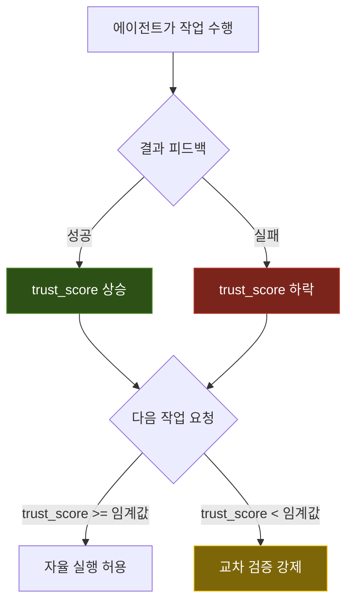

## 개요

[이전 글](/development/multi-agent-orchestration/)에서 Agent Task Hub(ATH)의 기본 아키텍처와 운영 패턴을 소개했다. 이 글에서는 ATH 최초 릴리스 이후 약 3주간 진행된 고도화 과정을 다룬다.

초기 ATH는 Task 등록, Knowledge CRUD, 파일 Lock, 포커스 브로드캐스트 등 기본적인 오케스트레이션 기능을 제공했다. 그러나 운영 과정에서 다음과 같은 한계가 드러났다.

1. **컨텍스트 단절**: 에이전트가 새 세션을 시작할 때마다 이전 작업의 맥락을 잃어버리는 문제
2. **지식 검색의 한계**: 키워드 기반 검색만으로는 의미적으로 관련된 지식을 찾기 어려움
3. **에이전트 신뢰도 관리 부재**: 모든 에이전트를 동일한 권한 수준으로 다루어 위험한 작업의 통제가 미흡
4. **지식 탐색 비효율**: 축적된 지식 항목이 증가할수록 에이전트가 관련 정보를 효율적으로 탐색하기 어려움

이러한 문제들을 해결하기 위해 신뢰도 기반 권한 제어, Wiki 컴파일러, 시맨틱 검색, 교차 검증, 컨텍스트 브리핑 등의 기능을 단계적으로 도입하고 있다.

---

## PostgreSQL 마이그레이션

### 배경

초기에는 SQLite(WAL 모드)를 사용했다. 단일 파일 기반으로 배포가 간단하고 유지보수 오버헤드가 적다는 장점이 있었으나, 다중 에이전트의 동시 쓰기 요청이 증가하면서 WAL 체크포인트 지연 및 데이터베이스 잠금(Busy) 에러가 간헐적으로 발생했다.

### 전환 과정

PostgreSQL을 K3s 클러스터 내에 StatefulSet으로 배포하고, 기존 SQLite 데이터를 마이그레이션했다. ATH 서버의 데이터 접근 계층(DAL)을 SQLAlchemy 기반으로 추상화해 두었기 때문에, 연결 문자열 변경과 일부 SQLite 전용 구문(예: `datetime('now')`)의 교체만으로 전환할 수 있었다.

```
# 마이그레이션 전
DATABASE_URL=sqlite:///./ath.db

# 마이그레이션 후
DATABASE_URL=postgresql://<user>:<password>@<host>:<port>/<database>
```

전환 이후 동시 쓰기 충돌이 크게 줄었고, JSONB 타입 활용으로 메타데이터 쿼리 성능도 개선되었다.

---

## 에이전트 신뢰도 관리

### 개념

에이전트별 **신뢰도(trust_score)**를 수치화하여 관리하는 시스템이다. 에이전트가 작업을 수행하고 그 결과에 대한 피드백이 누적될수록, 해당 에이전트의 신뢰도가 자동으로 조정된다.

### 구조



각 에이전트 프로필에는 다음과 같은 속성이 포함된다:

| 속성 | 설명 | 예시 |
|------|------|------|
| `trust_score` | 0.0~1.0 범위의 신뢰도 점수 | 0.66 |
| `role` | 에이전트의 역할 분류 | developer |
| `review_required` | 리뷰가 필수인 작업 카테고리 | infrastructure, security |
| `escalation_target` | 문제 발생 시 에스컬레이션 대상 | claude-code |

### 피드백 루프

에이전트의 작업 결과에 대해 `ath_evaluate_result` API를 통해 성공/부분성공/실패를 기록한다. 이 결과는 해당 에이전트의 `trust_score`에 반영되어, 향후 작업 시 교차 검증 필요 여부를 결정하는 기준이 된다.

```
POST /api/feedback
{
  "task_id": "2026-0413-042",
  "agent": "<agent-id>",
  "result": "partial",
  "summary": "배포는 완료했으나 롤아웃 확인 누락"
}
```

---

## 교차 검증(Phase 6a)

### 동작 원리

에이전트가 `infrastructure`, `security` 카테고리의 작업을 수행하기 전에 `ath_verify_check`를 호출하면, ATH는 해당 작업의 맥락과 에이전트의 주장(claims)을 기존 지식베이스와 대조한다.

```
POST /api/verify
{
  "agent": "<agent-id>",
  "task_context": "UFW 규칙 변경으로 특정 포트 외부 노출 허용",
  "claims": "security-policy.md의 외부 노출 승인 프로세스 확인 완료",
  "category": "security"
}
```

응답에는 검증 결과(`verified`, `warning`, `conflict`)와 관련 지식 항목에 대한 참조가 포함된다. `conflict`가 반환된 경우 에이전트는 작업을 중단하고 에스컬레이션 대상에게 리뷰를 요청한다.

### 적용 범위

| 카테고리 | 교차 검증 | 비고 |
|----------|-----------|------|
| infrastructure | 필수 | 클러스터/네트워크 변경 |
| security | 필수 | 방화벽, 인증, 외부 노출 |
| development | 선택(trust_score 기반) | 일반 개발 작업 |
| bugfix | 선택 | 버그 수정 |
| analysis | 생략 | 조회/분석 전용 |

---

## 시맨틱 검색

### 배경

초기 Knowledge 검색은 단순 키워드 매칭(`LIKE '%keyword%'`)에 의존했다. 이 방식은 "vLLM 메모리 부족"이라는 쿼리로 "OOM(Out of Memory) 에러 해결"이라는 제목의 지식을 찾지 못하는 한계가 있었다.

### 구현

sentence-transformers 기반의 벡터 임베딩을 도입하여 세 가지 검색 모드를 제공한다:

1. **시맨틱 검색**: 쿼리를 벡터로 변환한 뒤 코사인 유사도로 관련 지식을 탐색
2. **키워드 검색**: 기존의 텍스트 기반 매칭 (fallback)
3. **하이브리드 검색**: 시맨틱 + 키워드 결과를 가중 합산하여 최적의 결과 반환

```
GET /api/knowledge/search?query=vLLM+메모리+부족&mode=hybrid&limit=5
```

임베딩 모델은 `all-MiniLM-L6-v2`를 사용하며, Knowledge 항목 생성/수정 시 임베딩 벡터가 자동으로 계산되어 저장된다. 유사도 임계값은 0.3 이상으로 설정하여, 관련성이 낮은 결과는 자동으로 필터링된다.

---

## Wiki 컴파일러

### 목적

에이전트들이 축적한 Knowledge 항목(finding, decision, error, pattern)이 300개를 넘어서면서, 개별 항목 단위의 검색만으로는 전체적인 맥락을 파악하기 어려워졌다. Wiki 컴파일러는 이 항목들을 상호 연결된 문서 구조로 자동 재구성한다.

### 컴파일 과정


1. **태그 기반 클러스터링**: Knowledge 항목의 태그를 분석하여 관련 항목을 그룹화
2. **재귀적 분할**: 큰 클러스터를 문서 크기 적정 수준으로 재귀 분할
3. **수평 상호 참조**: 서로 다른 클러스터 간에도 연관성이 높은 항목을 Cross-Reference로 연결
4. **컨셉 허브**: 핵심 개념을 중심으로 관련 항목을 허브 구조로 집약

### 진화 과정

Wiki 컴파일러는 v1에서 시작하여 현재 v8까지 반복적으로 개선되고 있다. 초기에는 단순 태그 그룹핑만 수행했으나, 현재는 재귀 분할, 수평 관계, 자동 컴파일 트리거 등이 추가되어 점진적으로 발전하고 있다.

---

## 컨텍스트 브리핑

### 문제

AI 에이전트는 세션이 시작될 때마다 이전 작업의 맥락을 잃는다. 이로 인해 같은 실수를 반복하거나, 이미 해결된 문제를 다시 조사하는 비효율이 발생한다.

### 해법

에이전트가 작업 시작 전 `ath_context_briefing`을 호출하면, ATH는 다음 정보를 토큰 예산(기본 2,000) 내에서 자동 수집하여 반환한다:

- **신뢰도 프로필**: 해당 에이전트의 현재 trust_score, 리뷰 필수 카테고리
- **실패 이력**: 최근 실패한 작업의 원인 및 해결 여부
- **관련 지식**: 현재 작업 컨텍스트와 시맨틱으로 유사한 Knowledge 항목

```
POST /api/context-briefing
{
  "agent": "<agent-id>",
  "task_context": "블로그 포스트 최신화 작업",
  "token_budget": 2000
}
```

토큰 예산을 지정할 수 있어 모델의 컨텍스트 윈도우 용량에 맞게 조절이 가능하다.

---

## 가이드라인 동적 주입

### 메커니즘

에이전트의 시스템 프롬프트(GEMINI.md, CLAUDE.md 등)에 ATH 규약을 정적으로 기술하는 것 외에, 작업 카테고리나 에이전트 상태에 따라 동적으로 추가 가이드라인을 주입하는 시스템이다.

예를 들어, `infrastructure` 카테고리 작업 시에는 다음과 같은 가이드라인이 자동 주입된다:

- 반드시 `ath_verify_check`를 선행 호출할 것
- 보안 정책 마스터 문서를 먼저 참조할 것
- 방화벽 변경 시 전용 스크립트를 통해 적용할 것

이를 통해 에이전트가 특정 도메인 작업 시 필요한 안전장치를 자동으로 인식하게 된다.

---

## API 확장 현황

초기 약 70개에서 현재 90여 개로 확장된 ATH API 도메인을 요약하면 다음과 같다:

| 도메인 | 주요 엔드포인트 | 비고 |
|--------|---------------|------|
| Task | 생성, 조회, 업데이트, 분해, 단계 관리 | 핵심 |
| Knowledge | CRUD, 시맨틱/키워드/하이브리드 검색 | 시맨틱 검색 추가 |
| File Lock | 획득, 해제, 상태 조회 | 기존 유지 |
| Focus | 설정, 조회, 브로드캐스트 | 기존 유지 |
| Feedback | 작업 결과 평가 기록 | 신규 |
| Agent Profile | 에이전트 프로필, trust_score 관리 | 신규 |
| Guideline | 동적 가이드라인 주입 | 신규 |
| Verify | 교차 검증 요청/결과 | 신규 |
| Context | 컨텍스트 브리핑 자동 수집 | 신규 |
| Wiki | 컴파일 트리거, 문서 조회 | 신규 |

---

## 마무리

ATH 고도화 과정은 "에이전트에게 더 많은 맥락을 제공하고, 더 적은 실수를 하게 만드는 것"으로 요약할 수 있다.

신뢰도 관리 시스템으로 에이전트의 신뢰도를 정량적으로 추적하고, 교차 검증으로 위험한 작업의 안전장치를 마련했다. 시맨틱 검색과 Wiki 컴파일러는 축적된 지식의 발견 가능성(discoverability)을 높이고 있으며, 컨텍스트 브리핑은 세션 간 맥락 단절 문제를 완화하고 있다.

이러한 개선의 결과로 ATH 규약 전체 준수율은 초기 ~65%에서 ~74%로 상승했다. 여전히 파일 Lock 등에서 개선의 여지가 있으나, 작업 충돌 빈도와 중복 실행 비율은 확연히 줄어드는 추세다.

향후에는 에이전트 간 지식 항목의 엔티티 관계를 그래프로 시각화하고, 자동 연결 범위를 확장하는 방향으로 고도화를 이어갈 계획이다.

---

## 업데이트 내역

| 날짜 | 내용 |
|------|------|
| 2026-04-13 | 초판 작성 |

---

[^fastapi]: FastAPI: Python 기반의 비동기 웹 프레임워크로, 자동 OpenAPI 문서 생성과 높은 성능을 제공한다.
[^wal]: WAL(Write-Ahead Logging): 데이터 변경 전에 변경 내용을 미리 로그로 기록하여 데이터 무결성을 보장하는 메커니즘이다.
