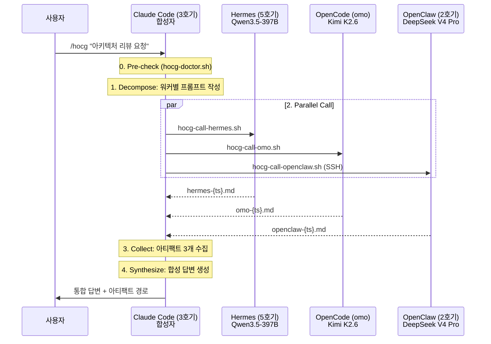

## 개요

[멀티 에이전트 오케스트레이션](/development/multi-agent-orchestration/) 글에서 hocg를 간략하게 언급했다. 이 글에서는 설계 동기부터 구현 상세, 안전장치, 실제 운영에서 드러난 한계까지 풀어본다.

hocg는 **H**ermes + **o**mo + Open**C**law + Claude 합성(**g** = glue)의 약어다. 3개의 외부 워커에 동일한 질문을 동시에 보내고, Claude Code(3호기)가 결과를 합성하는 fan-out 패턴이다.

핵심 목표는 두 가지다:
1. **다관점 검증**: 단일 모델의 hallucination이나 누락을 교차 검증으로 잡아낸다
2. **쿼터 절약**: Claude Code(Opus 4.7)는 합성만 담당하므로 Max 쿼터 소모를 최소화한다

---

## 설계 배경: /ccg에서 /hocg로

### 이전 버전: /ccg

최초에는 Claude Code + Codex + Gemini 조합의 `/ccg` 스킬이 있었다. 하지만 Codex 환경을 실제로 거의 사용하지 않았고, Gemini(Antigravity)는 IDE 안에서만 동작하여 CLI 호출이 어려웠다. 결과적으로 `/ccg`는 사실상 사장된 기능이었다.

### 재설계 동기

에이전트 fleet이 6개로 확장되면서 환경이 바뀌었다:

| 변화 | 내용 |
|------|------|
| Hermes(5호기) 투입 | Qwen3.5-397B 로컬 서빙, 무한 쿼터, CLI 호출 가능 |
| OpenCode/omo 구성 | Oh-My-OpenAgent로 Kimi K2.6 + GPT-5.5 라우팅, CLI 호출 가능 |
| OpenClaw(2호기) SSH 접근 | Mac에서 DeepSeek V4 Pro 실행, SSH 경유 CLI 호출 가능 |

세 워커 모두 **CLI에서 비대화형으로 호출 가능**하다는 공통점이 있었다. 이 조건이 fan-out 패턴의 전제조건이다.

---

## 아키텍처

### 전체 흐름



### 역할 분리 원칙

Claude Code(3호기)는 **오케스트레이터이자 합성자**다. 실제 추론 작업은 워커가 수행하고, 3호기는 프롬프트 분배와 결과 합성만 담당한다. 이 분리가 중요한 이유는 Opus 4.7의 Max 플랜 쿼터를 절약하기 위해서다.

워커별 강점 기반 프롬프트 분기가 가능하지만, 기본적으로는 동일 프롬프트를 보내는 경우가 대부분이다. 의사결정이나 아키텍처 리뷰에서 다관점을 확보하는 것이 주 목적이기 때문이다.

| 워커 | 모델 | 강점 | 비용 |
|------|------|------|------|
| Hermes (5호기) | Qwen3.5-397B int4, vLLM | 깊은 추론, 긴 컨텍스트 분석, 아키텍처 리스크 평가 | 0원 (자체호스팅) |
| OpenCode (omo) | Kimi K2.6 / GPT-5.5 (Ultraworker) | 코딩, 도구 호출, 단일 파일 변경 | 일부 유료 |
| OpenClaw (2호기) | DeepSeek V4 Pro (Ollama Cloud) | 일반 추론, UX 관점, 문서 표현 | 0원 (Ollama Cloud) |

---

## 구현 상세

### Wrapper 스크립트 구조

각 워커는 독립된 bash wrapper 스크립트로 호출된다. 인터페이스는 통일했다:

```bash
hocg-call-{worker}.sh "<PROMPT>" "<OUTPUT_PATH>"
```

- **입력**: 프롬프트 문자열 + 결과를 저장할 파일 경로
- **출력**: 워커의 응답이 지정된 파일에 기록됨
- **종료 코드**: 0=성공, 2=바이너리 미존재, 3=네트워크 미도달(OpenClaw 전용)

이 단순한 인터페이스 덕분에 워커를 교체하거나 추가할 때 wrapper만 새로 작성하면 된다.

### 워커별 호출 방식

**Hermes (로컬 바이너리)**

가장 단순하다. hermes CLI 바이너리에 `-z` (non-interactive) 플래그를 주고 stdout을 파일로 리다이렉트한다.

```bash
exec timeout --kill-after="$KILL_AFTER" "$TIMEOUT" \
  "$HERMES" -z "$PROMPT" </dev/null >"$OUT" 2>&1
```

**OpenCode/omo (로컬 바이너리)**

opencode CLI의 `run` 서브커맨드로 비대화형 실행한다. omo 플러그인이 자동 로드되어 Sisyphus Ultraworker 라우팅이 적용된다.

```bash
exec timeout --kill-after="$KILL_AFTER" "$TIMEOUT" \
  "$OPENCODE" run "$PROMPT" </dev/null >"$OUT" 2>&1
```

**OpenClaw (SSH 원격 호출)**

가장 복잡하다. Mac 247 호스트에 SSH로 접속하여 OpenClaw agent를 실행해야 한다. 프롬프트에 특수문자가 포함될 수 있으므로 `printf %q`로 이스케이프 처리한다.

```bash
ESCAPED=$(printf %q "$PROMPT")
exec timeout --kill-after="$KILL_AFTER" "$TIMEOUT" ssh \
  -o ConnectTimeout="$SSH_CONNECT_TIMEOUT" \
  -o ServerAliveInterval="$SSH_ALIVE_INTERVAL" \
  -o ServerAliveCountMax="$SSH_ALIVE_COUNT_MAX" \
  -o BatchMode=yes \
  -i "$SSH_KEY" \
  "$SSH_HOST" \
  "$NODE_BIN $OPENCLAW_JS agent -m $ESCAPED --json --agent $OPENCLAW_AGENT" \
  </dev/null >"$OUT" 2>&1
```

### 병렬 실행과 Watchdog

세 wrapper를 백그라운드(`&`)로 동시 실행하고, `wait`로 전부 종료를 대기한다. 추가로 전체 데드라인 watchdog 프로세스를 띄워 어떤 상황에서도 시간 상한을 보장한다.

```bash
TS=$(date -u +%Y%m%dT%H%M%SZ)
ART=.omc/artifacts/ask
mkdir -p "$ART"
OVERALL_DEADLINE="${HOCG_OVERALL_DEADLINE:-645}"

bash ~/scripts/hocg-call-hermes.sh   "$HERMES_PROMPT"   "$ART/hermes-$TS.md"   &
PA=$!
bash ~/scripts/hocg-call-omo.sh      "$OMO_PROMPT"      "$ART/omo-$TS.md"      &
PB=$!
bash ~/scripts/hocg-call-openclaw.sh "$OPENCLAW_PROMPT" "$ART/openclaw-$TS.md" &
PC=$!

# 전체 deadline watchdog
( sleep "$OVERALL_DEADLINE" && kill -KILL $PA $PB $PC 2>/dev/null ) &
WATCHDOG=$!

wait $PA $PB $PC 2>/dev/null
kill $WATCHDOG 2>/dev/null
```

타임아웃 체계는 3단계로 구성된다:

| 계층 | 기본값 | 역할 |
|------|--------|------|
| wrapper `timeout` | 600s | 개별 워커의 실행 시간 상한 |
| `--kill-after` | 15s | SIGTERM 무시 시 SIGKILL까지 대기 |
| OVERALL_DEADLINE watchdog | 645s | 전체 fan-out의 wall-clock 상한 |

---

## Anti-hang 안전장치

외부 프로세스를 병렬로 호출하는 구조에서 가장 위험한 것은 **무한 대기**다. 어떤 하나의 워커가 hang 상태에 빠지면 전체 세션이 멈춘다. 이를 방지하기 위해 5가지 안전장치를 적용했다.

### 1. timeout + kill-after

모든 wrapper는 `timeout --kill-after=$HOCG_KILL_AFTER $HOCG_TIMEOUT` 으로 감싸져 있다.

- SIGTERM을 보내고 `$HOCG_KILL_AFTER`(15초) 동안 종료를 기다린다
- 15초 후에도 살아있으면 SIGKILL로 강제 종료한다

### 2. stdin 차단

`</dev/null`로 stdin을 차단한다. 이것이 없으면 CLI 도구가 대화형 프롬프트를 띄우며 무한 대기에 빠질 수 있다. 실제로 초기 개발에서 hermes가 `--yes or --no?` 프롬프트를 띄워 hang이 발생한 적이 있다.

### 3. 바이너리 존재성 사전 검증

wrapper 실행 직후 바이너리가 존재하는지 확인한다. 바이너리가 없으면 exit code 2로 즉시 종료한다. 600초 타임아웃을 기다릴 필요 없이 빠르게 실패한다.

### 4. SSH 도달성 사전 검증 (OpenClaw 전용)

OpenClaw는 Mac에 SSH로 접속해야 하므로, 호출 전 `nc -z -w 2` 로 포트 22 도달 여부를 먼저 확인한다. Mac이 절전 모드이거나 네트워크가 끊긴 경우, 2초 만에 실패하고 exit code 3을 반환한다.

### 5. SSH KeepAlive (OpenClaw 전용)

SSH 연결이 성립된 후에도 stall이 발생할 수 있다. `ServerAliveInterval=15` + `ServerAliveCountMax=4` 설정으로, 15초마다 alive 패킷을 보내고 4회 연속 응답이 없으면 SSH 연결을 끊는다.

이 5가지를 조합하면, **어떤 상황에서도 wrapper는 `HOCG_TIMEOUT + HOCG_KILL_AFTER` 시간 내에 반드시 종료된다**는 것이 보장된다.

---

## Pre-check: hocg-doctor

fan-out 실행 전에 반드시 `hocg-doctor.sh`를 실행하여 워커 가용성을 사전 점검한다.

```text
$ ~/scripts/hocg-doctor.sh
[A. Hermes] OK (/home/hyunjam/.hermes/hermes-agent/hermes)
[B. omo]    OK (/home/hyunjam/.opencode/bin/opencode)
[C. OpenClaw] OK (192.168.0.247:22 reachable)

summary: 3/3 workers available
```

exit code에 따른 행동:

| Exit Code | 의미 | 행동 |
|-----------|------|------|
| 0 | 3/3 가용 | 정상 3-way fan-out |
| 1 | 1~2개 가용 | 가용 워커만 호출 (degraded mode) |
| 2 | 0개 가용 | Claude Code가 직접 답변으로 폴백 |

doctor 스크립트는 Hermes와 omo는 바이너리 존재 여부를, OpenClaw는 SSH 포트 도달성을 각각 점검한다. 전체 점검 시간은 3초 이내다.

---

## 합성 프로토콜

세 워커의 응답이 수집되면, Claude Code가 다음 6개 항목으로 합성을 수행한다:

### 합성 구조

1. **결론 한 줄**: 세 응답의 공통 결론을 한 문장으로 요약
2. **동의 영역**: 3개 워커 모두 일치한 부분
3. **불일치 영역**: 서로 다른 부분. "Hermes는 X를 권장, omo는 Y를 제안, OpenClaw는 Z를 주장" 형태로 각 워커를 명시
4. **추천안**: Claude Code의 종합 판단. 어느 워커의 의견에 가중치를 두는지와 그 이유
5. **후속 행동**: 사용자가 다음에 취할 단계
6. **아티팩트 경로**: 세 원본 응답의 절대 경로. 사용자가 직접 검증할 수 있도록 cite

불일치 영역이 핵심이다. 단일 모델에 질문하면 한 가지 답만 받지만, 3-way에서는 **모델 간 견해가 다른 부분**이 자연스럽게 드러나고, 사용자가 더 나은 판단을 내릴 수 있다.

### Graceful Degradation

모든 워커가 항상 정상 응답하지는 않는다. 실패 상황별 처리:

- **1개 워커 실패**: 가용한 2개 워커의 응답으로 합성 수행. 누락된 워커를 명시
- **2개 워커 실패**: 남은 1개 워커의 응답을 그대로 사용자에게 전달. 합성은 수행하지 않음
- **모두 실패**: "3 워커 모두 응답 실패" 보고. 사용자에게 Claude Code 직접 답변 여부를 질문

실제 운영에서 가장 흔한 실패 원인은 OpenClaw의 Mac 절전 모드다. doctor 사전 점검으로 대부분 걸러지지만, doctor와 실제 호출 사이에 Mac이 절전에 들어가는 경우도 있다. 이때 SSH 연결 타임아웃으로 감지된다.

---

## 사용 사례

### 적합한 사례

- **아키텍처 결정**: "이 서비스를 모노리스로 갈지 마이크로서비스로 갈지" 같은 설계 판단에서 3개 모델의 서로 다른 관점이 가치 있었다
- **코드 리뷰**: 동일한 PR diff를 세 모델에 보내면, 각각 다른 관점에서 문제를 지적한다. 한 모델이 놓친 보안 이슈를 다른 모델이 잡아내는 경우가 있었다
- **기술 조사**: 특정 기술의 장단점 분석에서 모델별 학습 데이터 차이로 인한 다양한 시각 확보

### 부적합한 사례

- **코드 변경 작업**: 세 모델이 각각 다른 코드를 생성하면 합치는 것이 불가능하다. 코드 변경은 단일 에이전트에게 맡기는 것이 맞다
- **단순 정보 조회**: "K8s에서 pod를 삭제하려면?" 같은 1-shot 질문에 3-way를 쓰는 것은 낭비다
- **긴급 작업**: 가장 느린 워커에 응답 시간이 바운드되므로, 빠른 응답이 필요한 작업에는 적합하지 않다

---

## 한계와 교훈

### 레이턴시

3개 워커를 병렬로 호출하지만, 응답 시간은 **가장 느린 워커**에 바운드된다. 현재 구성에서 Hermes(397B 모델)의 초기 프리필 시간이 병목이다. 짧은 질문이라도 30초~1분 정도 소요되며, 긴 컨텍스트를 보내면 수 분이 걸릴 수 있다.

### 합성 품질의 의존성

최종 결과물의 품질이 Claude Code의 합성 능력에 크게 의존한다. 워커 3개의 응답 포맷이 제각각이면(한 워커는 마크다운 테이블, 다른 워커는 산문체, 또 다른 워커는 코드 블록) 통합 난도가 올라간다. 프롬프트에 "마크다운으로 답변하라"는 지시를 넣어 포맷을 어느 정도 통일하는 것이 실용적이었다.

### 쿼터 관리

워커 3개 중 2개(Hermes, OpenClaw)는 무료지만, omo는 Kimi K2.6이나 GPT-5.5 쿼터를 소모한다. 빈번하게 호출하면 비용이 발생하므로, 실제로는 중요한 의사결정에만 선택적으로 사용하고 있다.

### 코드 변경의 한계

가장 근본적인 한계다. hocg는 **의견을 모으는 도구**이지 **작업을 수행하는 도구**가 아니다. "이 함수를 리팩토링해줘"라는 요청을 3개 모델에 보내면 세 가지 다른 코드가 나오고, 이를 합치는 것은 불가능하다. 코드 변경은 단일 에이전트에게 맡기고, hocg는 "어떻게 리팩토링할지"에 대한 방향 설정에만 사용하는 것이 맞다.

### 환경 의존성

OpenClaw 워커가 Mac에 SSH로 접속하는 구조이므로, Mac이 절전 모드이거나 네트워크가 변경되면 해당 워커를 사용할 수 없다. 워커 가용성이 물리적 환경에 의존하는 것은 본질적인 취약점이다.

---

## 설정과 커스터마이징

모든 동작 파라미터는 환경변수로 override 가능하다:

| 환경변수 | 기본값 | 설명 |
|---------|--------|------|
| `HOCG_TIMEOUT` | 600 | 개별 워커 타임아웃 (초) |
| `HOCG_KILL_AFTER` | 15 | SIGTERM 후 SIGKILL까지 대기 (초) |
| `HOCG_OVERALL_DEADLINE` | 645 | 전체 fan-out wall-clock 상한 (초) |
| `HOCG_SSH_KEY` | ~/.ssh/id_rsa | OpenClaw SSH 키 경로 |
| `HOCG_OPENCLAW_HOST` | hyunjam@192.168.0.247 | OpenClaw SSH 호스트 |
| `HOCG_PRECHECK_TIMEOUT` | 2 | SSH 도달성 사전 점검 타임아웃 (초) |
| `HOCG_DOCTOR_TIMEOUT` | 3 | doctor 점검 타임아웃 (초) |

타임아웃을 줄이면 빠르게 실패하지만, Hermes처럼 초기 로딩이 긴 모델은 정상 응답도 잘릴 수 있다. 현재 600초(10분)는 397B 모델의 긴 프리필까지 고려한 보수적인 값이다.

---

## 마무리

hocg는 "AI 에이전트에게 물어보는 것도 한 번 더 물어보면 낫다"는 단순한 아이디어에서 출발했다. 구현 자체는 bash wrapper 4개와 합성 프로토콜이 전부지만, 안전장치를 빠뜨리면 CLI 세션이 멈추는 실제 장애로 이어진다는 것을 학습하는 데 시간이 걸렸다.

현재 가장 효과적인 사용 패턴은 **아키텍처 의사결정 직전**에 hocg를 한 번 실행하는 것이다. 세 모델의 견해가 일치하면 확신을 갖고 진행할 수 있고, 불일치하면 더 깊이 검토해야 할 지점이 명확해진다.

코드 변경에는 적합하지 않고, 레이턴시 오버헤드가 있으며, 물리적 환경에 의존하는 취약점도 있다. 그러나 중요한 설계 결정에서 "한 모델의 의견만 듣고 결정했다"는 불안을 줄여주는 것만으로도 충분히 가치가 있다.

---

## 업데이트 내역

| 날짜 | 내용 |
|------|------|
| 2026-05-15 | 초판 작성 |

---

*관련 글:*
- [멀티 에이전트 오케스트레이션](/development/multi-agent-orchestration/)
- [에이전트 운영 규약 설계](/development/harness-engineering-guidelines/)
- [ATH 고도화](/development/ath-advanced-features/)
